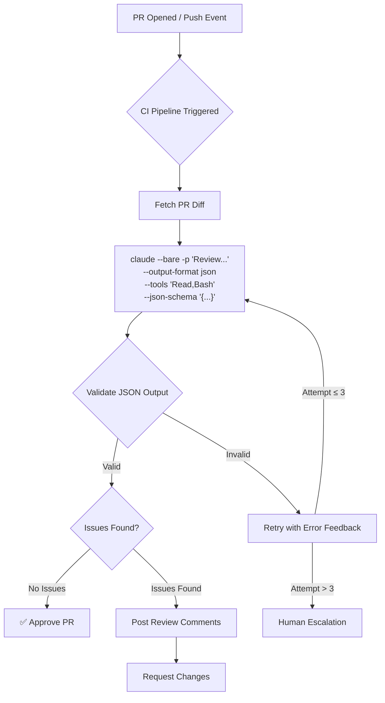
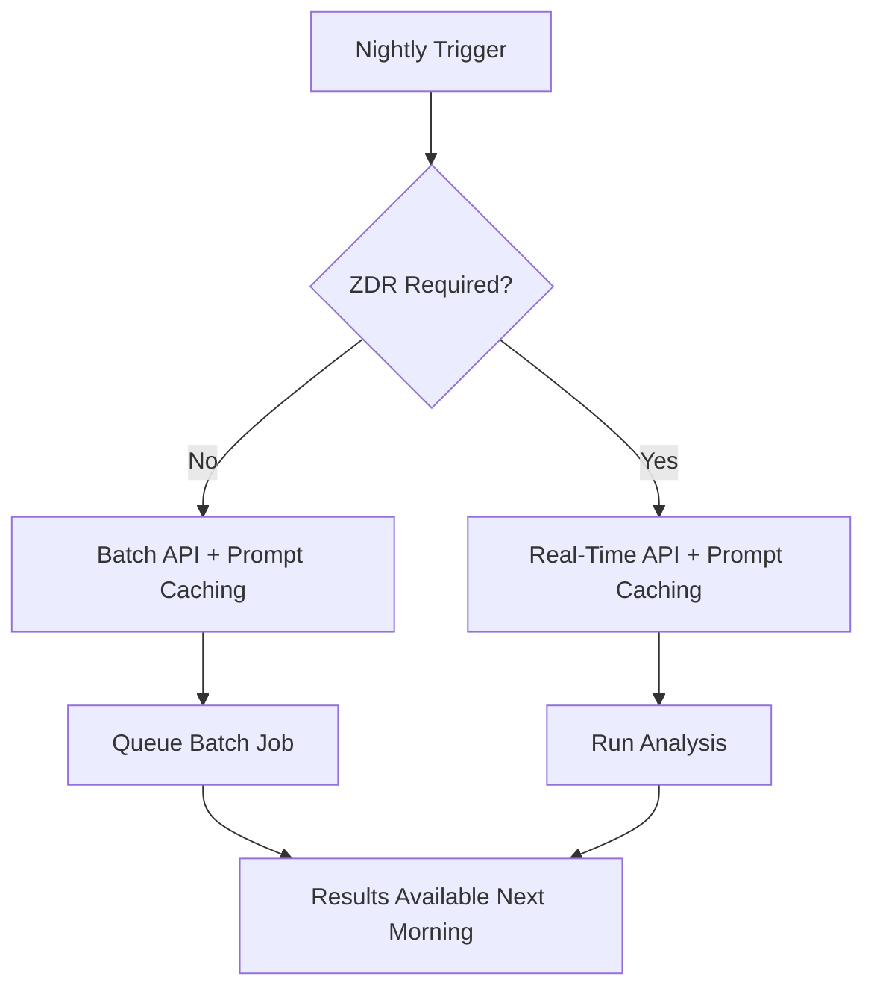

# Claude Certified Architect: Master the CI/CD Scenario for the CCA Foundations Exam

> The flags, output formats, and pipeline patterns that separate passing from failing.

Of the six CCA exam scenarios, the **CI/CD scenario** is the most **operationally concrete**. This is not about philosophy or architecture trade-offs — it is about exact flags, exact syntax, and exact application timing. **Memorize the details.**

Three elements are non-negotiable for any Claude Code CI/CD integration:

1. **`-p`** — non-interactive mode (imperative)
2. **`--bare`** — reproducible behavior across environments
3. **`--output-format json`** — machine-parseable output

If any one of these is missing, the pipeline breaks.

---

## The `-p` Flag: The Non-Interactive Imperative

Without **`-p`** (short for `--print`), running Claude Code in a CI/CD pipeline causes the **pipeline to hang**. Not slowly, not with an error. It just sits there, waiting for input that will never arrive.

```bash
# Correct pattern
claude --bare -p "Review this pull request for security vulnerabilities"
```

The **`-p`** flag tells Claude Code: "This is a one-shot execution. Take the prompt, process it, print the output, and exit." Without it, Claude Code enters interactive mode — which requires a human at a terminal.

### Exam Trap

> "Increase the pipeline timeout to 120 minutes."

This is **symptom treatment, not root cause resolution**. The hang is caused by the missing `-p` flag. No amount of timeout extension will fix a process that is waiting for input that will never come.

**Ignore the noise. If Claude Code is running in CI without `-p`, it is waiting for input.**

---

## The `--bare` Flag: Anthropic's Recommended CI/CD Default

**`--bare`** is Claude Code's headless mode. It skips:

- Hooks
- LSP (Language Server Protocol)
- Plugin synchronization
- Skill directory scanning
- Automatic memory
- OAuth / keychain authentication

### Why `--bare` Matters

Without `--bare`, running Claude Code with only `-p` means:

- On a **developer's local machine**: personal `CLAUDE.md`, MCP servers, hooks, and skills all load.
- On a **CI runner**: none of these exist.

**Same command, different behavior.** This is the opposite of reproducibility.

> Official documentation: "--bare is the recommended mode for scripts and SDK calls, and is expected to become the default for -p in a future release."

### Authentication Note

Because `--bare` skips OAuth and keychain authentication, you **must** explicitly set the `ANTHROPIC_API_KEY` environment variable.

```bash
export ANTHROPIC_API_KEY=${{ secrets.ANTHROPIC_KEY }}
claude --bare -p "Review this code"
```

---

## Machine-Parseable Output

### Anti-Pattern 1 — Regex Parsing

Parsing Claude's natural-language output with regular expressions. The output format can vary between runs, causing **intermittent failures**.

### Anti-Pattern 2 — Prompt-Only JSON

Adding "Always return your response as valid JSON" to the prompt. This works approximately 90% of the time. But Claude may wrap the response in a markdown code block, or add explanatory text before or after the JSON.

> **A prompt is guidance. A flag is a guarantee.**

90% reliability is not acceptable in a production pipeline.

### The Correct Pattern: `--output-format json`

```bash
claude --bare -p "Review the diff" \
  --output-format json \
  --json-schema '{"type":"object","properties":{"issues":{"type":"array"},"approve":{"type":"boolean"}},"required":["issues","approve"]}'
```

The **`--output-format json`** flag **guarantees** that Claude's response is valid JSON. Combined with **`--json-schema`**, the output is constrained to a specific schema.

### Critical Exam Detail

When using `--json-schema`, the result is in the **`structured_output`** field, not the `result` field.

```json
{
  "structured_output": {
    "issues": [...],
    "approve": true
  }
}
```

---

## Tool Sandboxing

Two flags control tool access, and they do **very different things**:

| Flag | Role | CI/CD Use |
|------|------|-----------|
| **`--tools "Read,Bash"`** | **Restricts** available tools | ✅ Actual sandboxing |
| **`--allowedTools "Read,Bash"`** | **Pre-approves** tools (no permission prompt) | ❌ Not restriction |

- **`--tools`** limits what Claude **can** use. This is real sandboxing.
- **`--allowedTools`** auto-approves tools so Claude doesn't ask for permission, but does **not** limit which tools are available.

For preventing unintended actions in CI/CD: use **`--tools`**.

---

## Pipeline Architecture Patterns

### Pattern 1 — Automated PR Code Review (Most Common on Exam)

```yaml
- name: Review PR
  run: |
    DIFF=$(gh pr diff ${{ github.event.pull_request.number }})
    echo "$DIFF" | claude --bare -p "Review for security issues" \
      --output-format json --tools "Read,Bash" \
      --json-schema '{"type":"object","properties":{"issues":{"type":"array","items":{"type":"object","properties":{"severity":{"type":"string"},"description":{"type":"string"}}}},"approve":{"type":"boolean"}},"required":["issues","approve"]}'
```

This pattern combines all four critical elements:
- **`--bare`** for reproducibility
- **`-p`** for non-interactive execution
- **`--output-format json`** for machine-parseable output
- **`--tools`** for sandboxing

### Pattern 2 — Automated Test Generation

Nightly execution → **Batch API candidate**.

Test generation does not block a developer. It runs overnight and the results are available in the morning. This makes it suitable for the Batch API, which offers **50% cost reduction** but with higher latency.

### Pattern 3 — Fix Pipeline (Validation-Retry Loop)

```
Test fails → Claude attempts fix → Re-run tests → If fail: retry with error feedback (max 2–3 attempts) → Human escalation
```

Key principles:
- **Retry limit**: 2–3 attempts maximum. Infinite retry is an anti-pattern.
- **Error feedback**: Each retry includes the specific error from the previous attempt. "Blind retry" (retrying without error context) is an anti-pattern.
- **Human escalation**: After retry limit, escalate to a human. Do not let the pipeline loop indefinitely.

---

## Token Economics

### Prompt Caching Cost Structure

| Type | Cost | Description |
|------|------|-------------|
| **Cache read** | **0.1x** base (90% savings) | Core savings for repeated tokens |
| **Cache write (5-min TTL)** | **1.25x** base (25% premium) | First-write premium |
| **Cache write (1-hour TTL)** | **2.0x** base (100% premium) | Extended cache premium |

### Exam Trap

> "Prompt Caching reduces all token costs by 90%."

**Wrong.** The 90% savings applies **only to cache read tokens**. Cache write tokens cost **more** than base price (25–100% premium depending on TTL).

### Zero Data Retention (ZDR) Constraint

> **The Message Batches API is NOT eligible for Zero Data Retention.**

This is a **critical exam fact**. Organizations in regulated industries — healthcare, finance, government — that require ZDR **cannot use the Batch API**. Even for nightly analysis, they must use the **Real-Time API with Prompt Caching**.

### Decision Framework

| Scenario | API | Cost Tool | ZDR Compatible |
|----------|-----|-----------|----------------|
| PR review (developer waiting) | Real-Time | Prompt Caching | Yes |
| Deploy gate (release-blocking) | Real-Time | Prompt Caching | Yes |
| Nightly test generation (no ZDR) | Batch | Caching + Batch | No |
| Nightly analysis (ZDR required) | Real-Time | Prompt Caching | Yes |

---

## Defense-in-Depth for CI/CD

Claude Code CI/CD integrations should follow a **defense-in-depth** strategy:

1. **Context defense**: `--bare` strips all local context (hooks, skills, memory)
2. **Tool defense**: `--tools` restricts available capabilities
3. **Output defense**: `--output-format json` + `--json-schema` constrains output structure
4. **Validation defense**: Schema validation before acting on results
5. **Retry defense**: Error-feedback retry loop (2–3 attempts) before human escalation

---

## Anti-Pattern Summary

| Anti-Pattern | Symptom | Correct Pattern |
|-------------|---------|-----------------|
| Missing `-p` | Pipeline hangs | `claude --bare -p` |
| Missing `--bare` | CI vs local behavior differs | Add `--bare` |
| Regex parsing | Intermittent failures | `--output-format json` |
| Prompt-only JSON | Non-JSON text included | `--output-format json` enforced |
| Batch API for blocking workflows | Developers wait hours | Real-Time API |
| Batch API in ZDR environment | Compliance violation | Real-Time + Caching |
| No validation | Blind trust in Claude output | Schema validation before action |
| No retry | Pipeline fails on first error | Error-feedback retry (2–3 attempts) |
| Missing `--tools` | Claude performs unintended actions | `--tools` to restrict tools |

---

## CI/CD Pipeline Flow





---

## Key Takeaways

1. **`-p` + `--bare` is the CI/CD base combination.** `-p` alone does not guarantee reproducibility. `--bare` alone is not non-interactive. Both are required, and Anthropic has stated this will become the default.

2. **Requesting JSON via prompt vs. enforcing JSON via flag are different things.** The former works 90% of the time; the latter works 100%. The exam explicitly tests this distinction.

3. **The Batch API is NOT ZDR-eligible.** If the question mentions a regulated industry and "Batch API" appears in the choices, eliminate it immediately.

4. **"90% savings" from Prompt Caching applies only to cache reads.** Cache writes cost 25–100% more. "All tokens reduced by 90%" is wrong.

5. **Validation-retry loops should be limited to 2–3 attempts.** Infinite retry is a reliability failure. Blind retry (without specific error feedback) is also an anti-pattern.

6. **`--tools` restricts; `--allowedTools` pre-approves.** For CI/CD sandboxing, the answer is `--tools`. For convenience, `--allowedTools`.
