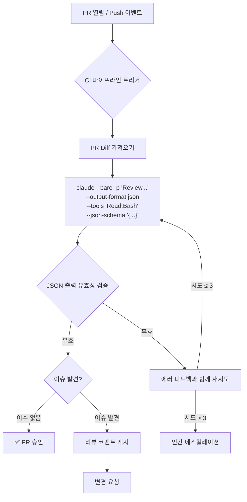
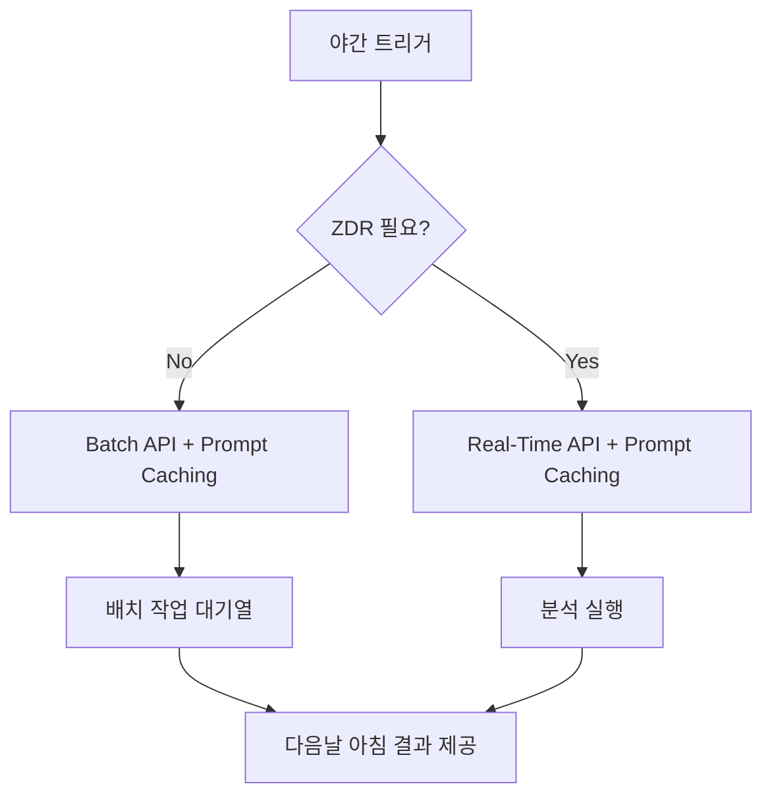

# CCA 인증 아키텍트: CCA 기초 시험을 위한 CI/CD 시나리오 마스터

> 합격과 불합격을 가르는 플래그, 출력 포맷, 파이프라인 패턴.

CCA 시험의 6개 시나리오 중 **CI/CD 시나리오**는 가장 **운영적으로 구체적인(operationally concrete)** 시나리오다. 철학이나 아키텍처 트레이드오프가 아니라, 정확한 플래그, 정확한 구문, 정확한 적용 시점이 중요하다. **세부 사항을 외워라.**

💡 CI/CD 통합에 절대 빠져서는 안 되는 세 가지 요소:

1. **`-p`** — 비인터랙티브 모드(non-interactive, 필수)
2. **`--bare`** — 환경 간 재현 가능한 동작(reproducible behavior)
3. **`--output-format json`** — 기계 파싱 가능 출력(machine-parseable output)

이 중 하나라도 빠지면 파이프라인이 깨진다.

---

## `-p` 플래그: 비인터랙티브의 필수 조건(The Non-Interactive Imperative)

**`-p`**(`--print`의 줄임말) 없이 CI/CD 파이프라인에서 Claude Code를 실행하면 **파이프라인이 멈춘다(hang)**. 느리게도 아니고, 에러도 아니다. 그냥 거기 앉아서, 절대 오지 않을 입력을 기다린다.

```bash
# 올바른 패턴
claude --bare -p "Review this pull request for security vulnerabilities"
# -p: 프롬프트를 받아 처리하고, 출력을 인쇄한 뒤 종료하는 일회성 실행 모드
```

**`-p`** 플래그는 Claude Code에게 "이것은 일회성 실행(one-shot execution)이다. 프롬프트를 받아 처리하고, 출력을 인쇄하고, 종료하라"고 지시한다. 이것이 없으면 Claude Code는 인터랙티브 모드(interactive mode)에 진입하고, 이는 터미널 앞에 사람이 있어야 한다는 뜻이다.

### 💡 시험 함정(Exam Trap)

> "파이프라인 타임아웃을 120분으로 늘려라."

이것은 **증상 치료(symptom treatment)이지 근본 원인 해결(root cause resolution)이 아니다**. 행(hang)의 원인은 `-p` 플래그 누락이다. 아무리 타임아웃을 늘려도, 절대 오지 않을 입력을 기다리는 프로세스는 고쳐지지 않는다.

**잡음을 무시하라. CI에서 Claude Code가 `-p` 없이 실행되고 있다면, 입력을 기다리고 있는 것이다.**

---

## `--bare` 플래그: Anthropic의 CI/CD 권장 기본값

**`--bare`**는 Claude Code의 헤드리스 모드(headless mode)다. 다음을 건너뛴다:

- 훅(Hooks)
- LSP(Language Server Protocol)
- 플러그인 동기화(Plugin synchronization)
- 스킬 디렉토리 스캔(Skill directory scanning)
- 자동 메모리(Automatic memory)
- OAuth / 키체인 인증(OAuth / keychain authentication)

### `--bare`가 필요한 이유

`--bare` 없이 `-p`만 사용하면:

- **개발자 로컬 머신**: 개인 `CLAUDE.md`, MCP 서버, 훅, 스킬이 모두 로드된다.
- **CI 러너(runner)**: 이런 것들이 전혀 없다.

**같은 명령어, 다른 동작.** 이것은 재현성(reproducibility)의 정반대다.

> 공식 문서: "--bare는 스크립트와 SDK 호출의 권장 모드이며, 향후 -p의 기본값이 될 예정이다."

### 인증 주의사항(Authentication Note)

`--bare`는 OAuth와 키체인 인증을 건너뛰므로, **반드시** `ANTHROPIC_API_KEY` 환경변수를 명시적으로 설정해야 한다.

```bash
export ANTHROPIC_API_KEY=${{ secrets.ANTHROPIC_KEY }}
# --bare는 OAuth/키체인을 건너뛰므로 API 키를 직접 설정해야 함
claude --bare -p "Review this code"
```

---

## 기계 파싱 가능 출력(Machine-Parseable Output)

### 안티패턴 1 — 정규식 파싱(Regex Parsing)

Claude의 자연어 출력을 정규식(regular expression)으로 파싱하는 것. 출력 포맷이 실행마다 달라질 수 있어 **간헐적 실패(intermittent failures)**를 일으킨다.

### 안티패턴 2 — 프롬프트 전용 JSON(Prompt-Only JSON)

프롬프트에 "항상 유효한 JSON으로 응답하라"고 추가하는 것. 약 90% 정도 작동한다. 하지만 Claude가 마크다운 코드 블록(markdown code block)으로 감싸거나, JSON 앞뒤에 설명 텍스트를 추가할 수 있다.

> 💡 **프롬프트는 안내(guidance)이고, 플래그는 보장(guarantee)이다.**

90%의 신뢰도는 프로덕션 파이프라인에서 수용 불가능하다.

### 올바른 패턴: `--output-format json`

```bash
claude --bare -p "Review the diff" \
  --output-format json \
  --json-schema '{"type":"object","properties":{"issues":{"type":"array"},"approve":{"type":"boolean"}},"required":["issues","approve"]}'
# --output-format json: 유효한 JSON 출력을 보장
# --json-schema: 특정 스키마 구조로 출력을 제약
```

**`--output-format json`** 플래그는 Claude의 응답이 유효한 JSON임을 **보장**한다. **`--json-schema`**와 결합하면 출력이 특정 스키마로 제약된다.

### 💡 시험 핵심 디테일(Critical Exam Detail)

`--json-schema` 사용 시, 결과는 **`structured_output`** 필드에 있다. `result` 필드가 아니다.

```json
{
  "structured_output": {
    "issues": ["..."],
    "approve": true
  }
}
```

---

## 도구 샌드박싱(Tool Sandboxing)

두 개의 플래그가 도구 접근을 제어하는데, **매우 다른 역할**을 한다:

| 플래그 | 역할 | CI/CD 사용 |
|--------|------|-----------|
| **`--tools "Read,Bash"`** | 사용 가능한 도구를 **제한(restrict)** | ✅ 실제 샌드박싱 |
| **`--allowedTools "Read,Bash"`** | 해당 도구를 권한 프롬프트 없이 **사전 승인(pre-approve)** | ❌ 제한이 아님 |

- **`--tools`**: Claude가 **사용할 수 있는** 것을 제한한다. 이것이 진짜 샌드박싱이다.
- **`--allowedTools`**: Claude가 허가를 구하지 않도록 자동 승인하지만, 어떤 도구를 사용할 수 있는지는 **제한하지 않는다**.

💡 CI/CD에서 의도하지 않은 동작을 방지하려면: **`--tools`**를 사용하라.

---

## 파이프라인 아키텍처 패턴(Pipeline Architecture Patterns)

### 패턴 1 — 자동 PR 코드 리뷰(가장 빈출)

```yaml
- name: Review PR
  run: |
    DIFF=$(gh pr diff ${{ github.event.pull_request.number }})
    echo "$DIFF" | claude --bare -p "Review for security issues" \
      --output-format json --tools "Read,Bash" \
      --json-schema '...'
# 네 가지 핵심 요소를 모두 조합:
# --bare(재현성) + -p(비인터랙티브) + --output-format json(파싱 가능) + --tools(샌드박싱)
```

이 패턴은 네 가지 핵심 요소를 모두 결합한다:
- **`--bare`** — 재현성 보장
- **`-p`** — 비인터랙티브 실행
- **`--output-format json`** — 기계 파싱 가능 출력
- **`--tools`** — 도구 샌드박싱

### 패턴 2 — 자동 테스트 생성(Automated Test Generation)

야간 실행(nightly execution) → **Batch API 후보**.

테스트 생성은 개발자를 블로킹하지 않는다. 밤새 돌리고 아침에 결과를 확인한다. 이 때문에 **50% 비용 절감**을 제공하지만 지연 시간(latency)이 높은 Batch API에 적합하다.

### 패턴 3 — 수정 파이프라인(Fix Pipeline, Validation-Retry Loop)

```
테스트 실패 → Claude가 수정 시도 → 테스트 재실행 → 실패 시: 에러 피드백과 함께 재시도(최대 2-3회) → 인간 에스컬레이션
```

핵심 원칙:
- **재시도 제한(Retry limit)**: 최대 2-3회. 무한 재시도(infinite retry)는 안티패턴이다.
- **에러 피드백(Error feedback)**: 각 재시도에 이전 시도의 구체적 에러를 포함한다. "맹목적 재시도(blind retry)"(에러 컨텍스트 없이 재시도)는 안티패턴이다.
- **인간 에스컬레이션(Human escalation)**: 재시도 제한 초과 후, 인간에게 에스컬레이션한다. 파이프라인이 무한 루프하도록 방치하지 않는다.

---

## 토큰 경제학(Token Economics)

### Prompt Caching 비용 구조

| 유형 | 비용 | 설명 |
|------|------|------|
| **캐시 읽기(Cache read)** | 기본의 **0.1배** (90% 절감) | 반복 토큰의 핵심 절감 포인트 |
| **캐시 쓰기 — 5분 TTL(Cache write)** | 기본의 **1.25배** (25% 추가) | 첫 쓰기 프리미엄 |
| **캐시 쓰기 — 1시간 TTL(Cache write)** | 기본의 **2.0배** (100% 추가) | 장기 캐시 프리미엄 |

### 💡 시험 함정(Exam Trap)

> "Prompt Caching으로 모든 토큰 비용이 90% 절감된다."

**오답.** 90% 절감은 **캐시 읽기 토큰에만** 적용된다. 캐시 쓰기 토큰은 기본가보다 **더 비싸다**(TTL에 따라 25-100% 추가).

### 💡 Zero Data Retention(ZDR) 제약 — 시험 핵심 사실

> **Message Batches API는 Zero Data Retention(제로 데이터 보유) 대상이 아니다.**

규제 산업(의료, 금융, 정부)에서 ZDR을 요구하는 조직은 **Batch API를 사용할 수 없다**. 야간 분석이라 하더라도 **Real-Time API + Prompt Caching**을 사용해야 한다.

### 의사결정 프레임워크(Decision Framework)

| 시나리오 | API | 비용 도구 | ZDR 호환 |
|---------|-----|---------|---------|
| PR 리뷰(개발자 대기) | Real-Time | Prompt Caching | Yes |
| 배포 게이트(릴리스 블로킹) | Real-Time | Prompt Caching | Yes |
| 야간 테스트 생성(ZDR 불필요) | Batch | Caching + Batch | No |
| 야간 분석(ZDR 필요) | Real-Time | Prompt Caching | Yes |

---

## CI/CD를 위한 심층 방어(Defense-in-Depth)

Claude Code CI/CD 통합은 **심층 방어(defense-in-depth)** 전략을 따라야 한다:

1. **컨텍스트 방어**: `--bare`가 모든 로컬 컨텍스트(훅, 스킬, 메모리)를 제거
2. **도구 방어**: `--tools`가 사용 가능한 기능을 제한
3. **출력 방어**: `--output-format json` + `--json-schema`가 출력 구조를 제약
4. **유효성 검사 방어**: 결과에 대해 동작하기 전 스키마 검증
5. **재시도 방어**: 에러 피드백 재시도 루프(2-3회) 후 인간 에스컬레이션

---

## CI/CD 파이프라인 흐름도





---

## 안티패턴 종합(Anti-Pattern Summary)

| 안티패턴 | 증상 | 올바른 패턴 |
|---------|------|-----------|
| `-p` 누락 | 파이프라인 행(hang) | `claude --bare -p` |
| `--bare` 누락 | CI vs 로컬 동작 차이 | `--bare` 추가 |
| 정규식 파싱(Regex parsing) | 간헐적 실패 | `--output-format json` |
| 프롬프트 전용 JSON | 비JSON 텍스트 포함 | `--output-format json` 강제 |
| 블로킹 워크플로우에 Batch API | 개발자가 시간 단위로 대기 | Real-Time API |
| ZDR 환경에서 Batch API | 컴플라이언스 위반 | Real-Time + Caching |
| 유효성 검사 없음 | Claude 출력 맹신 | 스키마 검증 후 동작 |
| 재시도 없음 | 첫 에러에 파이프라인 실패 | 에러 피드백과 함께 2-3회 재시도 |
| `--tools` 누락 | Claude가 의도하지 않은 동작 | `--tools`로 도구 제한 |

---

## 핵심 요약(Key Takeaways)

1. 💡 **`-p` + `--bare`는 CI/CD의 기본 조합이다.** `-p`만으로는 재현성이 보장되지 않고, `--bare`만으로는 비인터랙티브가 아니다. 둘 다 필요하며, Anthropic은 이것이 향후 기본값이 될 것이라 명시했다.

2. 💡 **프롬프트로 JSON을 요청하는 것과 플래그로 JSON을 강제하는 것은 다르다.** 전자는 90% 작동, 후자는 100% 작동. 시험은 이 차이를 명확히 테스트한다.

3. 💡 **Batch API는 ZDR 대상이 아니다.** 규제 산업 문제에서 "Batch API"가 선택지에 나오면 즉시 제거하라.

4. 💡 **Prompt Caching의 "90% 절감"은 읽기 토큰에만 적용된다.** 쓰기 토큰은 25-100% 추가 비용. "모든 토큰 90% 절감"은 오답이다.

5. 💡 **Validation-retry 루프의 재시도는 2-3회로 제한한다.** 무한 재시도는 신뢰성 실패. 맹목적 재시도(에러 피드백 없음)도 안티패턴이다.

6. 💡 **`--tools`는 제한(restrict), `--allowedTools`는 사전 승인(pre-approve).** CI/CD 샌드박싱에는 `--tools`, 편의성에는 `--allowedTools`.
