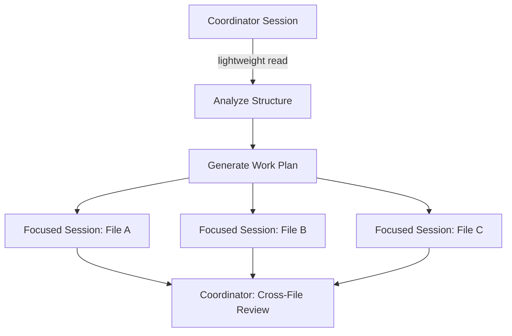

# CCA Exam Prep: Mastering the Code Generation with Claude Code Scenario

This is Part 3 of the CCA Exam Prep series. The **Code Generation** scenario tests whether you understand *why* certain architectural decisions produce better results — not just whether you can use Claude Code.

This scenario covers two exam domains:
- **Domain 3: Claude Code Workflows** (20%)
- **Domain 5: Context Management** (15%)

Combined, that's **35% of the entire exam** riding on this single scenario.

---

## Context Degradation: The Core Concept

**Context degradation** is an **attention** problem, not a **capacity** problem.

When a model processes its **context window**, total attention is fixed and distributed across all tokens. As the context grows, each token receives a thinner slice of attention. Information in the **middle** receives the thinnest attention — this is the **"lost in the middle"** effect.

> "The middle is where quality goes to die."

### The Failure Case

A team loaded **47 service files** (380K tokens) into a single session and asked for an authentication middleware refactoring. Here's what happened:

- **Files 1–5**: Clean, thorough refactoring ✅
- **Files 15–30**: Variable naming inconsistencies, middleware call format differences, edge cases missed ⚠️
- **Files 40–47**: Quality recovers (end-of-context attention boost), but import patterns now **conflict** with the early files ❌

### The Anti-Pattern

> "Let's just increase the context window."

This is **always wrong** on the exam. Increasing the window just spreads attention thinner. **200K tokens of focused context outperforms 1M tokens of dumped context.**

**Exam signal**: Any answer suggesting "load everything into one session" or "use a larger context window" to fix quality issues — **eliminate it immediately**.

---

## The Correct Pattern: Focused Per-File Passes

The answer to large-codebase work is **decomposition**:

1. **Decompose** the large task into file/module-level units
2. **Execute** each unit in a focused session containing only relevant context
3. **Compose** the results
4. **Review** cross-file consistency (naming, imports, interface contracts)

> "Think of it like surgery. A surgeon doesn't operate on every organ simultaneously. They focus on one area, work with complete attention, and move to the next."

The **surgeon metaphor** drives home that **scope creates quality** — and ties it to life-or-death stakes.

**Exam trap**: "Load the entire `src/` directory and refactor" is **always the wrong answer**.

---

## CLAUDE.md Hierarchy

| Level | Path | VCS Shared | Purpose | Exam Trap |
|-------|------|-----------|---------|-----------|
| **Project** | `.claude/CLAUDE.md` | Yes | Team standards, architecture rules | Team standards MUST go here |
| **User** | `~/.claude/CLAUDE.md` | No | Personal preferences | Team standards here = wrong answer |

### CLAUDE.md Is Context Engineering

CLAUDE.md is **automatically injected** into every session. Writing rules once (**programmatic** approach) is superior to typing them into every prompt (**prompt-based** approach).

> "A tech lead who is always present, never forgets a rule, and never skips a review."

This personification frames CLAUDE.md as the **ideal colleague** — always consistent, always enforcing.

### Exam Signal

> "Some developers follow standards and others don't. How do you solve this?"

If the answer mentions putting team standards in each developer's **user-level** CLAUDE.md, or "manually copying" rules to new team members — that's the **wrong answer**. The correct answer is **always project-level**.

---

## Custom Skills and Slash Commands

- If a workflow has **3+ steps** and is repeated **2+ times** → encode it as a **skill**
- Skills should **reference** CLAUDE.md, not **duplicate** it (avoid dual maintenance)
- **Frontmatter** for metadata, **Markdown body** for instructions

**Exam insight**: Five developers writing their own "deploy to staging" prompts = five different procedures. A skill **standardizes** the workflow.

---

## CI/CD Integration: The -p Flag

Running Claude Code in CI/CD **without the `-p` flag** causes the **pipeline to hang forever**. The interactive UI waits for user input — but there's no user in CI.

```bash
claude -p "Review this pull request for security issues" --bare
```

### Key Flags for CI/CD

| Flag | Purpose |
|------|---------|
| **`-p` (`--print`)** | Non-interactive mode. Stdin for prompt, stdout for response, exit code returned |
| **`--bare`** | Skip hooks, LSP, skill loading, auto-memory discovery → **reproducible behavior** |
| **`--output-format json`** | Structured output for pipeline parsing |

### Batch vs Real-Time API in CI/CD

| Scenario | API Choice | Reason |
|----------|-----------|--------|
| Developer waiting for merge | **Real-Time API** | Blocking workflow, needs immediate response |
| "Nightly", "weekly", "scheduled" | **Batch API** | Non-blocking, **50% cost discount**, 24h window |

**Exam keyword detection**: If the question mentions "nightly," "weekly," or "scheduled" → **Batch API**. If someone is actively waiting → **Real-Time API**.

---

## The Coordinator Pattern

An advanced pattern for large codebase operations:

1. **Coordinator session** analyzes overall structure (lightweight read)
2. **Generates a work plan**: which files, in what order, with what dependencies
3. **Each file** gets its own **focused session** with only the context it needs
4. **Coordinator reviews** all results for cross-file consistency

This is **context forking** — borrowed from Unix's `fork()` system call. The parent process's context is selectively copied to child processes, giving each child only what it needs.



The coordinator pattern is the **bridge concept** that connects directly to the **hub-and-spoke architecture** covered in Article 4 (Multi-Agent Research scenario).

---

## Key Exam Decision Framework

When you see a code generation question on the exam, apply this decision tree:

1. **Is the answer "load everything at once"?** → Eliminate it
2. **Does the answer decompose the task?** → Strong candidate
3. **Are team standards in project-level CLAUDE.md?** → Correct placement
4. **Is CI/CD using `-p` and `--bare`?** → Correct configuration
5. **Is the repeated workflow encoded as a skill?** → Best practice
6. **Does the large task use a coordinator pattern?** → Advanced but correct

---

## Summary of Anti-Patterns vs Correct Patterns

| Anti-Pattern | Correct Pattern |
|-------------|----------------|
| Load entire `src/` into one session | Decompose into per-file focused passes |
| Increase context window to fix quality | Reduce context to increase attention density |
| Team standards in user-level CLAUDE.md | Team standards in project-level CLAUDE.md |
| Run Claude Code in CI without `-p` | Always use `-p --bare` in CI/CD |
| Each developer writes their own prompts | Encode repeated workflows as skills |
| Single session for 47-file refactoring | Coordinator pattern with focused sub-sessions |

---

*This article is Part 3 of the CCA Exam Prep series by Rick Hightower. It covers the Code Generation with Claude Code scenario, mapping to Domain 3 (Claude Code Workflows, 20%) and Domain 5 (Context Management, 15%).*
