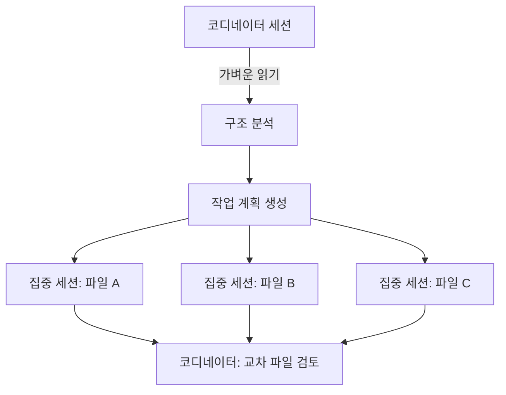

# CCA 시험 준비: 코드 생성 + Claude Code 시나리오 완전 정복

CCA 시험 준비 시리즈의 3편입니다. **코드 생성(Code Generation)** 시나리오는 Claude Code를 *사용할 줄 아는지*가 아니라, *왜 특정 아키텍처 결정이 더 나은 결과를 만드는지* 이해하는지를 테스트합니다.

이 시나리오는 두 가지 시험 도메인을 포괄합니다:
- **도메인 3: Claude Code 워크플로우(Claude Code Workflows)** (20%)
- **도메인 5: 컨텍스트 관리(Context Management)** (15%)

합산하면 **시험 전체의 35%**가 이 하나의 시나리오에 달려 있습니다.

---

## 컨텍스트 열화(Context Degradation): 핵심 개념

💡 **시험 핵심: 컨텍스트 열화(context degradation)는 용량(capacity) 문제가 아니라 주의력(attention) 문제입니다.**

모델이 **컨텍스트 윈도우(context window)**를 처리할 때, 총 주의력(total attention)은 고정되어 있고 모든 토큰(token)에 분배됩니다. 컨텍스트가 커지면 각 토큰이 받는 주의력 조각이 얇아집니다. **중간(middle)**에 있는 정보가 가장 얇은 주의력을 받습니다 — 이것이 **"lost in the middle" 효과**입니다.

> "중간은 품질이 죽으러 가는 곳이다(The middle is where quality goes to die)."

### 실패 사례

한 팀이 **47개 서비스 파일**(380K 토큰)을 단일 세션에 로드하고 인증 미들웨어(authentication middleware) 리팩토링을 요청했습니다. 결과는 다음과 같았습니다:

- **파일 1-5**: 깔끔하고 철저한 리팩토링 ✅
- **파일 15-30**: 변수 명명(variable naming) 불일치, 미들웨어 호출 포맷 차이, 엣지 케이스(edge case) 누락 ⚠️
- **파일 40-47**: 끝부분 주의력 상승으로 품질 회복, 하지만 초기 파일과 import 패턴이 **충돌** ❌

### 안티패턴(Anti-Pattern)

> "컨텍스트 윈도우를 늘리면 해결된다."

💡 **시험에서 이 선택지는 항상 오답입니다.** 윈도우를 늘리면 주의력을 더 얇게 분산시킬 뿐입니다. **200K 토큰의 집중된(focused) 컨텍스트가 1M 토큰을 덤프(dump)한 컨텍스트를 능가합니다.**

**시험 신호**: "모든 것을 하나의 세션에 로드하라" 또는 "더 큰 컨텍스트 윈도우를 사용하라"는 답변은 — **즉시 제거**하세요.

---

## 올바른 패턴: 파일별 집중 패스(Focused Per-File Passes)

대규모 코드베이스 작업의 정답은 **분해(decomposition)**입니다:

1. **분해(Decompose)**: 큰 작업을 파일/모듈 단위로 나눈다
2. **실행(Execute)**: 관련 컨텍스트만 포함한 집중 세션(focused session)에서 각 단위를 실행한다
3. **합성(Compose)**: 결과를 합친다
4. **검토(Review)**: 교차 파일 일관성을 확인한다 (명명 규칙, import 경로, 인터페이스 계약)

> "수술처럼 생각하라(Think of it like surgery). 외과의사는 모든 장기를 동시에 수술하지 않는다. 한 영역에 집중하고, 완전한 주의력으로 작업하고, 다음으로 넘어간다."

💡 **시험 함정**: "전체 `src/` 디렉토리를 로드하고 리팩토링하라"는 **항상 오답**입니다.

---

## CLAUDE.md 계층(Hierarchy)

| 레벨 | 경로(Path) | VCS 공유 | 용도 | 시험 함정 |
|------|-----------|---------|------|----------|
| **프로젝트(Project)** | `.claude/CLAUDE.md` | Yes | 팀 표준(team standards), 아키텍처 규칙 | 팀 표준은 반드시 여기 |
| **사용자(User)** | `~/.claude/CLAUDE.md` | No | 개인 선호도(personal preferences) | 팀 표준을 여기에 두면 오답 |

### CLAUDE.md는 컨텍스트 엔지니어링(Context Engineering)이다

CLAUDE.md는 매 세션에 **자동으로 주입(automatically injected)**됩니다. 한 번 작성하는 **프로그래밍적(programmatic)** 접근이, 매번 프롬프트에 타이핑하는 **프롬프트 기반(prompt-based)** 접근보다 우월합니다.

> "항상 존재하고, 규칙을 잊지 않고, 리뷰를 건너뛰지 않는 테크 리드(A tech lead who is always present, never forgets a rule, and never skips a review)."

### 시험 신호

> "일부 개발자만 코딩 표준을 따르고 다른 개발자는 따르지 않는다. 어떻게 해결하나?"

💡 각 개발자의 **사용자 레벨(user-level)** CLAUDE.md에 표준을 넣거나 "수동 복사(manually copying)"가 언급되면 — **오답**입니다. 정답은 항상 **프로젝트 레벨(project-level)**입니다.

---

## 커스텀 스킬(Custom Skills)과 슬래시 커맨드(Slash Commands)

- 워크플로우가 **3단계 이상**이고 **2회 이상 반복**되면 → **스킬(skill)**로 인코딩
- 스킬은 CLAUDE.md를 **참조(reference)**해야지 **복제(duplicate)**하면 안 됨 (이중 유지보수 방지)
- **프론트매터(Frontmatter)**로 메타데이터, **마크다운 본문**으로 지시사항

💡 **시험 인사이트**: 5명의 개발자가 각자 "스테이징 배포(deploy to staging)" 프롬프트를 작성하면 5개의 서로 다른 절차가 됩니다. 스킬이 워크플로우를 **표준화(standardize)**합니다.

---

## CI/CD 통합: -p 플래그

`-p` 플래그 없이 Claude Code를 CI/CD에서 실행하면 → **파이프라인이 영원히 행(hang)**합니다. 인터랙티브 UI(interactive UI)가 사용자 입력을 기다리지만 CI에는 사용자가 없습니다.

```bash
# CI/CD에서의 올바른 사용법
claude -p "Review this pull request for security issues" --bare
```

### CI/CD 핵심 플래그

| 플래그 | 용도 |
|--------|------|
| **`-p` (`--print`)** | 비인터랙티브 모드(non-interactive mode). 표준 입력으로 프롬프트, 표준 출력으로 응답, 종료 코드 반환 |
| **`--bare`** | 훅(hooks), LSP, 스킬 로딩, 자동 메모리(auto-memory) 스킵 → **재현 가능한 동작(reproducible behavior)** |
| **`--output-format json`** | 파이프라인 파싱용 구조화된 출력(structured output) |

### Batch API vs Real-Time API

| 상황 | API 선택 | 이유 |
|------|---------|------|
| 개발자가 머지(merge)를 기다리는 경우 | **Real-Time API** | 블로킹 워크플로우, 즉시 응답 필요 |
| "nightly", "weekly", "scheduled" | **Batch API** | 비블로킹, **50% 비용 할인**, 24시간 윈도우 |

💡 **시험 키워드 감지**: 문제에 "nightly", "weekly", "scheduled"가 나오면 → **Batch API**. 누군가 적극적으로 기다리고 있으면 → **Real-Time API**.

---

## 코디네이터 패턴(Coordinator Pattern)

대규모 코드베이스를 위한 고급 패턴입니다:

1. **코디네이터 세션(Coordinator session)**이 전체 구조를 분석 (가벼운 읽기)
2. **작업 계획(work plan) 생성**: 어떤 파일을, 어떤 순서로, 어떤 의존성(dependency)으로
3. **각 파일**이 필요한 컨텍스트만 가진 자체 **집중 세션(focused session)**을 받음
4. **코디네이터가 결과 검토**: 모든 결과의 교차 파일 일관성(cross-file consistency) 확인

이것이 **컨텍스트 포킹(context forking)**입니다 — Unix의 `fork()` 시스템 호출에서 차용한 개념입니다. 부모 프로세스의 컨텍스트 중 필요한 부분만 자식 프로세스에 복제합니다.



코디네이터 패턴은 Article 4(멀티에이전트 리서치 시나리오)의 **허브앤스포크(hub-and-spoke) 아키텍처**와 직접 연결되는 **브릿지 개념(bridge concept)**입니다.

---

## 시험 의사결정 프레임워크(Decision Framework)

코드 생성 문제를 만나면 이 의사결정 트리(decision tree)를 적용하세요:

1. **"모든 것을 한 번에 로드하라"는 답인가?** → 제거
2. **작업을 분해(decompose)하는 답인가?** → 유력 후보
3. **팀 표준이 프로젝트 레벨 CLAUDE.md에 있는가?** → 올바른 배치
4. **CI/CD가 `-p`와 `--bare`를 사용하는가?** → 올바른 설정
5. **반복 워크플로우가 스킬로 인코딩되어 있는가?** → 모범 사례(best practice)
6. **대규모 작업에 코디네이터 패턴을 사용하는가?** → 고급이지만 올바른 답

---

## 안티패턴 vs 올바른 패턴 요약

| 안티패턴(Anti-Pattern) | 올바른 패턴(Correct Pattern) |
|----------------------|---------------------------|
| 전체 `src/`를 하나의 세션에 로드 | 파일별 집중 패스(per-file focused passes)로 분해 |
| 컨텍스트 윈도우 늘려서 품질 해결 | 컨텍스트를 줄여서 주의력 밀도(attention density) 높이기 |
| 팀 표준을 사용자 레벨 CLAUDE.md에 배치 | 팀 표준을 프로젝트 레벨 CLAUDE.md에 배치 |
| CI에서 `-p` 없이 Claude Code 실행 | CI/CD에서 항상 `-p --bare` 사용 |
| 각 개발자가 자체 프롬프트 작성 | 반복 워크플로우를 스킬로 인코딩 |
| 47개 파일을 단일 세션에서 리팩토링 | 코디네이터 패턴으로 집중 서브세션 분배 |

---

*이 글은 Rick Hightower의 CCA 시험 준비 시리즈 3편입니다. 코드 생성 + Claude Code 시나리오를 다루며, 도메인 3(Claude Code 워크플로우, 20%)과 도메인 5(컨텍스트 관리, 15%)에 매핑됩니다.*
