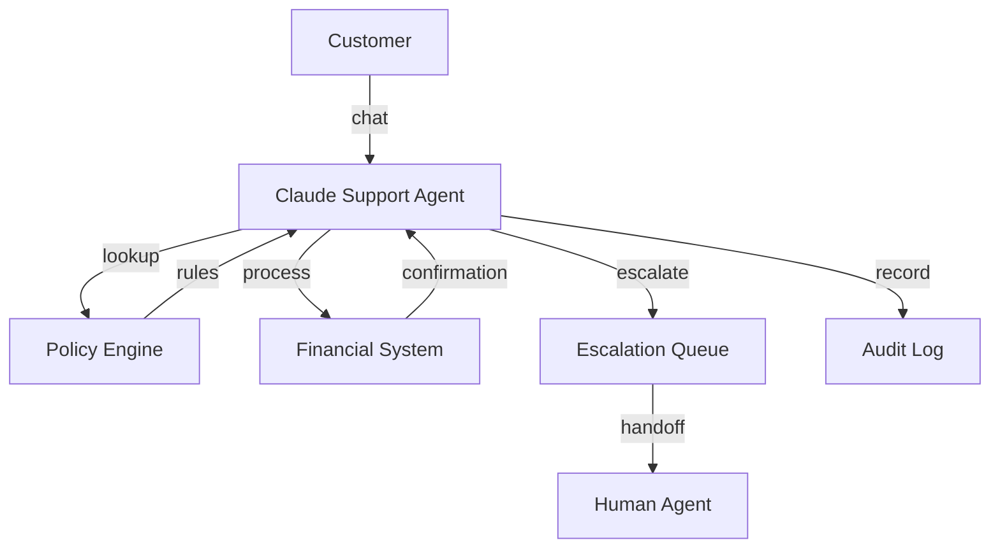
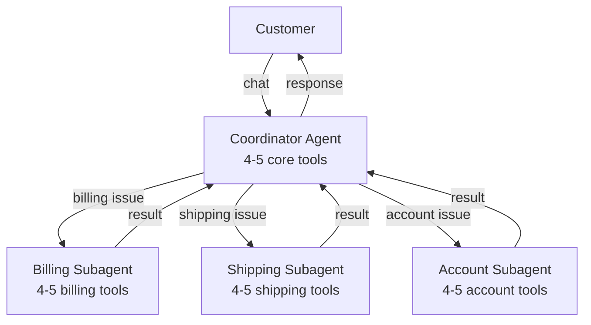

# Claude Code Certification Exam Prep: Mastering the Customer Support Resolution Agent Scenario

## Introduction

Of the six production scenarios on the **CCA Foundations exam**, the **Customer Support Resolution Agent** is the most dangerous. Not because the technology is unfamiliar — but because candidates *think* they already understand customer support. That familiarity is a trap. It causes you to pick answers that feel intuitive but are architecturally wrong.

Think of this article as a conversation with someone who already took the exam and is telling you exactly where the landmines are.

The **wrong answers look like reasonable engineering decisions**. They cite real APIs, real cost savings, and real architectural patterns. But each one contains a single fatal flaw that makes it incorrect in the context of a production customer support system.

This scenario simultaneously crosses **Agentic Architecture (27%)**, **Tool Design (18%)**, and **Context Management (15%)** domains. One mistake cascades into wrong answers across other domains. Get it right and a whole category of exam traps becomes transparent.

## Scenario Structure: Five Actors and Their Interactions

The exam presents a typical framing: a Claude-based customer support agent handling Tier-1 through Tier-3 issues, performing **account lookups**, **policy checks**, **refund processing**, and **escalation**.

| Actor | Role |
|-------|------|
| **Customer** | Initiates interaction, expects timely resolution |
| **Claude Support Agent** | Handles real-time conversation |
| **Policy Engine** | Refund rules, **escalation thresholds**, compliance requirements |
| **Financial System** | Processes refunds/adjustments within **authorization limits** |
| **Escalation Queue** | Routes to human agents with full context |
| **Audit Log** | Records all actions (compliance/audit) |



Exam questions focus on **decision points** within this flow: What triggers escalation? How is compliance enforced? Which API handles real-time interaction? How do you optimize cost? Each question has a "plausible but wrong" answer.

## Escalation Logic: Deterministic vs. Probabilistic

This is the **single most important concept** in this scenario. Get this wrong and you will miss multiple questions. Get it right and a whole category of exam traps becomes transparent.

### The Self-Reported Confidence Trap

The exam loves this **anti-pattern**: the agent faces a complex customer issue and reports "85% confidence." A threshold is set at 80% — escalate if below.

**Why this is wrong:**

1. **Lack of calibration**: LLM **confidence scores** are not **calibrated** like statistical model probability outputs. When Claude says "85% confident," that number was not computed from a probability distribution over possible outputs. It generated text that *looks like* a confidence assessment. Research shows LLMs exhibit **overconfidence** in the 90–100% high-confidence range, where stated certainty significantly exceeds actual accuracy.

2. **Circular reasoning**: You are asking a system that can be wrong to estimate the probability that it is wrong. That is like asking a student to grade their own test. It might be accurate sometimes, but you cannot build production **financial workflows** on top of it.

3. **Financial consequences**: Wrong routing decisions go beyond bad responses — they lead to **unauthorized refunds**, **regulatory violations**, and **compliance failures**. These stakes make the calibration problem fatal.

> **Exam Tip:** When answer choices mention "**confidence score**," "**self-reported confidence**," "**model certainty**," or "if the agent is uncertain, escalate" as the escalation routing mechanism — it is almost certainly wrong. Treat these words as a red flag and eliminate before reading the rest.

### The Correct Pattern: Programmatic Threshold Logic

The correct answer always involves **deterministic business rules** evaluated programmatically. Escalation decisions based on structured data that the model cannot override:

| Rule Type | Example |
|-----------|---------|
| **Amount** | Refund > $500 requires human review |
| **Account action** | Account closure, subscription cancellation always escalate |
| **Customer tier** | VIP customers get priority queue regardless of issue complexity |
| **Issue type** | Legal complaints, regulatory inquiries always escalate |
| **Policy lookup** | **Policy Engine** holds rules for the scenario |

These rules **exist in code**. Implemented via the Claude Agent SDK's **`PostToolUse` callback** — the agent *proposes* an action, then the programmatic layer *validates* against business rules before execution.

```python
# PostToolUse callback example - escalation enforcement
def post_tool_use(tool_name, tool_input, tool_result):
    if tool_name == "process_refund":
        amount = tool_input.get("amount", 0)
        if amount > 500:
            return {
                "action": "escalate",
                "reason": "refund_amount_exceeds_limit",
                "amount": amount,
                "limit": 500
            }
    return tool_result  # Allow if within limits
```

**The mental model the exam tests**: **Programmatic enforcement** always beats prompt-based guidance for business rules. You can write "always escalate refunds over $500" in the system prompt and it will mostly work. But "mostly" is not enough when real money is at stake. Programmatic hooks catch it every time, without exception.

**How the wrong answer appears on the exam**: A question describes a support agent that escalates based on "a **confidence threshold** set in the system prompt." The trap is that it *looks like* it uses both a programmatic threshold (a number) and a policy (escalate if below). The problem is that the threshold is based on **self-reported confidence**. The correct answer separates the two: **deterministic business rules** (amounts, account flags, issue categories) enforced in code — not confidence scores enforced via prompt.

## Compliance Workflows: Code, Not Prompts

What distinguishes the customer support scenario from other scenarios: **direct financial consequences**. A wrong decision by the agent can lead to unauthorized refunds, regulatory violations, and compliance failures — and that changes everything about system design.

Consider **PCI-DSS** requirements. "Asking Claude to be careful with credit card numbers" is not a **compliance strategy**. That is a **hope**.

| Requirement | Wrong Approach (Prompt) | Correct Approach (Code) |
|-------------|------------------------|------------------------|
| No logging of payment data | "Do not log sensitive data" | **Programmatic redaction** |
| Refund authorization chain | "Check if amount is within limit" | **Programmatic validation** |
| Customer identity verification | "Verify the customer" | **Structured workflow** |
| Audit trail for all financial actions | "Log everything" | **Programmatic logging** |

**The core formula**: Prompt = **guidance**, Code = **enforcement**. The system prompt can *explain* rules so Claude understands context, but actual enforcement happens in the application layer wrapping the agent.

> **Exam Pattern:** For questions about ensuring compliance in a customer support agent, answers that rely solely on **prompt engineering** are always wrong. The correct answer always involves **programmatic enforcement** + prompt providing context.

## Real-Time API vs. Batch API: The Cost Optimization Trap

This is the second major anti-pattern. It catches a surprising number of candidates, including experienced engineers.

**How the trap unfolds**: Your customer support system has high API costs. Switching to the **Message Batches API** would achieve **50% cost savings**. Same model, same prompts. What could go wrong?

**The problem is catastrophic**: The Batch API has a **processing window of up to 24 hours**. There is no formal SLA for guaranteed response time. Most complete within an hour, but the system is designed for non-blocking, **asynchronous workloads**. A customer waiting in a chat window cannot wait an hour. Let alone 24 hours. Using the Batch API for real-time customer support is not cost optimization — it is an **architecture failure** that breaks the fundamental contract with users.

**How the wrong answer appears on the exam**: "Migrate interactions to the **Message Batches API** to reduce API costs for a high-volume customer support system. Achieve 50% cost savings while maintaining the same model quality." This answer is attractive because it names a real API, cites a real cost savings percentage, and makes an accurate statement about model quality. All three facts are true. But it is still wrong because it ignores the fundamental incompatibility between a **24-hour processing window** and real-time customer support.

### API Selection Decision Framework

| Question | If YES | If NO |
|----------|--------|-------|
| Is the customer waiting for a response in real time? | **Real-Time API** (only option) | Next question |
| Is there a time-sensitive SLA? (SLA < 24 hours) | **Real-Time API** | Next question |
| Are there financial consequences to delay? | **Real-Time API** | Next question |
| Is this a background task with no waiting user? | **Batch API is viable** | Real-Time API |

**Batch API appropriate use cases**: Overnight audit reports, post-interaction quality evaluations, bulk ticket analysis, compliance log reviews, training data generation. Cost-sensitive, asynchronous, no-waiting-user workloads.

**Key insight**: Cost optimization cannot compromise user experience or compliance requirements.

## The Correct Cost Optimization: Prompt Caching

The correct answer for reducing costs in real-time customer support is **Prompt Caching**.

Context that repeats in every customer support interaction:
- **Compliance rulebook** (company refund policies, escalation procedures)
- **Product catalog** (descriptions, pricing, known issues)
- **Escalation policy documents** (tier definitions, routing rules)

These documents can total **50,000–100,000 tokens**. Without caching, you pay full price for these tokens on every interaction. With **Prompt Caching**, you pay full price once, then get **up to 90% cost reduction** on subsequent requests that reuse the same cache prefix.

| Comparison | Batch API | Prompt Caching |
|------------|-----------|----------------|
| Cost savings | 50% | **Up to 90%** |
| Real-time compatible | No (up to 24hr processing) | **Fully compatible** |
| User experience impact | Destructive | **None** |

**Numerical example**: 10,000 interactions per day, 80,000 tokens of policy context per interaction. Prompt Caching saves approximately 90% on the repeated cost of 800 million tokens per day. Greater than Batch API's 50% savings, and compatible with Real-Time API so customers get instant responses.

> **Exam Tip:** For cost optimization questions about customer support systems, choose **Prompt Caching** (90% savings, real-time compatible). Avoid the **Batch API trap** (50% savings but 24-hour processing time destroys user-facing workflows). Prompt Cache is cheaper than Batch API while remaining real-time.

## Tool Design: The 4–5 Focused Tools Principle

**Domain 4 (Tool Design and MCP Integration)** accounts for 18% of the exam, and the customer support scenario is a primary test area.

### The Correct Tool Set

| Tool Name | Function | When Called |
|-----------|----------|------------|
| `lookup_customer` | Retrieve customer profile, purchase history, support history | Every interaction; first step |
| `check_policy` | Look up refund policies, escalation rules, compliance requirements | Before every financial decision |
| `process_refund` | Execute refund within authorization limits | Only after policy check |
| `escalate_to_human` | Route to human agent with structured context summary | When business rules require it |
| `log_interaction` | Audit record of interaction details, decisions, outcomes | Every interaction; last step |

**Tool descriptions matter as much as functionality**: Claude uses tool descriptions as the **primary routing mechanism** for deciding which tool to call. Vague descriptions like "handles customer-related stuff" cause misrouting. A precise description like "takes a customer_id as input and returns a structured JSON containing purchase history, support ticket history, and account tier" gives Claude the information it needs to select the right tool at the right time.

```python
# Good tool description example
tools = [
    {
        "name": "lookup_customer",
        "description": "Takes a customer_id as input and returns structured JSON containing purchase history, support ticket history, and account tier. Use this as the first step in every customer interaction.",
        "input_schema": {
            "type": "object",
            "properties": {
                "customer_id": {
                    "type": "string",
                    "description": "The unique customer identifier (e.g., CUS-12345)"
                }
            },
            "required": ["customer_id"]
        }
    }
]
```

> **Exam Tip:** When a question describes a support agent calling the wrong tool, the answer depends on tool count. **4–5 tools**: fix the descriptions. **12+ tools**: reduce the tool count or split into **subagents**. Improving descriptions on a 12-tool agent does not solve the selection reliability problem.

### Anti-Pattern: The Swiss Army Agent

A support agent with 15 tools — billing management, shipping tracking, inventory lookup, HR policy queries, marketing campaign access, product roadmap... The exam expects you to know both reasons this is wrong:

**Reason 1: Tool selection accuracy degrades.** With 15+ tools, Claude must evaluate more options per turn, and the probability of selecting the wrong tool increases. Anthropic's official guideline is **4–5 tools per agent**. This is not a soft recommendation — it is the threshold where selection reliability holds.

**Reason 2: Scope creep creates security/compliance risk.** A support agent with access to HR policies or marketing campaign data possesses capabilities it should never exercise. The **principle of least privilege** applies to AI agents exactly as it does to human users. An agent that *can* access HR data *might* accidentally (or through **prompt injection**) expose that data to customers.

**The correct pattern when you need more than 5 tools**: A **coordinator agent** handles the conversation and routes to specialized **subagents** for billing, shipping, and account management. Each subagent has 4–5 tools scoped to its own domain.



**How the wrong answer appears on the exam**: "The best fix for a 12-tool agent that sometimes selects the wrong tool is to improve tool descriptions to make each tool more clearly distinguishable." This is partially correct (description quality matters) but addresses the symptom, not the root cause. The correct answer is to reduce to **4–5 focused tools** and move remaining capabilities to specialized subagents.

## Context Management: The Lost-in-the-Middle Effect

**Domain 5 (Context Management and Reliability)** accounts for 15% of the exam, and customer support sessions are among the hardest contexts to manage. A single support interaction can accumulate thousands of tokens: the initial complaint, multiple policy lookups, back-and-forth confirmations, previous resolution attempts, internal notes.

**The lost-in-the-middle effect**: LLMs pay more attention to information at the **beginning** and **end** of the context window, and less to information **buried in the middle**. Claude's architecture has improved significantly (long-context retrieval benchmarks: 18% → 76%), but at production scale the fundamental challenge remains.

**How it manifests in customer support**: The customer's initial complaint is at the start of context (high attention). The most recent conversation is at the end (high attention). But the key refund threshold from a policy lookup three turns ago is in the middle — where it may receive less weight.

### Correct Context Management Patterns

1. **Insert structured summaries at context boundaries**: Prevent raw conversation from growing unbounded. Periodically restate customer tier, active policies, refund limits, and current resolution status in a structured summary placed at the beginning of each new turn. This keeps critical information outside the "lost in the middle" zone.

2. **Separate system prompt from user messages**: Rules that never change (escalation thresholds, compliance requirements, agent role/capabilities) go in the **system prompt**. Session-specific context (this customer's history, this particular dispute) goes in the **user message sequence**.

3. **Structured escalation handoff**: When the agent escalates to a human, do not pass the raw conversation transcript. Pass a **structured summary**:

```json
{
  "customer_id": "CUS-12345",
  "customer_tier": "VIP",
  "issue_type": "billing_dispute",
  "disputed_amount": 750.00,
  "agent_findings": "Policy allows refund but amount exceeds agent authority",
  "escalation_reason": "refund_amount_exceeds_limit",
  "recommended_action": "approve_refund",
  "conversation_summary": "Customer disputed charge from March 15. Agent verified charge is valid but customer has VIP status with 100% satisfaction guarantee. Refund of $750 exceeds the $500 agent limit.",
  "turns_elapsed": 6
}
```

This structured handoff ensures the human agent receives exactly what they need without wading through six turns of conversation. It also keeps context compact and positions critical information where the next handler (human or AI) will pay appropriate attention.

**How the wrong answer appears on the exam**: "When escalating to a human agent, pass the complete conversation transcript so the human has full context." This sounds thorough. But it is wrong. The complete transcript is long, unstructured, and buries key information in a sea of back-and-forth.

> **Exam Tip:** For escalation handoff design questions, look for answers that include **structured JSON** or key-value summaries. Answers that pass "**full conversation history**" or "**complete interaction transcript**" are wrong.

## Practice Questions

### Question 1: Escalation Routing

> A Claude-based customer support agent handles refund requests. The agent reports 92% confidence in resolving a $600 refund. How should the system determine whether to process the refund or escalate?

| Choice | Verdict | Analysis |
|--------|---------|----------|
| A) Set a 90% confidence threshold; escalate if below | **Wrong** | The confidence score itself is irrelevant. $600 exceeds agent authority regardless of confidence. Even 99% certainty does not override business rules. Tests **Domain 1 (Agentic Architecture)** |
| **B) Apply deterministic business rules: $600 exceeds $500 limit, escalate regardless of confidence** | **Correct** | Business rule ($600 > $500) is deterministic. Independent of agent certainty. **PostToolUse** callback enforces unconditionally after agent proposal |
| C) 92% exceeds the typical threshold for financial decisions, so allow processing | **Wrong** | Same flaw as A, stated more directly. No confidence level overrides business rules |
| D) Improve the escalation rules in the system prompt for clarity | **Wrong** | System prompt is inadequate enforcement mechanism for financial authorization rules. Programmatic hooks enforce reliably |

### Question 2: Cost Optimization

> A customer support system using the Real-Time API processes 50,000 interactions per day, each containing 80,000 tokens of repeated policy context. How do you significantly reduce API costs?

| Choice | Verdict | Analysis |
|--------|---------|----------|
| A) Migrate to Message Batches API for 50% savings | **Wrong** | 24-hour processing time. Customer cannot wait in real-time chat workflow. **Most common wrong answer for this scenario's cost optimization questions** |
| B) Reduce policy context from 80,000 → 20,000 tokens through summarization | **Suboptimal** | Reduces tokens but may lose important policy details. Engineering tradeoff, not architectural best practice |
| **C) Implement Prompt Caching for repeated policy documents. Up to 90% cost reduction on cached tokens, maintaining real-time responses** | **Correct** | Addresses the specific problem (50,000 x 80,000 repeated tokens) with best cost savings (90%) while preserving the real-time responses the workflow requires |
| D) Use a smaller model for policy lookups, full model for complex issues | **Suboptimal** | Dual-model routing adds complexity. Since the question explicitly addresses repeated context costs, caching is the direct solution |

### Question 3: Tool Count

> A customer support agent has 12 tools (customer lookup, refund, shipping tracking, inventory management, HR policy queries, marketing campaign access). The agent sometimes selects the wrong tool. What is the best improvement?

| Choice | Verdict | Analysis |
|--------|---------|----------|
| A) Improve descriptions to make each tool more distinguishable | **Trap** | Valid for well-scoped toolsets. But does not address root problem of 12 tools exceeding the recommended 4–5. Also does not address that the agent should not have access to HR or marketing. Better descriptions on a 12-tool agent do not eliminate selection accuracy degradation caused by tool count |
| B) Add a validation step where Claude confirms tool selection before execution | **Wrong** | Makes the agent slow and expensive. Does not fix root cause. Validation step does not solve selection reliability problem |
| **C) Reduce agent toolset to 4–5 focused customer support tools, move remaining capabilities to specialized subagents** | **Correct** | Solves both problems simultaneously. Reduces to 4–5 for selection accuracy. Moves billing/shipping/HR to subagents for scope reduction + **least privilege** |
| D) Expand the model's context window to give more space for evaluating tool options | **Wrong** | Larger context window does not improve tool selection accuracy. May actually worsen it by giving the model more space to deliberate among wrong options |

## Six Decision Patterns Summary

| Domain | Anti-Pattern | Correct Pattern | Exam Signal |
|--------|-------------|-----------------|-------------|
| **Escalation routing** | Self-reported confidence score | **Deterministic business rules** (amount, tier, issue type) | "confidence threshold" = wrong |
| **Cost optimization** | Batch API (50% savings) | **Prompt Caching** (90% savings, real-time) | "Batch API" + real-time workflow = wrong |
| **Tool count** | 12–15 tools in single agent | **4–5 tools + specialized subagents** | 10+ tools = split into subagents |
| **Compliance** | Rules in system prompt | **Programmatic hooks** (application layer) | "include in system prompt" only = wrong |
| **Context management** | Pass raw conversation transcript | **Structured JSON summary** | "full transcript" = wrong |
| **API selection** | Batch API for cost savings | User-facing = Real-Time, background = Batch | Ask "who is waiting?" |

## Conclusion

The customer support scenario tests one mental model repeatedly: **programmatic enforcement always beats prompt-based guidance**. Escalation via deterministic business rules, not confidence scores. Compliance via code, not prompts. Cost optimization via Prompt Caching, not Batch API. Tools scoped to 4–5, not 12. Handoffs via structured JSON, not raw transcripts.

These patterns connect across the three domains this scenario spans — **Agentic Architecture (27%)**, **Tool Design (18%)**, and **Context Management (15%)**. One mistake cascades. One correct principle unlocks multiple questions.
