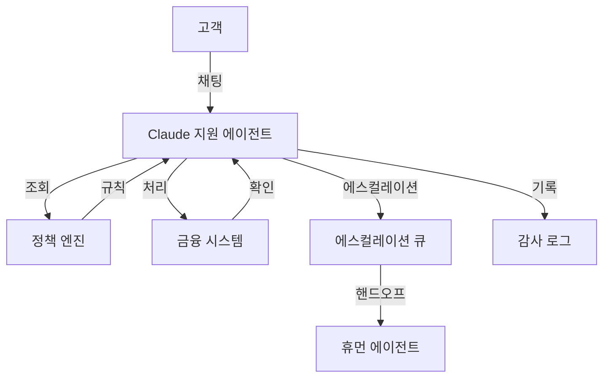
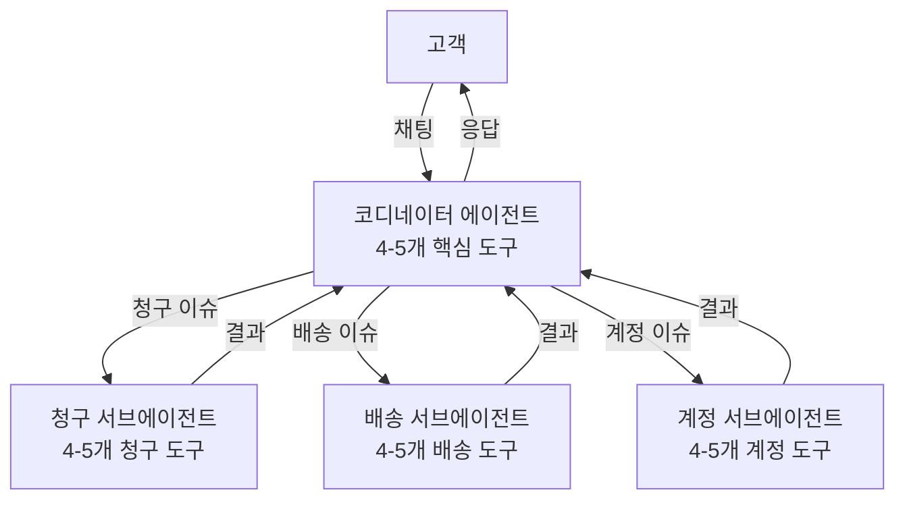

# CCA 시험 대비: 고객 지원 해결 에이전트 시나리오 마스터하기

## 도입

CCA Foundations 시험의 6개 프로덕션 시나리오 중 **고객 지원 해결 에이전트(Customer Support Resolution Agent)**는 가장 위험한 시나리오다. 기술이 생소해서가 아니라, 수험자가 고객 지원을 "이미 안다"고 *생각*하기 때문이다. 이 친숙함이 함정이다. 직관적이지만 아키텍처적으로 틀린 답을 선택하게 만든다.

이 글을 시험을 이미 본 사람과 나누는 대화라고 생각하라. 지뢰가 정확히 어디에 있는지 알려주는 것이다.

💡 **오답들은 합리적인 엔지니어링 결정처럼 보인다.** 실제 API, 실제 비용 절감 비율, 실제 아키텍처 패턴을 인용한다. 하지만 각각 프로덕션 고객 지원 시스템 맥락에서 치명적인 결함 하나를 품고 있다.

이 시나리오는 **에이전틱 아키텍처(Agentic Architecture, 27%)**, **도구 설계(Tool Design, 18%)**, **컨텍스트 관리(Context Management, 15%)** 도메인을 동시에 횡단한다. 하나의 실수가 다른 도메인의 오답으로 연쇄된다. 핵심 원칙을 잡으면 한 부류의 시험 함정 전체가 투명해진다.

## 시나리오 구조: 5개 행위자와 상호작용 흐름

시험에서 제시되는 전형적 프레이밍은 다음과 같다: Claude 기반 고객 지원 에이전트가 Tier-1부터 Tier-3 이슈를 처리하며, **계정 조회(account lookup)**, **정책 확인(policy check)**, **환불 처리(refund processing)**, **에스컬레이션(escalation)**을 수행한다.

| 행위자 | 역할 |
|--------|------|
| **고객(Customer)** | 상호작용 개시, 적시 해결 기대 |
| **Claude 지원 에이전트(Claude Support Agent)** | 실시간 대화 처리 |
| **정책 엔진(Policy Engine)** | 환불 규칙, 에스컬레이션 임계값(escalation threshold), 컴플라이언스(compliance) 요구사항 |
| **금융 시스템(Financial System)** | 승인 한도(authorization limit) 내 환불/조정 처리 |
| **에스컬레이션 큐(Escalation Queue)** | 전체 컨텍스트와 함께 휴먼 에이전트로 라우팅 |
| **감사 로그(Audit Log)** | 모든 행동 기록 (컴플라이언스/감사) |



시험 문제는 이 흐름 내 **의사결정 지점(decision point)**에 집중한다: 에스컬레이션 기준은 무엇인가? 컴플라이언스를 어떻게 적용하는가? 어떤 API가 실시간 상호작용을 처리하는가? 비용을 어떻게 최적화하는가? 각 질문에는 "그럴듯하지만 틀린" 답이 존재한다.

## 에스컬레이션(Escalation) 로직: 결정론적 vs. 확률론적

💡 이 시나리오에서 **가장 중요한 단일 개념**이다. 이것을 틀리면 여러 문제를 놓치고, 맞히면 한 부류의 시험 함정 전체가 투명해진다.

### 자기보고 신뢰도 함정 (Self-Reported Confidence Trap)

시험이 좋아하는 **안티패턴(anti-pattern)**: 에이전트가 복잡한 고객 이슈에 직면하여 "85% 확신"한다고 보고한다. 80% 임계값(threshold)을 설정하고 이하이면 에스컬레이션하라는 선택지가 제시된다.

**왜 틀린가?**

1. **보정 부재(lack of calibration)**: LLM의 신뢰도 점수(confidence score)는 통계 모델의 확률 출력처럼 보정(calibrate)되지 않는다. Claude가 "85% 확신"이라고 말할 때, 그 수치는 가능한 출력들에 대한 확률 분포에서 계산된 것이 아니다. 신뢰도 평가처럼 *보이는* 텍스트를 생성한 것이다. 연구에 따르면 LLM은 90-100% 고신뢰 구간에서 진술된 확신이 실제 정확도를 크게 초과하는 과잉 확신(overconfidence) 경향을 보인다.

2. **순환 논증(circular reasoning)**: 틀릴 수 있는 시스템에게 자신이 틀릴 확률을 물어보는 구조다. 💡 학생에게 자기 시험을 채점하라고 하는 것과 같다. 가끔 정확할 수 있지만, 그 위에 프로덕션 금융 워크플로우(financial workflow)를 구축할 수는 없다.

3. **재정적 결과(financial consequences)**: 잘못된 라우팅 결정은 나쁜 응답을 넘어 미승인 환불(unauthorized refund), 규정 위반(regulatory violation), 컴플라이언스 실패(compliance failure)로 이어진다. 이 이해관계가 보정 문제를 치명적으로 만든다.

> 💡 **시험 팁**: 선택지에서 "confidence score", "self-reported confidence", "model certainty", "if the agent is uncertain, escalate"를 에스컬레이션 라우팅 메커니즘으로 언급하면 거의 확실히 오답이다. 이 단어들을 보면 레드 플래그로 처리하고 나머지를 읽기 전에 제거하라.

### 올바른 패턴: 프로그래밍적 임계값 로직 (Programmatic Threshold Logic)

정답은 항상 프로그래밍적으로 평가되는 **결정론적 비즈니스 규칙(deterministic business rules)**이다. 모델이 재정의할 수 없는 구조화된 데이터에 기반한 에스컬레이션 결정:

| 규칙 유형 | 예시 |
|-----------|------|
| **금액(amount)** | 환불 > $500이면 휴먼 리뷰 필수 |
| **계정 행위(account action)** | 계정 폐쇄, 구독 취소는 항상 에스컬레이션 |
| **고객 등급(customer tier)** | VIP 고객은 이슈 복잡도 무관하게 우선 큐 |
| **이슈 유형(issue type)** | 법적 불만, 규제 문의는 항상 에스컬레이션 |
| **정책 조회(policy lookup)** | 정책 엔진(Policy Engine)이 해당 시나리오의 규칙 보유 |

이 규칙들은 **코드에 존재**한다. Claude Agent SDK의 **`PostToolUse` 콜백(callback)**으로 구현되어, 에이전트가 행동을 *제안*한 후 프로그래밍적 계층이 비즈니스 규칙에 따라 *검증*한 뒤 실행한다.

```python
# PostToolUse 콜백 예시 - 에스컬레이션 강제
def post_tool_use(tool_name, tool_input, tool_result):
    if tool_name == "process_refund":
        amount = tool_input.get("amount", 0)
        if amount > 500:
            return {
                "action": "escalate",
                "reason": "refund_amount_exceeds_limit",
                "amount": amount,
                "limit": 500
            }
    return tool_result  # 한도 내면 허용
```

💡 **시험이 테스트하는 멘탈 모델**: 비즈니스 규칙에 대해 **프로그래밍적 강제(programmatic enforcement)**는 항상 **프롬프트 기반 안내(prompt-based guidance)**보다 강하다. 시스템 프롬프트에 "항상 $500 이상 환불은 에스컬레이션하라"고 쓸 수 있고 대부분 작동한다. 하지만 "대부분"은 실제 돈이 걸린 상황에서 충분하지 않다. 프로그래밍적 훅(hook)은 매번, 예외 없이 잡아낸다.

## 컴플라이언스(Compliance) 워크플로우: 프롬프트가 아닌 코드로

고객 지원 시나리오가 다른 시나리오와 구별되는 이유: **직접적 재정 결과(direct financial consequences)**가 따른다. 에이전트의 잘못된 결정이 미승인 환불, 규정 위반, 컴플라이언스 실패를 초래할 수 있으며, 이것이 시스템 설계의 모든 것을 바꾼다.

PCI-DSS(Payment Card Industry Data Security Standard) 요구사항을 예로 들면, "Claude에게 신용카드 번호를 조심하라고 요청"하는 것은 컴플라이언스 전략이 아니다. 그것은 **희망(hope)**이다.

| 요구사항 | 잘못된 접근 (프롬프트) | 올바른 접근 (코드) |
|----------|----------------------|-------------------|
| 결제 데이터 로그 금지 | "민감 데이터를 로깅하지 마세요" | **프로그래밍적 리다크션(programmatic redaction)** |
| 환불 승인 체인 | "금액이 한도 내인지 확인하세요" | **프로그래밍적 밸리데이션(programmatic validation)** |
| 고객 본인 확인 | "고객을 확인하세요" | **구조화된 워크플로우(structured workflow)** |
| 모든 재정 행위 감사 추적 | "모든 것을 로깅하세요" | **프로그래밍적 로깅(programmatic logging)** |

💡 **핵심 공식**: 프롬프트 = **안내(guidance)**, 코드 = **강제(enforcement)**. 시스템 프롬프트는 Claude가 맥락을 이해하도록 규칙을 *설명*할 수 있지만, 실제 강제는 에이전트를 둘러싼 애플리케이션 레이어에서 일어난다.

> **시험 패턴**: 고객 지원 에이전트의 컴플라이언스 보장 방법을 묻는 문제에서, **프롬프트 엔지니어링(prompt engineering)**에만 의존하는 선택지는 항상 오답이다. 정답은 항상 **프로그래밍적 강제 + 프롬프트가 맥락을 제공**하는 구조다.

## 실시간 API(Real-Time API) vs. 배치 API(Batch API): 비용 최적화 함정

두 번째 주요 안티패턴이다. 경험 많은 엔지니어를 포함하여 놀라울 정도로 많은 수험자를 잡는다.

**함정의 전개**: 고객 지원 시스템의 API 비용이 높다. **Message Batches API**로 전환하면 **50% 비용 절감**을 달성할 수 있다. 모델도 프롬프트도 변경하지 않는다. 무엇이 문제인가?

**문제는 재앙적(catastrophic)**이다: Batch API의 처리 시간은 **최대 24시간**이다. 보장된 응답 시간에 대한 정식 SLA도 없다. 대부분 1시간 내 완료되지만, 시스템은 비차단(non-blocking), 비동기(asynchronous) 워크로드를 위해 설계되었다. 채팅 창에서 기다리는 고객은 1시간도 기다릴 수 없다. 24시간은 말할 것도 없다. Batch API를 실시간 고객 지원에 사용하는 것은 비용 최적화가 아니라 **사용자와의 근본 계약을 깨는 아키텍처 실패**다.

💡 **시험에서 오답의 형태**: "고볼륨 고객 지원 시스템의 API 비용을 줄이기 위해 상호작용을 Message Batches API로 마이그레이션한다. 동일 모델 품질을 유지하면서 50% 비용 절감을 달성한다." 이 선택지가 매력적인 이유는 실제 API를 명명하고, 실제 비용 절감 비율을 인용하고, 모델 품질에 대해 정확한 진술을 하기 때문이다. **세 가지 사실이 모두 참이다.** 하지만 24시간 처리 시간과 실시간 고객 지원 간의 근본적 비양립성을 무시하므로 여전히 오답이다. — "**3가지 사실 + 1가지 결함**" 구조.

### API 선택 의사결정 프레임워크 (API Selection Decision Framework)

| 질문 | YES일 때 | NO일 때 |
|------|---------|---------|
| 고객이 실시간으로 응답을 기다리는가? | **Real-Time API** (유일한 선택) | 다음 질문으로 |
| 시간 민감 SLA가 있는가? (SLA < 24시간) | **Real-Time API** | 다음 질문으로 |
| 지연에 재정적 결과가 따르는가? | **Real-Time API** | 다음 질문으로 |
| 대기 사용자 없는 백그라운드 작업인가? | **Batch API 사용 가능** | Real-Time API |

**Batch API 적합 사례**: 야간 감사 보고서, 사후 상호작용 품질 평가, 대량 티켓 분석, 컴플라이언스 로그 검토, 훈련 데이터 생성. 비용에 민감하고, 비동기적이며, 대기 사용자가 없는 워크로드.

## 올바른 비용 최적화: 프롬프트 캐싱(Prompt Caching)

실시간 고객 지원에서 비용을 줄이는 정답은 **프롬프트 캐싱(Prompt Caching)**이다.

고객 지원 에이전트에서 매 상호작용마다 반복되는 컨텍스트:
- **컴플라이언스 규정집(compliance rulebook)**: 회사 환불 정책, 에스컬레이션 절차
- **제품 카탈로그(product catalog)**: 설명, 가격, 알려진 이슈
- **에스컬레이션 정책 문서(escalation policy document)**: 등급 정의, 라우팅 규칙

이 문서들이 총 **50,000-100,000 토큰**에 달할 수 있다. 캐싱 없이는 매 상호작용마다 이 토큰에 전체 가격을 지불한다. Prompt Caching으로 한 번만 전체 가격을 내고, 동일 캐시 프리픽스(cache prefix)를 재사용하는 후속 요청에서 **최대 90% 비용 절감**을 받는다.

| 비교 항목 | Batch API | Prompt Caching |
|-----------|-----------|----------------|
| 비용 절감 | 50% | **최대 90%** |
| 실시간 호환 | 불가 (최대 24시간 처리) | **완전 호환** |
| 사용자 경험 | 파괴적 | **영향 없음** |

**수치 예시**: 하루 10,000건 상호작용, 건당 80,000 토큰 정책 컨텍스트. Prompt Caching으로 하루 8억 토큰의 반복 비용에서 약 90%를 절감한다. Batch API의 50% 절감보다 크고, Real-Time API와 호환되므로 고객은 즉시 응답을 받는다.

> 💡 **시험 팁**: 고객 지원 시스템의 비용 최적화 문제에서 **Prompt Caching**(90% 절감, 실시간 호환)을 선택하라. **Batch API 함정**(50% 절감이지만 24시간 처리 시간이 사용자 대면 워크플로우를 파괴)을 피하라.

## 도구 설계(Tool Design): 4-5개 집중 도구 원칙

**Domain 4(도구 설계 및 MCP 통합, Tool Design and MCP Integration)**가 시험의 18%를 차지하며, 고객 지원 시나리오가 주요 테스트 영역이다.

### 올바른 도구 구성

| 도구명 | 기능 | 호출 시점 |
|--------|------|----------|
| `lookup_customer` | 고객 프로필, 구매 이력, 지원 이력 조회 | 모든 상호작용; 첫 단계 |
| `check_policy` | 환불 정책, 에스컬레이션 규칙, 컴플라이언스 요구사항 조회 | 모든 재정 결정 전 |
| `process_refund` | 승인 한도 내 환불 실행 | 정책 확인 후에만 |
| `escalate_to_human` | 구조화된 컨텍스트 요약과 함께 휴먼 에이전트로 이관 | 비즈니스 규칙이 요구할 때 |
| `log_interaction` | 상호작용 세부사항, 결정, 결과 감사 기록 | 모든 상호작용; 마지막 단계 |

💡 **도구 설명(description)이 기능만큼 중요하다**: Claude는 도구 설명을 어떤 도구를 호출할지 결정하는 **1차 라우팅 메커니즘(primary routing mechanism)**으로 사용한다. "고객 관련 처리"같은 모호한 설명은 오라우팅(misrouting)을 유발한다. "customer_id를 입력으로 받아 구매 이력, 지원 티켓 이력, 계정 등급을 포함한 구조화된 JSON을 반환한다"는 정확한 설명이 Claude에게 적시에 올바른 도구를 선택하기 위해 필요한 정보를 제공한다.

```python
# 좋은 도구 설명 예시
tools = [
    {
        "name": "lookup_customer",
        "description": "Takes a customer_id as input and returns structured JSON containing "
                       "purchase history, support ticket history, and account tier. "
                       "Use this as the first step in every customer interaction.",
        "input_schema": {
            "type": "object",
            "properties": {
                "customer_id": {
                    "type": "string",
                    "description": "The unique customer identifier (e.g., CUS-12345)"
                }
            },
            "required": ["customer_id"]
        }
    }
]
```

> 💡 **시험 팁**: 지원 에이전트가 잘못된 도구를 호출하는 문제에서, 답은 도구 수에 따라 달라진다. **4-5개 도구**라면 설명을 수정하라. **12개 이상**이라면 도구 수를 줄이거나 서브에이전트(subagent)로 분리하라.

### 안티패턴: 스위스 군용 칼 에이전트 (Swiss Army Agent)

15개 도구(청구 관리, 배송 추적, 재고 조회, HR 정책, 마케팅 캠페인, 제품 로드맵...)를 가진 지원 에이전트의 문제. 시험은 두 가지 이유를 모두 알기를 기대한다:

**이유 1: 도구 선택 정확도 하락.** 15개 이상 도구에서 Claude는 턴마다 더 많은 옵션을 평가해야 하고, 잘못된 도구를 선택할 확률이 증가한다. Anthropic 공식 가이드라인은 에이전트당 **4-5개 도구**다. 이는 소프트 권고가 아니라 선택 신뢰도(selection reliability)가 유지되는 수치다.

**이유 2: 범위 확대(scope creep)로 인한 보안/컴플라이언스 리스크.** HR 정책이나 마케팅 캠페인 데이터에 접근할 수 있는 지원 에이전트는 결코 행사해서는 안 될 능력을 보유한다. **최소 권한 원칙(principle of least privilege)**이 AI 에이전트에도 인간 사용자와 정확히 동일하게 적용된다. HR 데이터에 접근할 수 있는 에이전트는 실수로(또는 **프롬프트 인젝션(prompt injection)**을 통해) 그 데이터를 고객에게 노출할 수 있다.

**5개 이상 도구가 필요할 때의 올바른 패턴**: **코디네이터 에이전트(coordinator agent)**가 대화를 처리하고 청구, 배송, 계정 관리를 위한 전문 **서브에이전트(subagent)**로 라우팅한다. 각 서브에이전트는 자체 도메인에 스코핑된 4-5개 도구를 보유한다.



## 컨텍스트 관리(Context Management): Lost-in-the-Middle 효과

**Domain 5(컨텍스트 관리 및 안정성, Context Management and Reliability)**가 시험의 15%를 차지하며, 고객 지원 세션은 관리하기 가장 어려운 컨텍스트 중 하나다. 단일 지원 상호작용이 수천 토큰을 축적할 수 있다: 최초 불만, 다수 정책 조회, 왕복 확인, 이전 해결 시도, 내부 메모.

**Lost-in-the-middle 효과**: LLM은 컨텍스트 윈도우의 **시작**과 **끝**에 있는 정보에 더 많은 주의를 기울이고, **중간에 묻힌** 정보에 덜 주의한다. Claude의 아키텍처가 크게 개선되었지만(장문 컨텍스트 검색 벤치마크: 18% → 76%), 프로덕션 규모에서 근본적 과제는 여전하다.

**고객 지원에서의 발현**: 고객의 최초 불만은 컨텍스트 시작에(높은 주의). 가장 최근 대화는 끝에(높은 주의). 하지만 3턴 전 정책 조회 결과에 담긴 핵심 환불 임계값은 **중간에 위치**하여 가중치가 낮아질 수 있다.

### 올바른 컨텍스트 관리 패턴

1. **컨텍스트 경계에서 구조화된 요약 삽입**: 원시 대화가 무한정 성장하지 않도록, 주기적으로 고객 등급/활성 정책/환불 한도/현재 해결 상태를 재기술하는 구조화된 요약을 매 새 턴 시작에 배치한다. 핵심 정보를 "lost in the middle" 영역 밖에 유지한다.

2. **시스템 프롬프트(system prompt) vs. 사용자 메시지(user message) 분리**: 절대 변하지 않는 규칙(에스컬레이션 임계값, 컴플라이언스 요구사항, 에이전트 역할/능력)은 시스템 프롬프트에. 세션별 컨텍스트(이 고객의 이력, 이 특정 분쟁)는 사용자 메시지 시퀀스에.

3. **구조화된 에스컬레이션 핸드오프(structured escalation handoff)**: 에이전트가 휴먼에게 에스컬레이션할 때, 원시 대화 기록(raw conversation transcript)을 전달하지 않는다. **구조화된 요약**을 전달한다:

```json
{
  "customer_id": "CUS-12345",
  "customer_tier": "VIP",
  "issue_type": "billing_dispute",
  "disputed_amount": 750.00,
  "agent_findings": "Policy allows refund but amount exceeds agent authority",
  "escalation_reason": "refund_amount_exceeds_limit",
  "recommended_action": "approve_refund",
  "conversation_summary": "Customer disputed charge from March 15. Agent verified charge is valid but customer has VIP status with 100% satisfaction guarantee. Refund of $750 exceeds the $500 agent limit.",
  "turns_elapsed": 6
}
```

💡 이 구조화된 핸드오프는 휴먼 에이전트가 6턴의 대화를 헤매지 않고 정확히 필요한 것을 받도록 보장한다. **"충분한 컨텍스트"보다 "정확한 컨텍스트"가 우선**이다.

> **시험 팁**: 에스컬레이션 핸드오프 설계 문제에서 구조화된 JSON이나 키-값 요약을 포함하는 선택지를 찾아라. "**full conversation history**"나 "**complete interaction transcript**"를 전달하라는 선택지는 오답이다.

## 연습문제 분석 (Practice Questions)

### 문제 1: 에스컬레이션 라우팅

> Claude 기반 고객 지원 에이전트가 환불 요청을 처리한다. 에이전트가 $600 환불 해결에 92% 확신을 보고한다. 환불 처리 vs. 에스컬레이션을 무엇으로 결정해야 하는가?

| 선택지 | 판정 | 분석 |
|--------|------|------|
| A) 90% 신뢰도 임계값 설정, 이하면 에스컬레이션 | **오답** | 신뢰도 점수 자체가 무관. $600이 에이전트 권한 초과이므로 99% 확신이어도 비즈니스 규칙은 절대적 |
| **B) 결정론적 비즈니스 규칙 적용: $600은 $500 한도 초과이므로 신뢰도 무관하게 에스컬레이션** | **정답** | 비즈니스 규칙($600 > $500)이 결정론적. PostToolUse 콜백이 에이전트 제안 후 무조건 적용 |
| C) 92%는 재정 결정 통상 임계값 이상이므로 처리 허용 | **오답** | A와 동일한 문제를 더 직접적으로 표현 |
| D) 시스템 프롬프트의 에스컬레이션 규칙을 명확히 개선 | **오답** | 재정 승인 규칙의 적용 메커니즘으로 시스템 프롬프트는 부적절 |

### 문제 2: 비용 최적화

> Real-Time API를 사용하는 고객 지원 시스템이 하루 50,000건 상호작용을 처리하며, 각 건에 80,000 토큰의 반복 정책 컨텍스트가 포함된다. API 비용을 크게 줄이려면?

| 선택지 | 판정 | 분석 |
|--------|------|------|
| A) Message Batches API로 마이그레이션하여 50% 절감 | **오답** | 24시간 처리 시간. 실시간 채팅에서 고객이 기다릴 수 없음 |
| B) 요약을 통해 정책 컨텍스트를 80,000 → 20,000 토큰으로 축소 | **차선** | 토큰 수는 줄지만 중요한 정책 세부사항 손실 가능 |
| **C) 반복 정책 문서에 Prompt Caching 구현. 최대 90% 비용 절감, 실시간 응답 유지** | **정답** | 특정 문제를 최선의 비용 절감으로 정확히 해결하면서 실시간 응답 보존 |
| D) 정책 조회에 소형 모델, 복잡 이슈에 풀 모델 사용 | **차선** | 이중 모델 라우팅은 복잡성 추가. 캐싱이 직접 해결 |

### 문제 3: 도구 수

> 고객 지원 에이전트가 12개 도구(고객 조회, 환불, 배송 추적, 재고 관리, HR 정책 쿼리, 마케팅 캠페인 접근 포함)를 보유한다. 에이전트가 가끔 잘못된 도구를 선택한다. 최선의 개선책은?

| 선택지 | 판정 | 분석 |
|--------|------|------|
| A) 각 도구를 다른 도구와 더 명확히 구별 가능하도록 설명 개선 | **함정** | 잘 스코핑된 도구셋에서는 유효. 하지만 12개가 권고 4-5개를 초과하는 근본 문제 미해결 |
| B) Claude에게 실행 전 도구 선택을 확인하도록 밸리데이션 단계 추가 | **오답** | 느리고 비싸게 만들 뿐. 근본 원인 미수정 |
| **C) 에이전트 도구셋을 4-5개 집중 도구로 축소하고 나머지 기능을 전문 서브에이전트로 이동** | **정답** | 두 문제 동시 해결: 선택 정확도 복원 + 최소 권한 적용 |
| D) 모델의 컨텍스트 윈도우를 확대하여 도구 옵션 평가 공간 제공 | **오답** | 더 큰 컨텍스트 윈도우는 도구 선택 정확도를 개선하지 않음 |

## 6개 의사결정 패턴 요약

| 영역 | 안티패턴 | 올바른 패턴 | 시험 시그널 |
|------|---------|-----------|-----------|
| 에스컬레이션 라우팅 | 자기보고 신뢰도 점수 | **결정론적 비즈니스 규칙** (금액, 등급, 이슈 유형) | "confidence threshold" = 오답 |
| 비용 최적화 | Batch API (50% 절감) | **Prompt Caching** (90% 절감, 실시간) | "Batch API" + 실시간 = 오답 |
| 도구 수 | 12-15개 도구 단일 에이전트 | **4-5개 도구 + 전문 서브에이전트** | 10+ 도구 = 서브에이전트 분리 |
| 컴플라이언스 | 시스템 프롬프트에 규칙 포함 | **프로그래밍적 훅** (애플리케이션 레이어) | "include in system prompt"만 = 오답 |
| 컨텍스트 관리 | 원시 대화 기록 전달 | **구조화된 JSON 요약** | "full transcript" = 오답 |
| API 선택 | 비용 절감을 위한 Batch API | 사용자 대면 = Real-Time, 백그라운드 = Batch | "누가 기다리는가?" 질문 |

## 결론

이 시나리오가 반복적으로 테스트하는 멘탈 모델은 하나다: **프로그래밍적 강제는 항상 프롬프트 기반 안내보다 강하다.** 에스컬레이션은 신뢰도 점수가 아니라 결정론적 비즈니스 규칙으로. 컴플라이언스는 프롬프트가 아니라 코드로. 비용 최적화는 Batch API가 아니라 Prompt Caching으로. 도구는 12개가 아니라 4-5개로, 나머진 서브에이전트로. 핸드오프는 원시 대화 기록이 아니라 구조화된 JSON으로.

이 패턴들은 시나리오가 횡단하는 세 도메인 -- **Agentic Architecture(27%)**, **Tool Design(18%)**, **Context Management(15%)** -- 을 가로질러 연결되어 있다. 하나의 실수가 연쇄되고, 하나의 올바른 원칙이 여러 문제를 한꺼번에 풀어준다.
