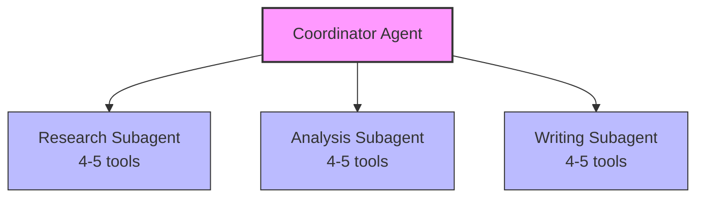
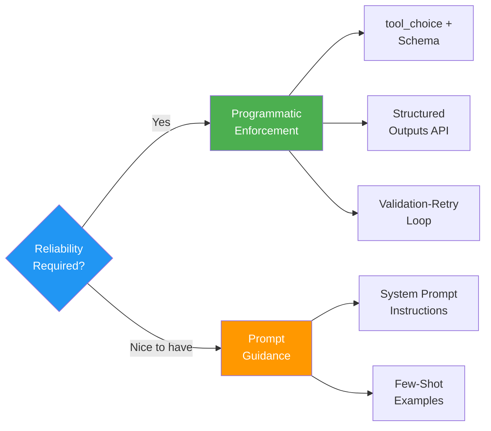

# Claude Certified Architect: The Complete Guide to Passing the CCA Foundations Exam

*By Rick Hightower — Published on Towards Artificial Intelligence*

---

## Why the CCA Matters Right Now

On March 12, 2026, **Anthropic** launched the **Claude Certified Architect (CCA) Foundations** exam — the first professional certification in the AI industry that tests whether you can actually **design production systems with Claude**. This is not about whether you can write good prompts or whether you've completed a tutorial. It's about whether you can **architect real, working software**.

Alongside the certification, Anthropic announced a **$100M Claude Partner Network** investment. Let that number land for a moment. The partners tell the story:

| Partner | Scale |
|---------|-------|
| **Accenture** | 30,000 professionals in training, new Anthropic Business Group |
| **Cognizant** | 350,000 employees granted Claude access |
| **Deloitte** | 470,000 people deployed on the platform |
| **Infosys** | Center of Excellence established |

These are not pilots. These are **workforce transformations at the scale of hundreds of thousands**. Every one of these organizations needs people who can architect Claude-based systems, and the **CCA** is the **first standardized signal** in a market that has none.

You showing up with a **CCA badge** while the market is still forming is a different proposition than showing up two years from now when everyone has one. The line is short. It is about to get very long.

---

## Exam Format

Let me be direct about what you are signing up for. This is a **301-level exam** designed for **seasoned professionals** with at least six months of hands-on experience building with Claude.

| Item | Detail |
|------|--------|
| Questions | **60** |
| Time | **120 minutes** (2 min per question) |
| Passing Score | **720 / 1,000** |
| Cost | **$99** |
| Level | **301-level** (6+ months practical experience assumed) |
| Format | **Scenario-based** multiple choice (150–200 word scenarios, then choose the optimal architecture decision) |
| Environment | Proctored, no pausing, no external tools |
| Production Scenarios | **4 of 6** randomly selected (you must prepare all 6) |

The **distractors are plausible**. They look like answers that could work. The difference between a correct answer and a plausible distractor often comes down to one architectural principle. The knowledge has to **live in your head**, not in a browser tab.

**Time management strategy** (from early test-takers): First pass — answer questions you're confident about. Flag anything you hesitate on. Second pass — revisit flagged questions with remaining time. Do not spend five minutes on a single question.

---

## The Five Competency Domains

The exam covers five domains. Each has a specific weight, and your study time should roughly mirror those weights — with one exception I'll call out.

| Domain | Weight | Recommended Study | Core Focus |
|--------|--------|-------------------|------------|
| **1. Agentic Architecture** | 27% | 8–10 hours | Multi-agent design, **coordinator-subagent** pattern |
| **2. Claude Code** | 20% | 6–7 hours | **CLAUDE.md** hierarchy, CI/CD **`-p`** flag |
| **3. Prompt Engineering** | 20% | 6–7 hours | Structured outputs, **tool_choice**, **validation-retry** |
| **4. Tool Design & MCP** | 18% | 6–8 hours | **Tool vs Resource** boundary (**highest unexpected point loss**) |
| **5. Context Management** | 15% | 4–5 hours | **Lost in the Middle**, **Token Economics** |

---

### Domain 1: Agentic Architecture (27%)

This is the largest single domain. Here is what you need to know.

**Coordinator-Subagent Pattern**: A coordinator agent delegates tasks to specialized **subagents**, then synthesizes the results. This is the foundational multi-agent pattern.

**Hub-and-Spoke Pattern**: Parallel independent tasks with no dependencies between subagents.

**Critical trap**: **Subagents do not automatically inherit context.** They start with an **empty context**. You must explicitly pass the information they need. This is the single most tested concept on the exam because it is **counterintuitive** — humans naturally assume that agents within the same system share awareness.

**"Super Agent" Anti-Pattern**: A single agent with **15+ tools**. This is almost always the wrong answer. Tool selection accuracy degrades measurably as the tool count increases. The correct pattern is to distribute tools across specialized subagents at **4–5 tools each**.

**Escalation Logic**: Escalation decisions must be based on **deterministic rules** — dollar amounts, account tiers, issue types — not on the model's **self-reported confidence**. If you see "Claude determines it is not confident enough to handle this" as an answer choice, it is wrong.

---

### Domain 2: Claude Code (20%)

**CLAUDE.md Hierarchy**:
- **Project level** (`.claude/CLAUDE.md`): Version-controlled, shared across the team. This is where project standards live.
- **User level** (`~/.claude/CLAUDE.md`): Personal, not version-controlled. Individual preferences.
- **Anti-pattern**: Putting personal settings in the project CLAUDE.md. This forces your preferences on the entire team.

**CI/CD Configuration**:
- **`-p` flag** (non-interactive/headless mode): **Required** in CI/CD pipelines. Without it, Claude Code waits for interactive input and the **system hangs**.
- **`--bare` flag**: Skips auto-discovery for **reproducible** behavior. Anthropic plans to make this the default for `-p`.
- **`--output-format json`**: Structured output for pipeline parsing. Modes: `text`, `json`, `stream-json`.

**Plan Mode vs Direct Execution**:
- **Plan Mode**: Complex multi-file changes. Claude shows the plan first, executes after approval.
- **Direct Execution**: Clear, low-risk single tasks. Immediate execution.
- Exam tip: If the scenario describes a complex multi-step change, **Plan Mode is the answer**. Direct execution on complex tasks is an anti-pattern.

---

### Domain 3: Prompt Engineering (20%)

**Core Anti-Pattern**: Enforcing JSON compliance through prompts alone. "Please respond only in valid JSON" works most of the time, but it **fails in production**. "Most of the time" is not good enough for production systems.

**The correct answers**:
- **`tool_choice`** + input schema: Forces the model to use a specific tool with a defined schema
- **Structured Outputs API** (`client.messages.parse()` with Pydantic models): Programmatic format enforcement
- **Validation-retry loop**: Validate output against schema → on failure, pass the error back to Claude → retry

**Exam tip**: Answer choices that say "add instructions to the system prompt" or "provide more detailed formatting guidance" are **almost always wrong**. The exam consistently rewards **programmatic enforcement over prompt-based guidance**.

**Stop Reasons** — you must know these:
| Stop Reason | Meaning |
|-------------|---------|
| `tool_use` | Waiting for tool result (you must return it) |
| `end_turn` | Response complete |
| `max_tokens` | Token limit reached |

Not checking the `tool_use` **stop reason** means you miss tool results entirely.

---

### Domain 4: Tool Design & MCP (18%)

This is the **dark horse domain**. Its weight (18%) understates its difficulty. Early test-takers report the **highest unexpected point loss** here. Invest more study time than the weight suggests.

**MCP Three Primitives**:

| Primitive | Purpose | Determination |
|-----------|---------|---------------|
| **Tool** | Executable function (DB query, API call, file write) | "Does Claude need to **execute** something to make something **happen**?" → Tool |
| **Resource** | Read-only data (documents, schemas, knowledge bases) | "Does Claude just need to **read** this for context?" → Resource |
| **Prompt** | Reusable template/workflow | Pre-defined instruction patterns |

Getting the **Tool vs Resource boundary** right is the core skill of this domain.

**Tool Description**: This is the **primary mechanism** by which Claude decides which tool to call. Not the agent name. Not the tool name. The **description**. A vague description like "handles customer requests" leads to incorrect tool selection. Write descriptions as if documenting for a developer who has never seen your codebase.

**4–5 Tool Rule**: Each agent should have **4–5 tools**. An agent with 18 tools has degraded selection accuracy. Excess tools should be distributed to specialized subagents.

**MCP Configuration**:
- **`.mcp.json`**: Project-level, version-controlled
- **`~/.claude.json`**: User-level, personal
- Same pattern as CLAUDE.md hierarchy.

---

### Domain 5: Context Management (15%)

The lowest weight, but it **cross-cuts every other domain**.

**"Lost in the Middle" Effect**: Transformer models pay **more attention to the beginning and end** of the context window, and **less attention to the middle**. This is not about context window size — it happens regardless of how large the window is. Place critical information at the **start or end** of the context.

<!-- image: diagram showing attention distribution across context window - U-shaped curve with high attention at beginning and end, low in middle -->

**Token Economics** — memorize this table:

| API | Cost Savings | Latency | Best For |
|-----|-------------|---------|----------|
| **Prompt Caching** | Up to **90%** | Real-time | Repeated system prompts, policy documents |
| **Batch API** | **50%** | Up to **24 hours** | Overnight audits, bulk processing |
| **Real-Time API** | Standard | Real-time | User-facing workflows |

**Exam tip**: When the scenario describes a user waiting for a response and asks about cost optimization, the answer is **never** Batch API. It is **Prompt Caching**. Batch API has up to 24-hour latency — you cannot use it for live user interactions.

---

## The Six Production Scenarios

The exam draws **4 of 6 scenarios randomly** each time. You must prepare all six.

### Scenario 1: Customer Support Agent

**Core trap**: Using Claude's **self-reported confidence score** to make escalation decisions. This is always wrong. Use **deterministic rules** — dollar amounts, account tiers, issue types.

```
# WRONG
if claude_response.confidence < 0.7:
    escalate_to_human()

# RIGHT
if transaction_amount > 10000 or account_tier == "enterprise":
    escalate_to_human()
```

### Scenario 2: Claude Code Code Generation

**Core trap**: Believing that a **larger context window** solves attention distribution problems. The **Lost in the Middle** effect is independent of context window size. A 200K token window still has attention degradation in the middle.

### Scenario 3: Multi-Agent Research

**Core trap**: The **"super agent"** with 18 tools. The correct answer is distributing tools across specialized subagents (4–5 each). Also remember: **subagents do not inherit context automatically**. They start with an empty slate.



### Scenario 4: Developer Productivity Tool

**Core focus**: **Plan Mode vs Direct Execution** judgment, **CLAUDE.md hierarchy** configuration. Complex multi-file changes require Plan Mode.

### Scenario 5: CI/CD Claude Code

**Core trap**: Running Claude Code in CI/CD **without the `-p` flag**. The system hangs waiting for interactive input.

```bash
# WRONG — hangs in CI/CD
claude code "run tests"

# RIGHT — non-interactive mode
claude -p "run tests" --bare --output-format json
```

### Scenario 6: Structured Data Extraction

**Core trap**: Enforcing JSON compliance through **prompts alone**. The correct answer is `tool_choice` + schema + **validation-retry loop**.

```python
# WRONG — prompt-only enforcement
response = client.messages.create(
    model="claude-sonnet-4-20250514",
    messages=[{"role": "user", "content": "Extract data as JSON..."}]
)

# RIGHT — programmatic enforcement
response = client.messages.create(
    model="claude-sonnet-4-20250514",
    tools=[extraction_tool],
    tool_choice={"type": "tool", "name": "extract_data"},
    messages=[{"role": "user", "content": "Extract data from..."}]
)
# Then validate output against schema and retry on failure
```

---

## Five Mental Models That Separate Passers from Failers

| # | Mental Model | Principle |
|---|-------------|-----------|
| 1 | **Programmatic enforcement > Prompt guidance** | Prompts are guidance. **Code is law.** When reliability matters, the answer is always code. |
| 2 | **Subagents do not inherit context** | They start with a **blank slate**. Explicit passing is required. The most tested concept. |
| 3 | **Tool Description drives routing** | Claude selects tools by **description**, not by agent name or tool name. Vague descriptions = wrong tool calls. |
| 4 | **"Lost in the Middle" is real** | Place critical information at the **start or end** of context. Applies to every long-context scenario. |
| 5 | **Match the API to latency requirements** | User waiting → Real-Time + **Prompt Caching**. Background job → **Batch API**. |



---

## The Four-Week Study Plan

| Week | Focus | Goal |
|------|-------|------|
| **Week 1** | Claude 101, AI Fluency Framework | Internalize vocabulary and mental models (**agentic loop**, **context forking**, **stop reason**, **tool_choice**, etc.) |
| **Week 2** | Building with the Claude API (8–10 hours, **highest priority**) | Build a **validation-retry loop** yourself. Implement `tool_choice` structured outputs. Build an agent with 3–4 tools. |
| **Week 3** | MCP Mastery, Claude Code in Action, Agent Skills | Build an MCP server (3 Tools + 1 Resource). Configure CLAUDE.md. Run Claude Code with `-p` flag in CI/CD. |
| **Week 4** | Practice exams + anti-pattern review | Take practice exams under real conditions (no notes, no docs). Target **900+** before registering for the real exam. |

**Total study time**: **30–37 hours** (if you already have experience building with Claude). Add 2–4 weeks if you are starting from scratch.

**Do not skip the exercises.** Build this loop; do not just read about it. If you have not built an MCP server by the time you take the exam, you are **gambling** on this domain.

---

## Early Test-Taker Feedback

The exam launched 11 days ago. Here is what the community is reporting:

- Difficulty is **real**: "This is not a tutorial-completion certificate."
- **MCP Tool boundaries** are the most common source of unexpected point loss
- **Anti-pattern recognition** is as important as knowing the correct answer
- **Scenario chains** (one question's context carries into the next) require time management
- Reddit reports scores as high as **985/1000** — near-perfect scores are possible
- The 720 passing threshold provides a meaningful margin for error

---

## Study Resources

### Anthropic Official
- **Anthropic Academy**: anthropic.skilljar.com (13 courses, free)
- **CCA Exam Guide**: Official SlideShare guide
- **Practice Exams**: Inside Anthropic Academy (benchmark at 900+)
- **Exam Registration**: Access request form

### Official Documentation
- Claude Agent SDK
- Claude Code
- MCP (Model Context Protocol)
- Advanced Tool Use
- Batch Processing
- Structured Outputs

### Community
- **DEV Community**: CCA program internals, preparation roadmaps
- **FlashGenius**: CCA flashcards
- **Udemy**: CCA practice exams

---

## What Comes Next

This is Part 1 of an 8-part series. Each subsequent article will deep-dive into one of the six production scenarios, with architecture patterns, code examples, and the specific traps the exam sets for each.

Handle your logistics beforehand. Register for the exam, bookmark the study resources, and start with Week 1 of the study plan today.

The market is forming. The line is short. It is about to get very long.

---

*Rick Hightower is a technology executive who has led ML/AI development at Fortune 100 financial institutions.*
