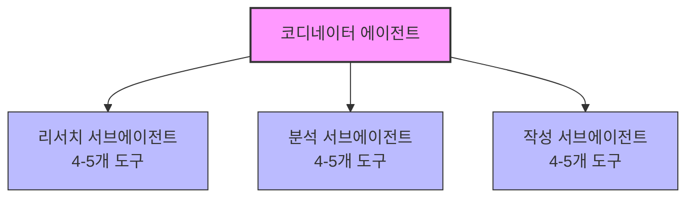
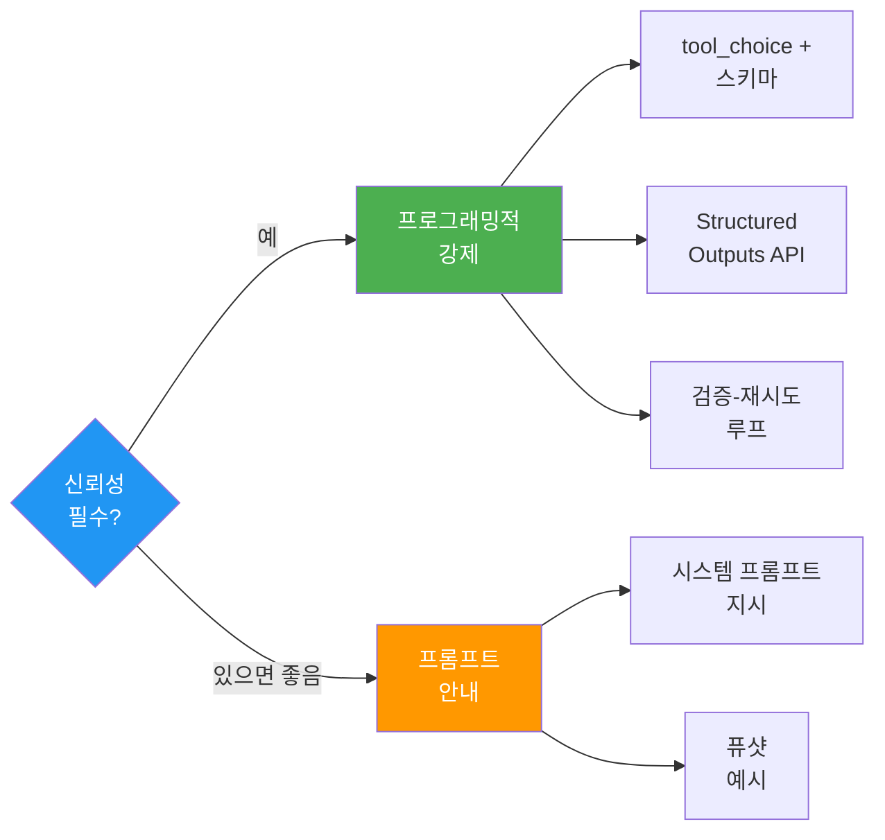

# Claude Certified Architect: CCA Foundations 시험 합격 완벽 가이드

*Rick Hightower 저 — Towards Artificial Intelligence 게재*

---

## 왜 CCA가 지금 중요한가

2026년 3월 12일, **Anthropic**이 **Claude Certified Architect(CCA) Foundations** 시험을 출시했다. AI 업계 최초로 "Claude로 **프로덕션 시스템(production system)**을 실제로 설계할 수 있는가"를 검증하는 전문 자격증이다. 프롬프트를 잘 쓰는지, 튜토리얼을 완료했는지를 보는 시험이 아니다. **실제로 동작하는 소프트웨어를 아키텍팅(architect)할 수 있는가**를 시험한다.

💡 Anthropic은 이 자격증과 함께 **1억 달러 규모의 Claude Partner Network** 투자를 발표했다. 파트너사 규모가 이 투자의 의미를 말해준다:

| 파트너 | 규모 |
|--------|------|
| **Accenture** | 30,000명 전문가 교육, Anthropic Business Group 신설 |
| **Cognizant** | 350,000명에게 Claude 접근권 부여 |
| **Deloitte** | 470,000명을 플랫폼에 투입 |
| **Infosys** | Center of Excellence 구축 |

이들은 파일럿이 아니다. **수십만 명 단위의 인력 전환(workforce transformation)**이다. 이 모든 조직에 Claude 기반 시스템을 아키텍팅할 수 있는 사람이 필요하고, CCA는 표준화된 검증 신호(standardized signal)가 없는 시장에서 **최초의 표준화된 신호**다.

시장이 아직 형성 중일 때 CCA 배지를 들고 나타나는 것과, 2년 뒤 모두가 가지고 있을 때 나타나는 것은 전혀 다른 상황이다. 줄은 짧다. 곧 아주 길어질 것이다.

---

## 시험 형식

💡 이 시험이 어떤 시험인지 솔직하게 말하겠다. 이것은 **301 레벨(301-level)** 시험으로, 최소 6개월 이상 Claude 실무 경험이 있는 **숙련된 전문가(seasoned professionals)**를 대상으로 설계되었다.

| 항목 | 내용 |
|------|------|
| 문항 수 | **60문항** |
| 시간 | **120분** (문항당 2분) |
| 합격 점수 | **720 / 1,000** |
| 비용 | **$99** |
| 난이도 | **301 레벨** (6개월 이상 실무 경험 전제) |
| 형식 | **시나리오 기반 객관식** (150-200단어 시나리오 후 최적 아키텍처 결정 선택) |
| 시험 환경 | 감독관(proctored) 모니터링, 일시 중지 불가, 외부 도구 사용 불가 |
| 프로덕션 시나리오 | 6개 중 **4개 랜덤 출제** (전부 준비해야 함) |

💡 **오답지(distractor)**가 매우 그럴듯하다. 실제로 될 것 같은 답처럼 보인다. 정답과 그럴듯한 오답의 차이는 종종 하나의 아키텍처 원칙에서 갈린다. 지식이 **브라우저 탭이 아니라 머릿속에 살아야 한다(internalized knowledge)**.

**시간 관리 전략** (초기 응시자 피드백): 1차 패스로 확실한 문제를 먼저 풀고, 망설여지는 문제는 플래그(flag) → 남은 시간에 재방문. 한 문제에 5분 이상 쓰지 말 것.

---

## 5개 역량 도메인(Competency Domain)

시험은 5개 도메인으로 구성된다. 각 도메인은 고유한 비중(weight)을 가지며, 학습 시간도 대략 이 비중을 따라야 한다 — 한 가지 예외가 있는데 아래에서 짚겠다.

| 도메인 | 비중 | 권장 학습 시간 | 핵심 |
|--------|------|---------------|------|
| **1. Agentic Architecture** | 27% | 8-10시간 | 멀티 에이전트 설계, **코디네이터-서브에이전트(coordinator-subagent)** 패턴 |
| **2. Claude Code** | 20% | 6-7시간 | **CLAUDE.md** 계층, CI/CD **`-p`** 플래그 |
| **3. Prompt Engineering** | 20% | 6-7시간 | 구조화된 출력(structured outputs), **tool_choice**, **검증-재시도(validation-retry)** |
| **4. Tool Design & MCP** | 18% | 6-8시간 | **Tool vs Resource** 경계 (**가장 많이 실점하는 도메인**) |
| **5. Context Management** | 15% | 4-5시간 | **Lost in the Middle**, **토큰 경제학(Token Economics)** |

---

### 도메인 1: 에이전트 아키텍처(Agentic Architecture) — 27%

시험에서 가장 큰 비중을 차지하는 도메인이다.

**코디네이터-서브에이전트 패턴(Coordinator-Subagent Pattern)**: 코디네이터 에이전트(coordinator agent)가 전문화된 **서브에이전트(subagent)**에 작업을 위임(delegate)하고, 결과를 종합(synthesize)한다. 멀티 에이전트의 기본 패턴이다.

**허브-앤-스포크 패턴(Hub-and-Spoke Pattern)**: 서브에이전트 간 의존성(dependency)이 없는 병렬 독립 작업.

💡 **핵심 함정**: **서브에이전트는 컨텍스트를 자동 상속하지 않는다(subagents do not automatically inherit context).** 빈 컨텍스트(empty context)에서 시작한다. 필요한 정보를 **명시적으로 전달(explicitly pass)**해야 한다. 이것이 시험에서 **가장 많이 출제되는 개념**이다. 직관에 반하기 때문이다 — 인간은 같은 시스템 안의 에이전트가 인식을 공유한다고 자연스럽게 가정한다.

**"슈퍼 에이전트(Super Agent)" 안티패턴**: **15개 이상의 도구(tool)**를 가진 단일 에이전트. 거의 항상 오답이다. 도구 수가 증가하면 선택 정확도(selection accuracy)가 측정 가능하게 저하된다. 정답은 **에이전트당 4-5개** 도구로 전문 서브에이전트에 분산하는 것이다.

**에스컬레이션 로직(Escalation Logic)**: 에스컬레이션 결정은 **결정론적 규칙(deterministic rules)** — 금액, 계정 등급(account tier), 이슈 유형 — 을 기반으로 해야 한다. 모델의 **자체 보고 신뢰도(self-reported confidence)**로 판단하면 안 된다. "Claude가 처리할 자신이 없다고 판단했다"는 선택지가 보이면 오답이다.

---

### 도메인 2: Claude Code — 20%

**CLAUDE.md 계층(Hierarchy)**:
- **프로젝트 레벨**(`.claude/CLAUDE.md`): 버전 관리(version-controlled)에 포함, 팀 전체가 공유. 프로젝트 표준이 여기에 있다.
- **사용자 레벨**(`~/.claude/CLAUDE.md`): 개인용, 버전 관리에 포함되지 않음. 개인 선호(preference).
- 💡 **안티패턴**: 개인 설정을 프로젝트 CLAUDE.md에 넣는 것. 자신의 선호를 팀 전원에게 강제하게 된다.

**CI/CD 설정**:
- 💡 **`-p` 플래그** (비대화 모드/headless): CI/CD 파이프라인에서 **필수**. 없으면 Claude Code가 대화형 입력을 기다리며 **시스템이 멈춘다(hang)**.
- **`--bare` 플래그**: 자동 검색(auto-discovery)을 건너뛰어 **재현 가능한(reproducible)** 동작을 보장. Anthropic은 `-p`의 기본값으로 만들 예정.
- **`--output-format json`**: 파이프라인 파싱(parsing)을 위한 구조화된 출력. `text`, `json`, `stream-json` 모드.

**계획 모드(Plan Mode) vs 직접 실행(Direct Execution)**:
- **계획 모드**: 복잡한 멀티 파일 변경. Claude가 계획을 먼저 보여주고 승인 후 실행.
- **직접 실행**: 명확하고 저위험(low-risk)한 단일 작업. 즉시 실행.
- 💡 시험 팁: 시나리오에서 "복잡한 멀티스텝(multi-step) 변경"이 나오면 **계획 모드가 정답**. 복잡한 작업에 직접 실행은 안티패턴.

---

### 도메인 3: 프롬프트 엔지니어링(Prompt Engineering) — 20%

💡 **핵심 안티패턴**: 프롬프트만으로 JSON 준수(compliance)를 강제하는 것. "Please respond only in valid JSON"은 대부분의 경우 동작하지만, **프로덕션에서 실패한다**. "대부분"은 프로덕션 시스템에 충분하지 않다.

**정답들**:
- **`tool_choice`** + 입력 스키마(input schema): 모델이 정의된 스키마를 가진 특정 도구를 사용하도록 강제
- **Structured Outputs API** (`client.messages.parse()` + Pydantic 모델): 프로그래밍적 형식 강제
- **검증-재시도 루프(validation-retry loop)**: 출력을 스키마로 검증 → 실패 시 에러를 Claude에 전달 → 재시도

💡 **시험 팁**: "시스템 프롬프트에 지시를 추가한다" 또는 "더 상세한 포맷팅 가이드를 제공한다"는 선택지는 **거의 항상 오답**이다. 시험은 일관되게 **프롬프트 기반 안내보다 프로그래밍적 강제(programmatic enforcement)**를 정답으로 채택한다.

**Stop Reason** — 반드시 알아야 한다:

| Stop Reason | 의미 |
|-------------|------|
| `tool_use` | 도구 결과 대기 중 (결과를 돌려줘야 함) |
| `end_turn` | 응답 완료 |
| `max_tokens` | 토큰 한도 도달 |

`tool_use` **stop reason**을 확인하지 않으면 도구 결과를 완전히 놓치게 된다.

---

### 도메인 4: 도구 설계와 MCP(Tool Design & MCP) — 18%

💡 이 도메인은 **다크호스(dark horse)**다. 비중(18%)이 난이도를 과소평가한다. 초기 응시자들이 **가장 많은 예상 외 실점(unexpected point loss)**을 보고한 영역이다. 비중보다 학습 시간을 더 투자해야 한다.

**MCP 3대 프리미티브(Three Primitives)**:

| 프리미티브 | 목적 | 판별법 |
|-----------|------|--------|
| **Tool** (도구) | 실행 가능한 함수 (DB 쿼리, API 호출, 파일 쓰기) | "Claude가 이것을 **실행**해서 뭔가를 **일어나게** 해야 하는가?" → Tool |
| **Resource** (리소스) | 읽기 전용 데이터 (문서, 스키마, 지식 베이스) | "Claude가 이것을 **읽기만** 하면 되는가?" → Resource |
| **Prompt** (프롬프트) | 재사용 가능한 템플릿/워크플로우 | 미리 정의된 지시 패턴 |

💡 **Tool vs Resource 경계**를 정확히 구분하는 것이 이 도메인의 핵심 역량이다.

**도구 설명(Tool Description)**: Claude가 어떤 도구를 호출할지 결정하는 **주요 메커니즘**이다. 에이전트 이름도, 도구 이름도 아닌 **설명(description)**으로 라우팅한다. "handles customer requests" 같은 모호한 설명은 잘못된 도구 선택으로 이어진다. 코드베이스를 한 번도 본 적 없는 개발자를 위한 문서를 쓴다고 생각하고 작성하라.

**4-5 도구 규칙(4-5 Tool Rule)**: 에이전트당 **4-5개** 도구가 적정선이다. 18개 도구를 가진 에이전트는 선택 정확도가 저하된다. 초과분은 전문 서브에이전트로 분산해야 한다.

**MCP 설정 파일**:
- **`.mcp.json`**: 프로젝트 레벨, 버전 관리 포함
- **`~/.claude.json`**: 사용자 레벨, 개인
- CLAUDE.md 계층과 동일한 패턴.

---

### 도메인 5: 컨텍스트 관리(Context Management) — 15%

비중은 가장 낮지만, **다른 모든 도메인에 걸쳐 영향을 미친다(cross-cuts)**.

💡 **"Lost in the Middle" 효과**: 트랜스포머(Transformer) 모델은 컨텍스트 창의 **처음과 끝**에 더 많은 주의(attention)를 기울이고, **중간은 덜 기울인다**. 이것은 컨텍스트 창 크기와 무관하다 — 창이 아무리 크더라도 발생한다. 중요한 정보를 컨텍스트의 **처음 또는 끝**에 배치하라.

<!-- image: 컨텍스트 창 전체의 주의 분포 다이어그램 - U자형 곡선으로 처음과 끝에서 높고 중간에서 낮음 -->

**토큰 경제학(Token Economics)** — 이 표를 반드시 암기하라:

| API | 비용 절감 | 지연 시간(latency) | 적합한 용도 |
|-----|----------|-------------------|------------|
| **Prompt Caching** (프롬프트 캐싱) | 최대 **90%** | 실시간 | 반복 시스템 프롬프트, 정책 문서 |
| **Batch API** (배치 API) | **50%** | 최대 **24시간** | 야간 감사, 대량 처리 |
| **Real-Time API** (실시간 API) | 표준 | 실시간 | 사용자 대면 워크플로우 |

💡 **시험 팁**: 사용자가 응답을 기다리는 상황에서 비용 최적화를 묻는다면, 답은 **절대 Batch API가 아니다**. **Prompt Caching**이다. Batch API는 최대 24시간 지연이 발생한다 — 라이브 사용자 인터랙션에는 사용할 수 없다.

---

## 6개 프로덕션 시나리오

시험은 매번 6개 중 **4개를 랜덤으로 출제**한다. 전부 준비해야 한다.

### 시나리오 1: 고객 지원 에이전트(Customer Support Agent)

💡 **핵심 함정**: Claude의 **자체 신뢰도 점수(self-reported confidence score)**로 에스컬레이션 결정을 내리는 것. 항상 오답이다. **결정론적 규칙(deterministic rules)** — 금액, 계정 등급, 이슈 유형 — 을 사용하라.

```python
# 오답 — 모델의 자체 판단에 의존
if claude_response.confidence < 0.7:
    escalate_to_human()

# 정답 — 결정론적 규칙 사용
if transaction_amount > 10000 or account_tier == "enterprise":
    escalate_to_human()
```

### 시나리오 2: Claude Code 코드 생성

💡 **핵심 함정**: **큰 컨텍스트 창(larger context window)**이 주의력 분산 문제를 해결한다고 믿는 것. **Lost in the Middle** 효과는 컨텍스트 창 크기와 독립적이다. 200K 토큰 창에서도 중간의 주의력 저하(attention degradation)는 발생한다.

### 시나리오 3: 멀티 에이전트 리서치(Multi-Agent Research)

💡 **핵심 함정**: 18개 도구를 가진 **"슈퍼 에이전트(super agent)"**. 정답은 전문 서브에이전트에 도구를 분산하는 것이다 (에이전트당 4-5개). 또한 기억하라: **서브에이전트는 컨텍스트를 자동 상속하지 않는다**. 빈 슬레이트(blank slate)에서 시작한다.



### 시나리오 4: 개발자 생산성 도구(Developer Productivity Tool)

**핵심 포커스**: **계획 모드(Plan Mode) vs 직접 실행(Direct Execution)** 판단, **CLAUDE.md 계층(hierarchy)** 설정. 복잡한 멀티 파일 변경은 계획 모드가 필요하다.

### 시나리오 5: CI/CD용 Claude Code

💡 **핵심 함정**: **`-p` 플래그 없이** CI/CD에서 Claude Code를 실행하는 것. 대화형 입력을 기다리며 시스템이 멈춘다.

```bash
# 오답 — CI/CD에서 시스템이 멈춤
claude code "run tests"

# 정답 — 비대화 모드(non-interactive mode)
claude -p "run tests" --bare --output-format json
```

### 시나리오 6: 구조화 데이터 추출(Structured Data Extraction)

💡 **핵심 함정**: **프롬프트만으로** JSON 준수를 강제하는 것. 정답은 `tool_choice` + 스키마 + **검증-재시도 루프(validation-retry loop)**.

```python
# 오답 — 프롬프트만으로 형식 강제
response = client.messages.create(
    model="claude-sonnet-4-20250514",
    messages=[{"role": "user", "content": "데이터를 JSON으로 추출해주세요..."}]
)

# 정답 — 프로그래밍적 강제
response = client.messages.create(
    model="claude-sonnet-4-20250514",
    tools=[extraction_tool],  # 추출용 도구 정의
    tool_choice={"type": "tool", "name": "extract_data"},  # 도구 강제 사용
    messages=[{"role": "user", "content": "다음에서 데이터를 추출하세요..."}]
)
# 그 다음 출력을 스키마로 검증하고 실패 시 재시도
```

---

## 합격자를 만드는 5가지 멘탈 모델

| # | 멘탈 모델 | 원칙 |
|---|-----------|------|
| 1 | **프로그래밍적 강제 > 프롬프트 안내** | 프롬프트는 가이드(guidance)다. **코드는 법(law)**이다. 신뢰성이 필요하면 답은 항상 코드다. |
| 2 | **서브에이전트는 컨텍스트를 상속하지 않는다** | **빈 슬레이트(blank slate)**에서 시작한다. 명시적 전달이 필수. 가장 많이 시험되는 개념. |
| 3 | **Tool Description이 라우팅을 결정한다** | Claude는 에이전트 이름이나 도구 이름이 아닌 **설명(description)**으로 도구를 선택한다. 모호한 설명 = 잘못된 도구 호출. |
| 4 | **"Lost in the Middle" 효과는 실재한다** | 중요 정보를 컨텍스트의 **처음 또는 끝**에 배치하라. 모든 긴 컨텍스트 시나리오에 적용. |
| 5 | **API를 지연 시간 요구에 맞춰라** | 사용자 대기 → 실시간(Real-Time) + **Prompt Caching**. 배경 작업 → **Batch API**. |



---

## 4주 학습 계획

| 주차 | 과정 | 목표 |
|------|------|------|
| **1주차** | Claude 101, AI Fluency Framework | 어휘와 멘탈 모델 내재화 (**에이전트 루프(agentic loop)**, **컨텍스트 분기(context forking)**, **stop reason**, **tool_choice** 등) |
| **2주차** | Building with the Claude API (8-10시간, **최우선**) | **검증-재시도 루프(validation-retry loop)**를 직접 구축. `tool_choice` 구조화 출력 구현. 3-4개 도구를 가진 에이전트 빌드. |
| **3주차** | MCP Mastery, Claude Code in Action, Agent Skills | MCP 서버 구축 (Tool 3개 + Resource 1개). CLAUDE.md 설정. CI/CD에서 `-p` 플래그로 실행. |
| **4주차** | 모의 시험 + 안티패턴 복습 | 실전 조건(노트 없음, 문서 없음) 모의 시험. **900점 이상** 목표 후 본 시험 등록. |

**총 학습 시간**: **30-37시간** (이미 Claude로 개발 경험이 있는 경우). 초심자는 2-4주 추가.

💡 **연습을 건너뛰지 마라(Do not skip the exercises).** 이 루프를 직접 만들어라; 읽기만 하지 마라. 시험 볼 때까지 MCP 서버를 한 번도 만들어보지 않았다면, 이 도메인에서 **도박(gambling)**하는 것이다.

---

## 초기 응시자 피드백

시험 출시 11일 만의 커뮤니티 반응:

- 난이도는 **실제로 높다**: "튜토리얼 완료 자격증이 아니다."
- **MCP Tool 경계(boundary)**가 가장 흔한 예상 외 실점 원인
- **안티패턴 인식(anti-pattern recognition)**이 정답을 아는 것만큼 중요
- **시나리오 체인(scenario chain)** (한 문제의 컨텍스트가 다음에 이어짐)에서 시간 관리가 필수
- Reddit에서 **985/1000** 점수 보고 — 만점에 가까운 점수가 가능
- 720 합격선은 의미 있는 오차 범위(margin for error)를 제공

---

## 학습 자료

### Anthropic 공식
- **Anthropic Academy**: anthropic.skilljar.com (13개 과정, 무료)
- **CCA 시험 가이드**: 공식 SlideShare 가이드
- **모의 시험**: Anthropic Academy 내 (900점 이상 벤치마크)
- **시험 등록**: 접근 요청 양식

### 공식 문서
- Claude Agent SDK
- Claude Code
- MCP (Model Context Protocol)
- Advanced Tool Use
- Batch Processing
- Structured Outputs

### 커뮤니티
- **DEV Community**: CCA 프로그램 내부 정보, 준비 로드맵
- **FlashGenius**: CCA 플래시카드
- **Udemy**: CCA 모의 시험

---

## 다음 편 예고

이 글은 8부작 시리즈의 첫 번째다. 이후 각 글에서 6개 프로덕션 시나리오를 하나씩 심층 분석하며, 아키텍처 패턴, 코드 예시, 시험이 설정하는 구체적인 함정을 다룬다.

사전 준비를 먼저 하라. 시험에 등록하고, 학습 자료를 북마크하고, 오늘부터 1주차 학습 계획을 시작하라.

시장이 형성되고 있다. 줄은 짧다. 곧 아주 길어질 것이다.

---

*Rick Hightower는 Fortune 100 금융 기관에서 ML/AI 개발을 이끈 기술 임원이다.*
