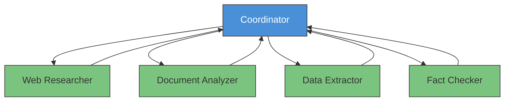
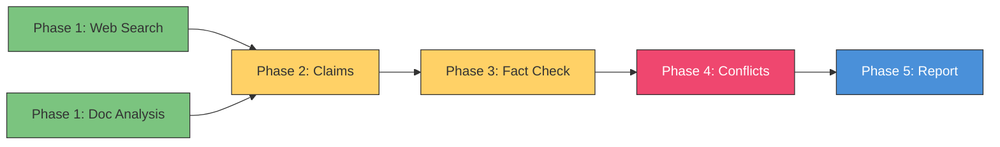

# CCA Exam Prep: Mastering the Multi-Agent Research System Scenario

The **multi-agent research system** is the most comprehensive scenario on the CCA exam. It simultaneously tests three core domains — **Agentic Architecture** (27%), **Tool Design** (18%), and **Context Management** (15%) — covering a combined **60%** of the exam weight. Master this scenario, and you've covered more than half the exam.

## Why This Scenario Matters

This scenario integrates the highest-weighted domains into a single, realistic system design. The patterns you learn here — **context isolation**, **focused tooling**, **structured error handling**, and **explicit context passing** — recur throughout the entire exam.

## The Hub-and-Spoke Architecture

The multi-agent research system follows a **hub-and-spoke coordinator pattern**. A central **coordinator** (the hub) delegates work to specialized **sub-agents** (the spokes), then synthesizes their results.

### The Newsroom Mental Model

Think of a newsroom. The **editor** (coordinator) assigns stories. The **politics reporter**, **finance reporter**, and **investigative reporter** (sub-agents) each cover their beat, then submit their articles back to the editor, who combines them into one cohesive piece.

The critical insight: **reporters don't talk to each other**. All coordination flows through the editor. If the politics reporter has context that would help the finance reporter, it must go through the editor first.

### System Architecture



Each agent has a **focused set of 4–5 tools**:

| Agent | Tools (4–5 each) | Role |
|-------|-------------------|------|
| **Web Researcher** | `search_web`, `fetch_page`, `extract_text`, `summarize_source` | Search and process web content |
| **Document Analyzer** | `parse_document`, `extract_sections`, `identify_claims`, `check_citations` | Analyze document structure and claims |
| **Data Extractor** | `query_database`, `transform_data`, `validate_schema`, `format_output` | Extract and structure data |
| **Fact Checker** | `verify_claim`, `cross_reference`, `score_reliability`, `flag_conflict` | Verify facts and assess reliability |
| **Coordinator** | `delegate_task`, `collect_results`, `resolve_conflicts`, `compile_report` | Orchestration and synthesis |

## Context Isolation: The Concept That Fails the Most Candidates

Here's the single most important sentence in this article:

> **Sub-agents do not inherit the coordinator's context.**

Each sub-agent starts as a **blank slate**. When the coordinator spawns a sub-agent, that sub-agent knows nothing about the coordinator's conversation history, the overall research plan, or what other sub-agents are doing — unless this information is **explicitly passed**.

### Why This Trips People Up

If you come from a multithreaded programming background, you carry a **"shared memory" mental model**. Parent processes share memory with child processes. But in the agent world, this does not apply. Each agent operates in an **isolated context**.

### A Concrete Failure Example

The coordinator's context includes the instruction: "All citations must use APA format." The coordinator delegates a document analysis task to the Document Analyzer but **does not explicitly include** the citation format requirement in the delegation message.

**Result**: The Document Analyzer returns citations in MLA format. The coordinator "knew" the requirement, but the sub-agent didn't — because **context is not inherited**.

### Explicit Context Passing

What a sub-agent **receives**:
- A specific task description
- Relevant constraints and requirements
- The expected output format
- Context needed for the task

What a sub-agent **does NOT receive**:
- The coordinator's full conversation history
- Other sub-agents' results (unless explicitly passed)
- The full research plan (unless explicitly passed)

This is the principle of **explicit context passing**. If the sub-agent needs to know something, you must **explicitly include it** in the delegation. There is no implicit inheritance.

### Context Forking

When you need to pass context to a sub-agent, think of it as **context forking** — like Unix `fork()`. You selectively copy the relevant portions of the parent's context to the child. Not everything, just what's needed for the specific task.

## The Super-Agent Anti-Pattern

**18 tools in a single agent = failure.**
**4–5 tools across 5 specialized agents = success.**

### The Attention Tax

Why do super-agents fail? Because of the **attention tax**:

- Every time the agent selects a tool, it must evaluate **all 18 tool descriptions**
- Similar tools (`search_web`, `search_docs`, `search_db`, `search_archive`, `search_kb`) create **ambiguity**
- Tools irrelevant to the current task **consume attention** on every decision

This is a tax — an unavoidable cost imposed on every single tool selection. More tools means higher tax, means worse performance.

### Show Truck vs Work Truck

Think about trucks. A **show truck** — chrome-plated, oversized tires, lift kit — looks impressive at a car show. But it's useless on a job site. A **work truck** — maybe scratched and dented, but with the right hitch, the right bed size, and the right towing capacity — gets the job done.

A super-agent with 18 tools is a show truck. It **looks** capable but **performs** poorly.

> **"Like wearing a 10-gallon cowboy hat with no ranch."**

More capability ≠ more effectiveness. The exam tests whether you understand this distinction.

## Silent Sub-Agent Failure

This is the **most dangerous failure mode** in multi-agent systems.

### The Anti-Pattern

1. A sub-agent calls an API that times out
2. The sub-agent returns: `{"status": "success", "data": null}`
3. The coordinator interprets this as "no relevant data found"
4. The final report is generated **missing contradictory evidence**
5. The report appears "complete" — but it's not

The fundamental problem: **"no data exists" and "couldn't reach the source" are completely different situations**, but the response structure makes them indistinguishable.

### The Solution: Structured Error Context

```json
{
  "status": "error",
  "error_type": "timeout",
  "source": "api.example.com",
  "attempted_at": "2026-03-23T14:30:00Z",
  "retry_eligible": true,
  "partial_data": null,
  "fallback_available": false
}
```

With structured error context, the coordinator can:
- **Retry** failures that are retry-eligible
- **Flag data gaps** in the report explicitly
- **Adjust confidence** for conclusions that depend on missing sources

## MCP Integration and Tool Descriptions

### The Three MCP Primitives

The exam tests your vocabulary here:

| Primitive | What It Is | Analogy |
|-----------|-----------|---------|
| **Tools** | Executable functions the agent calls | Verbs |
| **Resources** | Data schemas/catalogs the agent queries | Nouns |
| **Prompts** | Templates for common tasks | Patterns |

### Negative Bounds in Tool Descriptions

Good tool descriptions include **negative bounds** — they specify not just what a tool does, but **what it does NOT do**.

**Good tool description**:
```
search_web: Searches the public web for information matching the query.
Returns URLs, titles, and snippets.
Does NOT fetch full page content (use fetch_page for that).
Does NOT search private databases or internal documents.
```

**Bad tool description**:
```
search_web: Searches for information.
```

Without negative bounds, the agent may attempt to use the tool for purposes outside its scope — leading to **misrouting** and **wasted tokens**.

## Task Decomposition Strategy

Effective multi-agent research follows a **task decomposition DAG** (Directed Acyclic Graph) — the same concept as dependency graphs in build systems like Make or Gradle.

| Phase | Task | Parallel/Sequential | Rationale |
|-------|------|---------------------|-----------|
| **Phase 1** | Web search + Document analysis | **Parallel** | Independent inputs |
| **Phase 2** | Claim extraction | Sequential | Depends on Phase 1 results |
| **Phase 3** | Fact checking | Sequential | Depends on extracted claims |
| **Phase 4** | Conflict resolution | Sequential | Depends on fact-check results |
| **Phase 5** | Report compilation | Sequential | Depends on resolved results |



Phase 1 tasks run in **parallel** because they have no dependencies on each other. Phases 2–5 must be **sequential** because each depends on the output of the previous phase.

## Conflict Resolution Strategy

When multiple sources disagree, the coordinator needs a systematic approach:

1. **Source reliability ranking** — Peer-reviewed > official docs > news > blog posts > social media
2. **Majority consensus** — If 4 out of 5 sources agree, the outlier needs stronger evidence
3. **Human escalation** — High-stakes claims with unresolvable conflicts get flagged for human review

The anti-pattern: **"first result wins"** — accepting whichever sub-agent responds first without cross-validation.

## Validation-Retry Loop

A robust multi-agent system includes a **validation-retry loop**:

1. Sub-agent returns result
2. Coordinator validates the result against expected schema/format
3. If validation fails → send error feedback + retry
4. If validation passes → incorporate into synthesis

This pattern applies across all Prompt Engineering scenarios on the exam.

## Key Takeaways for the Exam

1. **Sub-agents do NOT inherit coordinator context** — They only know what you explicitly pass. The answer to "why didn't the sub-agent follow the coordinator's instruction?" is always "the instruction wasn't passed."

2. **18 tools = failure, 4–5 tools = success** — This is an architectural best practice, not an SDK hard limit. More tools → predictably lower selection accuracy.

3. **Silent failure is the most dangerous failure mode** — If you can't distinguish "no data" from "source unreachable," incomplete results look complete. Structured error context is the only solution.

4. **Tool descriptions must include negative bounds** — Positive bounds alone allow the agent to attempt out-of-scope inputs.

5. **Conflict resolution requires strategy** — Source reliability ranking, majority consensus, human escalation for high-risk claims. "First result wins" is an anti-pattern.

6. **In hub-and-spoke, spokes never talk to each other** — All coordination goes through the hub. Direct communication or automatic context sharing between sub-agents is always wrong.

Good luck on the exam.
