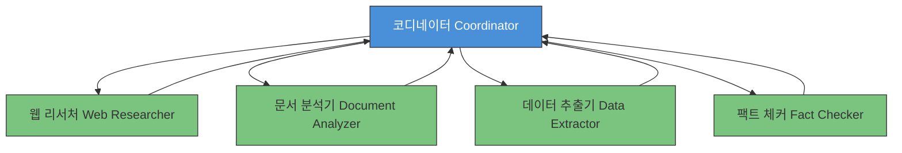
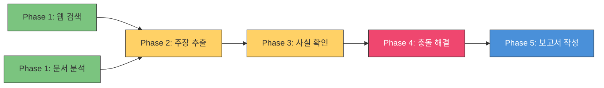

# CCA 시험 대비: 멀티에이전트 리서치 시스템 시나리오 완전 공략

**멀티에이전트 리서치 시스템**(Multi-Agent Research System)은 CCA 시험에서 가장 포괄적인 시나리오다. **에이전틱 아키텍처**(Agentic Architecture, 27%), **도구 설계**(Tool Design, 18%), **컨텍스트 관리**(Context Management, 15%) — 이 세 핵심 도메인을 동시에 테스트하며, 합산 가중치가 **60%**에 달한다. 이 시나리오 하나만 제대로 익히면 시험의 절반 이상을 커버할 수 있다.

## 이 시나리오가 중요한 이유

이 시나리오는 가장 높은 가중치의 도메인들을 하나의 현실적인 시스템 설계에 통합한다. 여기서 배운 패턴들 — **컨텍스트 격리**(context isolation), **집중 도구 구성**(focused tooling), **구조화된 에러 핸들링**(structured error handling), **명시적 컨텍스트 전달**(explicit context passing) — 은 시험 전반에 걸쳐 반복 출제된다.

## 허브앤스포크 아키텍처 (Hub-and-Spoke Architecture)

멀티에이전트 리서치 시스템은 **허브앤스포크 코디네이터 패턴**(hub-and-spoke coordinator pattern)을 따른다. 중앙의 **코디네이터**(coordinator, 허브)가 전문화된 **서브에이전트**(sub-agent, 스포크)에 작업을 위임한 뒤, 결과를 종합한다.

### 뉴스룸 멘탈 모델 (Newsroom Mental Model)

뉴스룸을 떠올려 보자. **편집자**(코디네이터)가 기사를 배정한다. **정치 기자**, **금융 기자**, **탐사 기자**(서브에이전트)가 각자 자기 분야를 취재한 뒤 기사를 제출하면, 편집자가 하나의 일관된 기사로 조합한다.

💡 핵심 포인트: **기자들은 서로 대화하지 않는다**. 모든 조율은 편집자를 통해서만 이뤄진다. 정치 기자가 금융 기자에게 도움이 될 컨텍스트를 갖고 있어도, 반드시 편집자를 거쳐야 한다.

### 시스템 아키텍처



각 에이전트는 **4-5개의 집중된 도구**를 가진다:

| 에이전트 | 도구 (각 4-5개) | 역할 |
|---------|----------------|------|
| **웹 리서처**(Web Researcher) | `search_web`, `fetch_page`, `extract_text`, `summarize_source` | 웹 콘텐츠 검색 및 처리 |
| **문서 분석기**(Document Analyzer) | `parse_document`, `extract_sections`, `identify_claims`, `check_citations` | 문서 구조 및 주장 분석 |
| **데이터 추출기**(Data Extractor) | `query_database`, `transform_data`, `validate_schema`, `format_output` | 데이터 추출 및 구조화 |
| **팩트 체커**(Fact Checker) | `verify_claim`, `cross_reference`, `score_reliability`, `flag_conflict` | 사실 확인 및 신뢰도 평가 |
| **코디네이터**(Coordinator) | `delegate_task`, `collect_results`, `resolve_conflicts`, `compile_report` | 오케스트레이션 및 종합 |

## 컨텍스트 격리: 가장 많은 수험생을 탈락시키는 개념 (Context Isolation)

이 아티클에서 가장 중요한 한 문장:

> 💡 **서브에이전트는 코디네이터의 컨텍스트를 상속하지 않는다.** (Sub-agents do not inherit the coordinator's context.)

각 서브에이전트는 **빈 상태**(blank slate)에서 시작한다. 코디네이터가 서브에이전트를 생성할 때, 그 서브에이전트는 코디네이터의 대화 이력, 전체 리서치 계획, 다른 서브에이전트의 상태에 대해 아무것도 모른다 — **명시적으로 전달**(explicitly passed)하지 않는 한.

### 왜 이것이 수험생을 혼란에 빠뜨리는가

멀티스레드 프로그래밍 배경이 있는 사람은 **"공유 메모리"(shared memory) 멘탈 모델**을 가져온다. 부모 프로세스가 자식 프로세스와 메모리를 공유하듯이, 코디네이터의 정보를 서브에이전트가 자연스럽게 볼 수 있다고 생각한다. 하지만 에이전트 세계에서는 이 모델이 적용되지 않는다. 각 에이전트는 **격리된 컨텍스트**(isolated context)에서 작동한다.

### 구체적 실패 사례

코디네이터의 컨텍스트에 "모든 인용은 APA 형식으로(All citations must use APA format)"라는 지시가 있다. 코디네이터가 문서 분석기에 작업을 위임할 때 이 인용 형식 요구사항을 **명시적으로 포함하지 않았다**.

**결과**: 문서 분석기가 MLA 형식의 인용을 반환한다. 코디네이터는 "알고 있었지만" 서브에이전트는 몰랐다 — 왜냐하면 **컨텍스트는 상속되지 않기** 때문이다.

### 명시적 컨텍스트 전달 (Explicit Context Passing)

서브에이전트가 **받는 것**:
- 구체적 작업 설명(specific task description)
- 관련 제약 조건과 요구사항(relevant constraints and requirements)
- 기대 출력 형식(expected output format)
- 작업에 필요한 컨텍스트(context needed for the task)

서브에이전트가 **받지 않는 것**:
- 코디네이터의 전체 대화 이력(coordinator's full conversation history)
- 다른 서브에이전트의 결과(other sub-agents' results) — 명시적으로 전달하지 않는 한
- 전체 리서치 계획(full research plan) — 명시적으로 전달하지 않는 한

💡 이것이 **명시적 컨텍스트 전달**(explicit context passing)의 원칙이다. 서브에이전트가 무언가를 알아야 한다면, 위임 시 **명시적으로 포함**해야 한다. 암묵적 상속(implicit inheritance)은 없다.

### 컨텍스트 포킹 (Context Forking)

서브에이전트에 컨텍스트를 전달할 때, 이것을 **컨텍스트 포킹**(context forking)이라 생각하면 된다 — Unix의 `fork()`와 같다. 부모의 컨텍스트 중 관련 있는 부분만 선택적으로 자식에게 복제한다. 전부가 아니라, 특정 작업에 필요한 것만.

## 슈퍼에이전트 안티패턴 (Super-Agent Anti-Pattern)

**18개 도구를 가진 단일 에이전트 = 실패.**
**4-5개 도구를 가진 전문 에이전트 5개 = 성공.**

### 주의력 세금 (Attention Tax)

슈퍼에이전트가 실패하는 이유? **주의력 세금**(attention tax) 때문이다:

- 에이전트가 도구를 선택할 때마다 **18개 도구 설명 전부를 평가**해야 한다
- 유사한 도구(`search_web`, `search_docs`, `search_db`, `search_archive`, `search_kb`)가 **모호함**(ambiguity)을 유발한다
- 현재 작업과 무관한 도구가 **매 결정마다 주의력을 소비**한다

이것은 "세금(tax)"이다 — 매 도구 선택에 부과되는 피할 수 없는 비용. 도구가 많을수록 세금이 높아지고, 성능이 떨어진다.

### 쇼 트럭 대 작업 트럭 (Show Truck vs Work Truck)

트럭을 생각해 보자. **쇼 트럭**(show truck) — 크롬 도금, 오버사이즈 타이어, 리프트 킷 — 은 자동차 쇼에서는 인상적이지만 작업 현장에서는 쓸모없다. **작업 트럭**(work truck) — 긁히고 찌그러졌을 수 있지만, 적절한 히치, 적절한 적재함 크기, 적절한 견인 용량을 갖춘 — 이 실제 일을 해낸다.

18개 도구를 가진 슈퍼에이전트는 쇼 트럭이다. **보기에는** 유능하지만 **실제로는** 형편없다.

> 💡 **"목장도 없으면서 10갤런 카우보이 모자를 쓰는 것과 같다."** ("Like wearing a 10-gallon cowboy hat with no ranch.")

더 많은 역량 ≠ 더 많은 효과. 시험은 이 구분을 이해하는지 테스트한다.

## 사일런트 서브에이전트 실패 (Silent Sub-Agent Failure)

이것은 멀티에이전트 시스템에서 **가장 위험한 실패 모드**(most dangerous failure mode)다.

### 안티패턴

1. 서브에이전트가 API를 호출했는데 타임아웃(timeout) 발생
2. 서브에이전트가 반환: `{"status": "success", "data": null}`
3. 코디네이터가 이를 "관련 데이터 없음"으로 해석
4. 최종 보고서가 **반박 증거가 누락된 채** 생성됨
5. 보고서가 "완전해 보이지만" — 실제로는 불완전

💡 근본적 문제: **"데이터가 없다"와 "소스에 접근할 수 없었다"는 완전히 다른 상황**인데, 응답 구조가 이를 구분 불가능하게 만든다.

### 해결책: 구조화된 에러 컨텍스트 (Structured Error Context)

```json
{
  "status": "error",
  "error_type": "timeout",
  "source": "api.example.com",
  "attempted_at": "2026-03-23T14:30:00Z",
  "retry_eligible": true,
  "partial_data": null,
  "fallback_available": false
}
```

구조화된 에러 컨텍스트가 있으면 코디네이터가:
- 재시도 가능한 실패를 **재시도**(retry)할 수 있다
- 보고서에 **데이터 갭을 명시**(flag data gaps)할 수 있다
- 누락된 소스에 의존하는 결론의 **신뢰도를 조정**(adjust confidence)할 수 있다

## MCP 통합과 도구 설명 (MCP Integration and Tool Descriptions)

### MCP 3대 프리미티브 (Three MCP Primitives)

시험에서 용어 구분 능력을 테스트한다:

| 프리미티브 | 정의 | 유추 |
|-----------|------|------|
| **Tools** (도구) | 에이전트가 호출하는 실행 가능한 함수 | 동사(Verb) |
| **Resources** (리소스) | 에이전트가 조회하는 데이터 스키마/카탈로그 | 명사(Noun) |
| **Prompts** (프롬프트) | 공통 작업용 템플릿 | 패턴(Pattern) |

### 도구 설명의 부정 경계 (Negative Bounds in Tool Descriptions)

좋은 도구 설명은 **부정 경계**(negative bounds)를 포함한다 — 도구가 무엇을 하는지뿐 아니라 **무엇을 하지 않는지**도 명시한다.

**좋은 도구 설명**:
```
search_web: 쿼리와 일치하는 정보를 공개 웹에서 검색합니다.
URL, 제목, 스니펫을 반환합니다.
전체 페이지 콘텐츠를 가져오지 않습니다 (fetch_page를 사용하세요).
비공개 데이터베이스나 내부 문서를 검색하지 않습니다.
```

**나쁜 도구 설명**:
```
search_web: 정보를 검색합니다.
```

부정 경계가 없으면, 에이전트가 도구의 범위 밖 용도로 사용을 시도할 수 있다 — **잘못된 라우팅**(misrouting)과 **토큰 낭비**로 이어진다.

## 작업 분해 전략 (Task Decomposition Strategy)

효과적인 멀티에이전트 리서치는 **작업 분해 DAG**(Task Decomposition Directed Acyclic Graph)를 따른다 — Make나 Gradle 같은 빌드 시스템의 의존성 그래프와 동일한 개념이다.

| 단계 | 작업 | 병렬/순차 | 근거 |
|------|------|----------|------|
| **Phase 1** | 웹 검색 + 문서 분석 | **병렬**(Parallel) | 상호 독립적 입력 |
| **Phase 2** | 주장 추출(Claim extraction) | 순차(Sequential) | Phase 1 결과에 의존 |
| **Phase 3** | 사실 확인(Fact checking) | 순차(Sequential) | 추출된 주장에 의존 |
| **Phase 4** | 충돌 해결(Conflict resolution) | 순차(Sequential) | 사실 확인 결과에 의존 |
| **Phase 5** | 보고서 작성(Report compilation) | 순차(Sequential) | 해결된 결과에 의존 |



Phase 1 작업은 서로 의존하지 않으므로 **병렬** 실행이 가능하다. Phase 2-5는 이전 단계의 출력에 의존하므로 **순차** 실행이 필요하다.

## 충돌 해결 전략 (Conflict Resolution Strategy)

여러 소스가 상충할 때, 코디네이터에게는 체계적 접근법이 필요하다:

1. **소스 신뢰도 랭킹**(Source reliability ranking) — 동료 심사(peer-reviewed) > 공식 문서 > 뉴스 > 블로그 > 소셜 미디어
2. **다수결 합의**(Majority consensus) — 5개 소스 중 4개가 동의하면, 이탈 소스에 더 강한 근거가 필요
3. **인간 에스컬레이션**(Human escalation) — 해결 불가능한 고위험 주장은 인간 리뷰로 넘김

💡 안티패턴: **"먼저 도착한 결과가 이긴다"**(first result wins) — 교차 검증 없이 가장 먼저 응답한 서브에이전트의 결과를 수용하는 것.

## 유효성 검사-재시도 루프 (Validation-Retry Loop)

견고한 멀티에이전트 시스템은 **유효성 검사-재시도 루프**(validation-retry loop)를 포함한다:

1. 서브에이전트가 결과를 반환
2. 코디네이터가 기대 스키마/형식에 대해 결과를 검증
3. 검증 실패 시 → 에러 피드백과 함께 재시도
4. 검증 통과 시 → 종합에 포함

이 패턴은 시험의 모든 프롬프트 엔지니어링 시나리오에 적용된다.

## 시험 핵심 요약

1. 💡 **서브에이전트는 코디네이터 컨텍스트를 상속하지 않는다** — 명시적으로 전달한 것만 안다. "왜 서브에이전트가 코디네이터 지시를 따르지 않았는가?"의 답은 항상 "지시가 전달되지 않았다".

2. 💡 **18개 도구 = 실패, 4-5개 = 성공** — SDK 하드 리밋이 아닌 아키텍처 모범 사례. 도구가 많을수록 선택 정확도 저하는 예측 가능한 결과.

3. 💡 **사일런트 실패는 가장 위험한 실패 모드** — "데이터 없음"과 "소스 불가"를 구분할 수 없으면, 불완전한 결과가 완전한 것처럼 보인다. 구조화된 에러 컨텍스트가 유일한 해결책.

4. 💡 **도구 설명에 부정 경계를 포함해야 한다** — 긍정 경계만으로는 에이전트가 범위 밖 입력을 시도할 수 있다.

5. 💡 **충돌 해결에는 전략이 필요하다** — 소스 신뢰도 랭킹, 다수결 합의, 고위험 주장은 인간 에스컬레이션. "먼저 도착한 결과가 이긴다"는 안티패턴.

6. 💡 **허브앤스포크에서 스포크끼리는 절대 대화하지 않는다** — 모든 조율은 허브(코디네이터)를 통해서만. 서브에이전트 간 직접 통신이나 자동 컨텍스트 공유는 항상 오답.

시험 건투를 빕니다.
