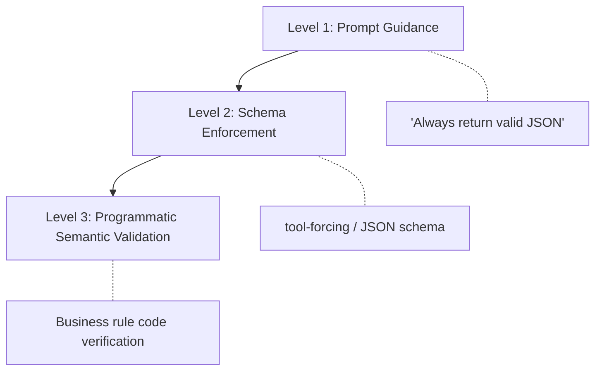
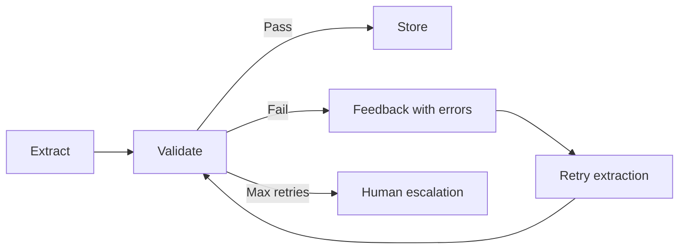

# CCA Exam Prep: Structured Data Extraction

The **structured data extraction** scenario is the one that fails the most candidates. It precisely tests the difference between "works in a demo" and "works in production."

## The Three-Level Reliability Model

**Burn this into your memory.** Every extraction system needs three layers of reliability, and the exam always rewards the Level 3 answer.



| Level | Mechanism | Problem Solved | Limitation |
|-------|-----------|---------------|------------|
| **Level 1**: Prompt Guidance | "Always return valid JSON" | Tells Claude what to do | **Probabilistic nudge**, not a guarantee |
| **Level 2**: Schema Enforcement | tool-forcing / `--json-schema` | Guarantees **structural** conformance | Does not verify **semantic** accuracy |
| **Level 3**: Programmatic Validation | Business rule code | Verifies actual accuracy of extracted data | — |

**Why this order matters**: Each layer only makes sense if the previous layer succeeds. Running semantic validation on structurally invalid data just wastes compute.

## Level 1: Why Prompt Guidance Fails

"Always return valid JSON" in your system prompt shifts the probability distribution strongly toward JSON output — but it does **not eliminate** other possibilities:

| Failure Mode | Example |
|-------------|---------|
| Markdown code fence wrapping | ````json { ... } ```` |
| Explanatory text prepended | "Here is the extracted data:" + JSON |
| Schema mismatch | Unexpected fields, missing fields, type errors |
| **Hallucinated values** | "payment pending" → `"status": "completed"` |
| Truncation under context pressure | Long documents with missing closing braces |

In the words of Admiral Ackbar: **"It's a trap!"** When you see a prompt-enhancement answer on the exam, eliminate it immediately.

## Level 2: Schema Enforcement — SDK Patterns

### Approach 1 — Tool-Forcing

The key mechanism: define a tool whose `input_schema` is the JSON schema you want, then use `tool_choice` to **force** Claude to call it.

```python
# Define the extraction tool
extraction_tool = {
    "name": "extract_invoice",
    "description": "Extract structured invoice data from the document",
    "input_schema": {
        "type": "object",
        "properties": {
            "vendor_name": {"type": "string"},
            "invoice_number": {"type": "string"},
            "date": {"type": "string", "pattern": "^\\d{4}-\\d{2}-\\d{2}$"},
            "line_items": {
                "type": "array",
                "items": {
                    "type": "object",
                    "properties": {
                        "description": {"type": "string"},
                        "quantity": {"type": "integer"},
                        "unit_price": {"type": "number"},
                        "total": {"type": "number"}
                    },
                    "required": ["description", "quantity", "unit_price", "total"]
                }
            },
            "total": {"type": "number"},
            "currency": {"type": "string", "enum": ["USD", "EUR", "GBP", "JPY"]}
        },
        "required": ["vendor_name", "invoice_number", "date", "line_items", "total", "currency"]
    }
}

# Force Claude to use this tool
response = client.messages.create(
    model="claude-sonnet-4-6",
    tools=[extraction_tool],
    tool_choice={"type": "tool", "name": "extract_invoice"},
    messages=[{"role": "user", "content": f"Extract invoice data from this document:\n\n{document_text}"}]
)

# Extract the structured data
extracted = response.content[0].input
```

**`tool_choice` is the key** — it forces Claude into a specific tool call. No markdown wrappers, no explanatory text — just schema-conformant JSON.

### Approach 2 — `client.messages.parse()` (Pydantic)

```python
from pydantic import BaseModel
from typing import List

class LineItem(BaseModel):
    description: str
    quantity: int
    unit_price: float
    total: float

class Invoice(BaseModel):
    vendor_name: str
    invoice_number: str
    date: str
    line_items: List[LineItem]
    total: float
    currency: str

response = client.messages.parse(
    model="claude-sonnet-4-6",
    output_format=Invoice,  # Pydantic model
    messages=[{"role": "user", "content": f"Extract invoice data:\n\n{document_text}"}]
)

extracted = response.parsed_output  # Typed Pydantic object
```

### Exam Trap: `with_structured_output()`

**`with_structured_output()` is a LangChain method**, NOT the native Anthropic SDK. When a question says "implement using the native Anthropic SDK" and this option appears — eliminate it immediately. The correct answers are `tool_choice` (tool-forcing) or `client.messages.parse()` (Pydantic).

## Level 3: Programmatic Semantic Validation

Schema enforcement guarantees that the `total` field is a `number` type — but it does **not** verify that the number matches the sum of `line_items`. **A perfectly formatted check is not the same as a check that will clear.**

```python
def validate_invoice(extracted: dict) -> tuple[bool, list[str]]:
    errors = []

    # Date format validation
    try:
        datetime.strptime(extracted["date"], "%Y-%m-%d")
    except ValueError:
        errors.append(f"Invalid date format: {extracted['date']}")

    # Line items sum vs total validation
    calculated_total = sum(item["total"] for item in extracted["line_items"])
    if abs(calculated_total - extracted["total"]) > 0.01:
        errors.append(
            f"Total mismatch: stated {extracted['total']}, "
            f"calculated {calculated_total}"
        )

    # Total must be positive
    if extracted["total"] <= 0:
        errors.append(f"Total must be positive: {extracted['total']}")

    # Vendor name validation against known list
    known_vendors = load_known_vendors()  # External data source
    if extracted["vendor_name"] not in known_vendors:
        errors.append(f"Unknown vendor: {extracted['vendor_name']}")

    return (len(errors) == 0, errors)
```

### The Self-Reported Confidence Trap

"Ask Claude to rate its extraction confidence on a 1-10 scale." This sounds reasonable — but it is an **anti-pattern**. Claude may report 9/10 confidence even when the data is wrong. A hallucinated vendor name feels just as "certain" to the model as a correct one. **Programmatic validation asks Claude nothing** — it checks independently against ground truth.

## The Validation-Retry Feedback Loop



### Three Types of Retry

| Type | Example | Exam Verdict |
|------|---------|-------------|
| **Blind retry** | "Try again." | **Always wrong** |
| **Informed retry** | "The total is 150 but line items sum to 175. Re-examine the source." | **Correct pattern** |
| **Unbounded retry** | "Keep retrying until it succeeds" | **Always wrong** |

The only correct answer: **informed + bounded (2-3 attempts) + human escalation**.

Informed retry is like debugging — when a compiler tells you "line 47, undeclared variable" vs "something went wrong." The specific error message determines whether the retry converges.

## Complete Reliability Pattern vs Incomplete Pattern

The author deliberately shows an **incomplete code example** first and asks "find what's wrong":

### Incomplete Pattern (What's Wrong?)

```python
def extract_invoice_incomplete(document_text: str) -> dict:
    response = client.messages.create(
        model="claude-sonnet-4-6",
        tools=[extraction_tool],
        tool_choice={"type": "tool", "name": "extract_invoice"},
        messages=[{"role": "user", "content": f"Extract: {document_text}"}]
    )

    extracted = response.content[0].input  # Assumes success

    is_valid, errors = validate_invoice(extracted)
    if not is_valid:
        # Retry with feedback
        response = client.messages.create(
            model="claude-sonnet-4-6",
            tools=[extraction_tool],
            tool_choice={"type": "tool", "name": "extract_invoice"},
            messages=[
                {"role": "user", "content": f"Extract: {document_text}"},
                {"role": "assistant", "content": str(extracted)},
                {"role": "user", "content": f"Errors found: {errors}. Please re-extract."}
            ]
        )
        extracted = response.content[0].input

    return extracted
```

**Hidden assumptions**:
- API call always succeeds
- `response.content` is always non-empty
- `content[0]` is always a `tool_use` block
- Only one retry, no max bound
- No human escalation path

If any of these break, the system crashes **before** reaching `validate_invoice`.

### Complete Pattern

```python
def extract_invoice_complete(document_text: str, max_retries: int = 3) -> dict:
    for attempt in range(max_retries):
        try:
            response = client.messages.create(
                model="claude-sonnet-4-6",
                tools=[extraction_tool],
                tool_choice={"type": "tool", "name": "extract_invoice"},
                messages=[{"role": "user", "content": f"Extract: {document_text}"}]
            )

            # Verify response structure (hard failure protection)
            if not response.content:
                raise ExtractionError("Empty response content")
            if response.content[0].type != "tool_use":
                raise ExtractionError(f"Unexpected block type: {response.content[0].type}")

            extracted = response.content[0].input

            # Semantic validation (soft failure detection)
            is_valid, errors = validate_invoice(extracted)
            if is_valid:
                return extracted

            # Informed retry with specific errors
            if attempt < max_retries - 1:
                document_text = (
                    f"{document_text}\n\n"
                    f"Previous extraction had errors: {errors}. "
                    f"Please re-examine the source document carefully."
                )

        except (APIError, ExtractionError) as e:
            if attempt < max_retries - 1:
                continue
            raise

    # Human escalation after max retries
    escalate_to_human(document_text, errors)
    return None
```

This handles **both** hard failures (API/schema/response shape) and soft failures (semantic validation) in a single retry loop with bounded retries and human escalation.

## Long Document: Lost-in-the-Middle

For documents over 50 pages, extraction accuracy drops for information in the middle of the document. The solution:

1. **Split** the document into chunks
2. **Extract** independently from each chunk
3. **Merge** results with deduplication

## Related CCA Concepts

### MCP (Model Context Protocol)

For diverse document types, use 4-5 focused extraction tools. If you have 10 document types, the pattern is: **specialized sub-agent extractors + a coordinator agent**.

### Batch API

If you need to extract from 5,000 invoices, use the **Message Batches API** (50% cost discount). Processing them one-by-one in real-time is an **anti-pattern**.

## Exam Mapping

This scenario maps to three CCA domains:

- **Domain 4: Prompt Engineering** (20%) — Level 1 prompt guidance, structured output prompts
- **Domain 3: Context Management** (15%) — Long document chunking, lost-in-the-middle, human escalation
- **Domain 5: Agentic Architecture** (27%) — Validation-retry loops, tool-forcing, MCP extractors, Batch API

## Summary: What to Remember in the Exam Room

1. **Eliminate** any answer that relies solely on prompt-based JSON enforcement — it's a probabilistic nudge, not a guarantee.
2. **`tool_choice`** or **`client.messages.parse()`** are the native SDK patterns. `with_structured_output()` is LangChain.
3. **LLM self-reported confidence** is never a production validation mechanism.
4. Retries must be **informed + bounded + human escalation**.
5. The complete answer handles **both hard and soft failures**.
6. For compound failure mode questions, choose the answer that addresses **all** symptoms.

---

*Rick Hightower — CCA Scenario Deep Dive Series (6/8)*
*Published: March 28, 2026*
