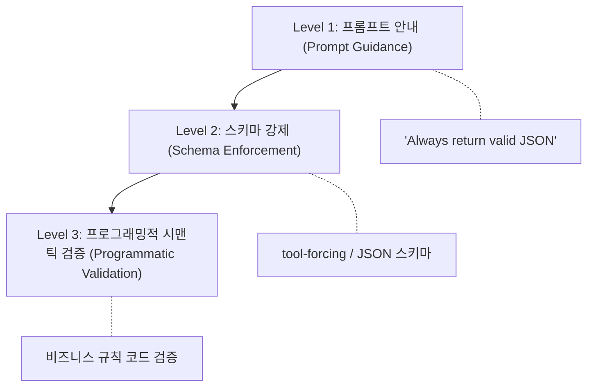
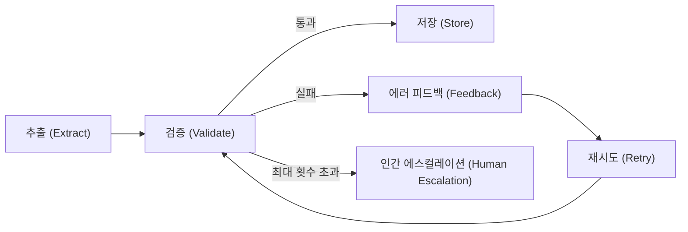

# CCA 시험 준비: 구조화된 데이터 추출

**구조화된 데이터 추출(Structured Data Extraction)** 시나리오는 가장 많은 수험생을 탈락시키는 시나리오다. "데모에서 작동하는 것"과 "프로덕션에서 작동하는 것"의 차이를 정밀하게 테스트한다.

## 3계층 신뢰성 모델 (Three-Level Reliability Model)

💡 **시험 핵심**: 시험은 항상 Level 3 답을 보상한다. 이 모델을 뇌에 새겨야 한다.



| 레벨 | 메커니즘 | 해결하는 문제 | 한계 |
|------|---------|-------------|------|
| **Level 1**: 프롬프트 안내 | "Always return valid JSON" | Claude에게 무엇을 할지 안내 | **확률적 넛지(probabilistic nudge)**, 보장이 아님 |
| **Level 2**: 스키마 강제 | tool-forcing / `--json-schema` | **구조적(structural)** 적합성 보장 | **의미적(semantic)** 정확성은 미검증 |
| **Level 3**: 프로그래밍적 검증 | 비즈니스 규칙 코드 | 추출된 데이터의 실제 정확성 검증 | — |

**왜 이 순서인가**: 각 레이어는 이전 레이어가 성공해야 의미가 있다. 구조적으로 유효하지 않은 데이터에 시맨틱 검증을 실행하면 컴퓨팅 자원만 낭비된다.

## Level 1: 프롬프트 안내가 실패하는 이유

시스템 프롬프트에 "Always return valid JSON"을 넣으면 확률 분포(probability distribution)를 JSON 쪽으로 강하게 이동시키지만, 다른 가능성을 **제거하지는 못한다**:

| 실패 모드 | 예시 |
|----------|------|
| 마크다운 코드 펜스 래핑 | ````json { ... } ```` |
| 설명 텍스트 추가 | "Here is the extracted data:" + JSON |
| 스키마 불일치 | 예상 외 필드, 누락 필드, 타입 오류 |
| **환각된 값(hallucinated values)** | "payment pending" → `"status": "completed"` |
| 컨텍스트 압박 시 절단(truncation) | 긴 문서에서 닫는 중괄호 누락 |

💡 저자의 표현을 빌리면, 스타워즈의 애크바 제독(Admiral Ackbar)이 말하듯: **"It's a trap!"** 시험에서 프롬프트 강화 답변이 나오면 즉시 제거하라.

## Level 2: 스키마 강제 — SDK 패턴 (Schema Enforcement)

### 접근법 1 — 도구 강제 (Tool-Forcing)

핵심 메커니즘: 원하는 JSON 스키마를 도구의 `input_schema`로 정의하고, `tool_choice`로 Claude가 해당 도구를 **반드시 호출하도록 강제**한다.

```python
# 추출 도구 정의 (extraction tool definition)
extraction_tool = {
    "name": "extract_invoice",
    "description": "Extract structured invoice data from the document",
    "input_schema": {
        "type": "object",
        "properties": {
            "vendor_name": {"type": "string"},
            "invoice_number": {"type": "string"},
            "date": {"type": "string", "pattern": "^\\d{4}-\\d{2}-\\d{2}$"},
            "line_items": {
                "type": "array",
                "items": {
                    "type": "object",
                    "properties": {
                        "description": {"type": "string"},
                        "quantity": {"type": "integer"},
                        "unit_price": {"type": "number"},
                        "total": {"type": "number"}
                    },
                    "required": ["description", "quantity", "unit_price", "total"]
                }
            },
            "total": {"type": "number"},
            "currency": {"type": "string", "enum": ["USD", "EUR", "GBP", "JPY"]}
        },
        "required": ["vendor_name", "invoice_number", "date", "line_items", "total", "currency"]
    }
}

# Claude에게 이 도구 사용을 강제 (force Claude to use this tool)
response = client.messages.create(
    model="claude-sonnet-4-6",
    tools=[extraction_tool],
    tool_choice={"type": "tool", "name": "extract_invoice"},  # 핵심 파라미터
    messages=[{"role": "user", "content": f"Extract invoice data from this document:\n\n{document_text}"}]
)

# 구조화된 데이터 추출 (extract structured data)
extracted = response.content[0].input
```

**`tool_choice`가 핵심이다** — Claude를 특정 도구 호출로 강제한다. 마크다운 래퍼도, 설명 텍스트도 없이 스키마에 맞는 JSON만 반환된다.

### 접근법 2 — `client.messages.parse()` (Pydantic 모델)

```python
from pydantic import BaseModel
from typing import List

class LineItem(BaseModel):
    description: str
    quantity: int
    unit_price: float
    total: float

class Invoice(BaseModel):
    vendor_name: str
    invoice_number: str
    date: str
    line_items: List[LineItem]
    total: float
    currency: str

response = client.messages.parse(
    model="claude-sonnet-4-6",
    output_format=Invoice,  # Pydantic 모델을 직접 전달
    messages=[{"role": "user", "content": f"Extract invoice data:\n\n{document_text}"}]
)

extracted = response.parsed_output  # 타입이 지정된 Pydantic 객체
```

### 💡 시험 함정: `with_structured_output()`

**`with_structured_output()`는 LangChain 메서드**이다. 네이티브 Anthropic SDK가 아니다. "네이티브 Anthropic SDK로 구현하라"는 문제에서 이 선택지가 나오면 — 즉시 제거하라. 정답은 `tool_choice`(도구 강제) 또는 `client.messages.parse()`(Pydantic)이다.

## Level 3: 프로그래밍적 시맨틱 검증 (Programmatic Semantic Validation)

스키마 강제는 `total` 필드가 `number` 타입인지 보장하지만, 그 숫자가 line_items 합계와 일치하는지는 검증하지 **않는다**. 저자의 비유를 빌리면: **"완벽하게 포맷된 수표(check)가 결제(clear)되는 수표와 같지 않다."**

```python
def validate_invoice(extracted: dict) -> tuple[bool, list[str]]:
    errors = []

    # 날짜 형식 검증 (date format validation)
    try:
        datetime.strptime(extracted["date"], "%Y-%m-%d")
    except ValueError:
        errors.append(f"잘못된 날짜 형식: {extracted['date']}")

    # line_items 합계 vs total 검증 (sum validation)
    calculated_total = sum(item["total"] for item in extracted["line_items"])
    if abs(calculated_total - extracted["total"]) > 0.01:
        errors.append(
            f"합계 불일치: 명시된 값 {extracted['total']}, "
            f"계산된 값 {calculated_total}"
        )

    # total 양수 검증 (positive total validation)
    if extracted["total"] <= 0:
        errors.append(f"총액은 양수여야 함: {extracted['total']}")

    # 알려진 벤더 목록 대조 (vendor validation against known list)
    known_vendors = load_known_vendors()  # 외부 데이터 소스
    if extracted["vendor_name"] not in known_vendors:
        errors.append(f"알 수 없는 벤더: {extracted['vendor_name']}")

    return (len(errors) == 0, errors)
```

### 💡 자기보고 신뢰도 함정 (Self-Reported Confidence Trap)

"Claude에게 1-10 척도로 추출 신뢰도를 평가하라"는 접근 — 이것은 **안티패턴(anti-pattern)**이다. Claude가 9점을 매겨도 데이터가 틀릴 수 있다. 환각으로 생성된 벤더 이름(hallucinated vendor name)도 모델에게는 정확한 값만큼이나 "확신(confidence)"이 있다. **프로그래밍적 검증은 Claude에게 아무것도 묻지 않는다** — ground truth에 대해 독립적으로 확인한다.

## 검증-재시도 피드백 루프 (Validation-Retry Feedback Loop)



### 3가지 재시도 유형

| 유형 | 예시 | 시험 판정 |
|------|------|---------|
| **맹목적 재시도(Blind retry)** | "다시 해봐(Try again)." | **항상 오답** |
| **정보 기반 재시도(Informed retry)** | "total은 150인데 line items 합계는 175야. 소스 문서를 다시 확인해봐." | **올바른 패턴** |
| **무한 재시도(Unbounded retry)** | "성공할 때까지 계속 재시도" | **항상 오답** |

💡 유일한 정답: **정보 기반(informed) + 횟수 제한(bounded, 2-3회) + 인간 에스컬레이션(human escalation)**.

정보 기반 재시도는 디버깅과 같다 — 컴파일러가 "47번 줄, 미선언 변수(undeclared variable)"라고 알려주는 것과 그냥 "무언가 잘못됨(something went wrong)"이라고 알려주는 것의 차이다. 구체적인 에러 메시지가 재시도의 수렴 여부를 결정한다.

## 완전한 신뢰성 패턴 vs 불완전한 패턴

저자는 의도적으로 **불완전한 코드**를 먼저 보여주고 "어디가 잘못되었는지 찾아보라"고 요구한다. 이 **역방향 교수법(reverse pedagogy)**은 시험에서 "겉보기에 괜찮은" 답을 식별하는 훈련이 된다.

### 불완전한 패턴 (어디가 잘못되었나?)

```python
def extract_invoice_incomplete(document_text: str) -> dict:
    response = client.messages.create(
        model="claude-sonnet-4-6",
        tools=[extraction_tool],
        tool_choice={"type": "tool", "name": "extract_invoice"},
        messages=[{"role": "user", "content": f"Extract: {document_text}"}]
    )

    extracted = response.content[0].input  # 성공을 가정함 (assumes success)

    is_valid, errors = validate_invoice(extracted)
    if not is_valid:
        # 피드백과 함께 재시도 (retry with feedback)
        response = client.messages.create(
            model="claude-sonnet-4-6",
            tools=[extraction_tool],
            tool_choice={"type": "tool", "name": "extract_invoice"},
            messages=[
                {"role": "user", "content": f"Extract: {document_text}"},
                {"role": "assistant", "content": str(extracted)},
                {"role": "user", "content": f"Errors found: {errors}. Please re-extract."}
            ]
        )
        extracted = response.content[0].input

    return extracted
```

**숨겨진 가정들**:
- API 호출이 항상 성공한다
- `response.content`가 항상 비어있지 않다
- `content[0]`이 항상 `tool_use` 블록이다
- 재시도가 1회뿐, 최대 횟수 제한 없음
- 인간 에스컬레이션 경로 없음

이 가정 중 하나라도 깨지면 `validate_invoice`에 도달하기도 전에 시스템이 크래시(crash)한다.

### 완전한 패턴 (Complete Pattern)

```python
def extract_invoice_complete(document_text: str, max_retries: int = 3) -> dict:
    for attempt in range(max_retries):
        try:
            response = client.messages.create(
                model="claude-sonnet-4-6",
                tools=[extraction_tool],
                tool_choice={"type": "tool", "name": "extract_invoice"},
                messages=[{"role": "user", "content": f"Extract: {document_text}"}]
            )

            # 응답 구조 검증 — hard failure 방어
            if not response.content:
                raise ExtractionError("빈 응답 콘텐츠 (empty response)")
            if response.content[0].type != "tool_use":
                raise ExtractionError(f"예상 외 블록 타입: {response.content[0].type}")

            extracted = response.content[0].input

            # 시맨틱 검증 — soft failure 감지
            is_valid, errors = validate_invoice(extracted)
            if is_valid:
                return extracted

            # 구체적 에러로 정보 기반 재시도 (informed retry)
            if attempt < max_retries - 1:
                document_text = (
                    f"{document_text}\n\n"
                    f"이전 추출에서 에러 발견: {errors}. "
                    f"소스 문서를 주의 깊게 재검토하세요."
                )

        except (APIError, ExtractionError) as e:
            if attempt < max_retries - 1:
                continue  # hard failure도 재시도
            raise

    # 최대 재시도 후 인간 에스컬레이션 (human escalation)
    escalate_to_human(document_text, errors)
    return None
```

💡 이 패턴은 **hard failure**(API/스키마/응답 형태 이상)와 **soft failure**(시맨틱 검증 실패)를 하나의 재시도 루프에서 모두 처리한다. 복합 실패 모드(compound failure mode) 문제에서는 모든 증상을 해결하는 답을 선택해야 한다. 하나만 고치는 답은 함정이다.

## 긴 문서의 Lost-in-the-Middle 현상

50페이지 이상의 문서에서는 문서 중간에 위치한 정보의 추출 정확도가 하락하는 "lost-in-the-middle" 현상이 발생한다. 해결책:

1. **분할(Split)** — 문서를 청크(chunk)로 나눈다
2. **독립 추출(Extract)** — 각 청크에서 독립적으로 추출한다
3. **병합(Merge)** — 결과를 병합하면서 중복을 제거(deduplication)한다

## 연관 CCA 개념

### MCP (Model Context Protocol)

다양한 문서 유형에는 4-5개의 집중 추출 도구(focused extraction tools)를 사용한다. 문서 유형이 10개라면: **전문 서브에이전트 추출기(specialized sub-agent extractors) + 코디네이터 에이전트(coordinator agent)** 패턴을 적용한다.

### Batch API

송장 5,000건을 추출해야 한다면 **Message Batches API**를 사용한다 (비용 50% 할인). 하나씩 실시간(real-time)으로 처리하는 것은 **안티패턴(anti-pattern)**이다.

## 시험 도메인 매핑 (Exam Domain Mapping)

이 시나리오는 세 가지 CCA 도메인에 매핑된다:

- **Domain 4: Prompt Engineering** (20%) — Level 1 프롬프트 안내, 구조화된 출력 프롬프트
- **Domain 3: Context Management** (15%) — 긴 문서 청킹, lost-in-the-middle, 인간 에스컬레이션
- **Domain 5: Agentic Architecture** (27%) — 검증-재시도 루프, 도구 강제, MCP 추출기, Batch API

## 💡 시험장에서 기억할 핵심 요약

1. 프롬프트 기반 JSON 강제가 정답인 선택지는 **즉시 제거** — 확률적 넛지일 뿐이다.
2. **`tool_choice`** 또는 **`client.messages.parse()`**가 네이티브 SDK 패턴. `with_structured_output()`는 LangChain이다.
3. **LLM 자기보고 신뢰도**는 프로덕션 검증 메커니즘이 될 수 없다.
4. 재시도는 반드시 **informed + bounded + 인간 에스컬레이션**이어야 한다.
5. **hard failure와 soft failure 모두** 처리하는 답이 완전한 답이다.
6. 복합 실패 모드 문제에서는 **모든 증상을 해결하는 답**을 선택하라.

---

*Rick Hightower — CCA 시나리오 딥다이브 시리즈 (6/8)*
*게시일: 2026년 3월 28일*
