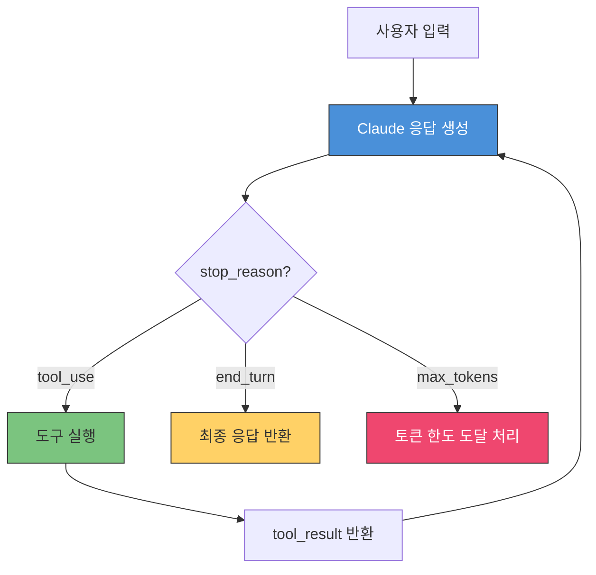
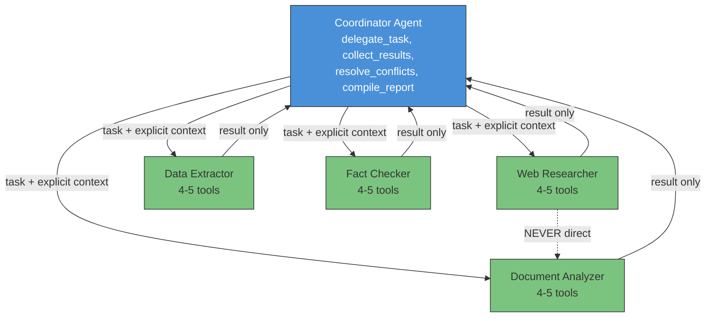
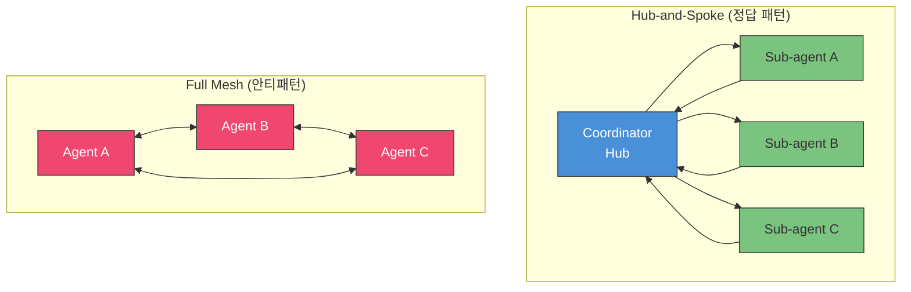
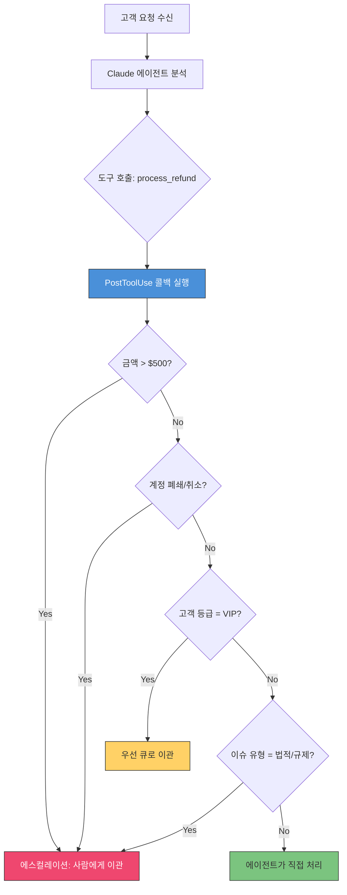
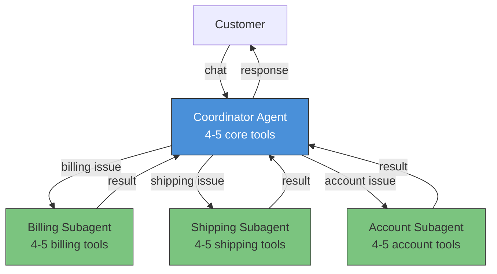
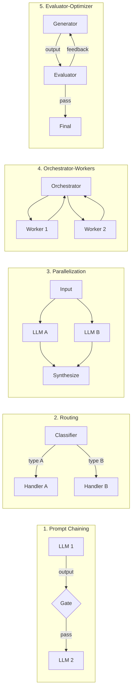

# Domain 1: Agentic Architecture & Orchestration (27%)

> CCA Foundations 시험에서 가장 높은 비중을 차지하는 도메인. 60문항 중 약 16문항이 이 도메인에서 출제된다.
> 이 가이드는 Rick Hightower의 CCA 시리즈(Part 1, 2, 4)를 기반으로 시험 핵심 개념을 정리한다.

---

## 1. 도메인 개요 (Domain Overview)

### 시험 비중 및 핵심 테마

| 항목 | 내용 |
|------|------|
| **비중** | 27% (~16문항 / 60문항) |
| **권장 학습 시간** | 8-10시간 |
| **합격 점수** | 720 / 1,000 |
| **시험 시간** | 120분 (문항당 약 2분) |

이 도메인은 **멀티에이전트 시스템 설계**, **에스컬레이션 로직**, **비용 최적화**, **컴플라이언스 강제** 등 프로덕션 에이전트 아키텍처의 핵심을 평가한다.

> **English (Exam Vocabulary)**: Domain 1 evaluates your ability to design production-grade agentic systems — coordinator-subagent patterns, escalation logic using deterministic business rules, API selection for cost optimization, and programmatic enforcement of compliance workflows.

**시험을 관통하는 3대 원칙**:

1. **"Prompts are guidance. Code is law."** — 비즈니스 규칙은 프롬프트가 아닌 코드로 강제
2. **서브에이전트는 컨텍스트를 상속하지 않는다** — 빈 슬레이트에서 시작, 명시적 전달 필수
3. **결정론적 규칙 > 모델 판단** — 에스컬레이션, 라우팅, 검증은 결정론적 규칙이 항상 정답

---

## 2. 핵심 패턴 6가지 (Six Core Patterns)

### 2.1 Agentic Loop

에이전트 루프는 Claude 기반 에이전트의 기본 실행 흐름이다. Claude가 응답을 생성하고, 도구 호출이 필요하면 `tool_use` stop reason을 반환하며, 도구 실행 결과를 다시 Claude에 전달하는 순환 구조를 형성한다. 이 루프는 `end_turn`이 반환될 때까지 반복된다.

> **English (Exam Vocabulary)**: The agentic loop is the fundamental execution cycle: Claude generates a response → returns `tool_use` stop reason → the application executes the tool → feeds the result back to Claude → Claude continues until `end_turn`. Understanding stop reasons (`tool_use`, `end_turn`, `max_tokens`) is critical for building functional agents.

| 한국어 | English Term | 시험 빈출도 |
|--------|-------------|-----------|
| 에이전트 루프 | Agentic Loop | ★★★☆☆ |
| 도구 사용 중단 이유 | `tool_use` stop reason | ★★★★☆ |
| 턴 종료 | `end_turn` stop reason | ★★★★☆ |
| 최대 토큰 도달 | `max_tokens` stop reason | ★★★☆☆ |



**Stop Reason 암기표**:

| Stop Reason | 의미 | 필수 처리 |
|-------------|------|----------|
| `tool_use` | 도구 결과 대기 중 | tool_result를 반드시 반환해야 함 |
| `end_turn` | 응답 완료 | 사용자에게 결과 전달 |
| `max_tokens` | 토큰 한도 도달 | 출력이 잘렸을 수 있음, 후처리 필요 |

---

### 2.2 Coordinator-Subagent Pattern

코디네이터-서브에이전트 패턴은 멀티에이전트 시스템의 기반 아키텍처다. 중앙 코디네이터가 작업을 전문 서브에이전트에 위임하고, 각 서브에이전트의 결과를 수집하여 종합한다. 이것은 CCA 시험에서 가장 많이 출제되는 단일 패턴이다.

> **English (Exam Vocabulary)**: The coordinator-subagent pattern is the foundational multi-agent architecture. A central coordinator delegates tasks to specialized subagents, each with 4-5 focused tools. The coordinator synthesizes results. This is the single most tested pattern on the CCA exam.

| 한국어 | English Term | 시험 빈출도 |
|--------|-------------|-----------|
| 코디네이터-서브에이전트 패턴 | Coordinator-Subagent Pattern | ★★★★★ |
| 작업 위임 | Task Delegation | ★★★★☆ |
| 결과 종합 | Result Synthesis | ★★★☆☆ |
| 서브에이전트 컨텍스트 비상속 | Subagent Context Non-Inheritance | ★★★★★ |

**뉴스룸 멘탈 모델**: 편집자(코디네이터)가 기사를 배정하고, 정치 기자/경제 기자/탐사 기자(서브에이전트)가 각자 취재 후 편집자에게 제출한다. 기자끼리는 직접 기사를 공유하지 않는다.

**멀티에이전트 리서치 시스템 예시**:

| 에이전트 | 도구 (4-5개) | 역할 |
|----------|-------------|------|
| **Coordinator** | `delegate_task`, `collect_results`, `resolve_conflicts`, `compile_report` | 오케스트레이션 및 종합 |
| **Web Researcher** | `search_web`, `fetch_page`, `extract_text`, `summarize_source` | 웹 콘텐츠 검색 및 처리 |
| **Document Analyzer** | `parse_document`, `extract_sections`, `identify_claims`, `check_citations` | 문서 구조 및 주장 분석 |
| **Data Extractor** | `query_database`, `transform_data`, `validate_schema`, `format_output` | 데이터 추출 및 구조화 |
| **Fact Checker** | `verify_claim`, `cross_reference`, `score_reliability`, `flag_conflict` | 사실 검증 및 신뢰도 평가 |

**코디네이터 에이전트 구조**:

```
코디네이터(Hub)
├── 작업 위임 (delegate_task)
├── 결과 수집 (collect_results)
├── 충돌 해결 (resolve_conflicts)
└── 보고서 작성 (compile_report)

서브에이전트(Spoke) x 4
├── 전문 도구 4-5개
├── blank slate에서 시작
├── 명시적으로 전달받은 컨텍스트만 보유
└── 코디네이터에만 결과 반환 (다른 스포크와 직접 통신 불가)
```



---

### 2.3 Hub-and-Spoke vs Full Mesh Topology

Hub-and-Spoke는 중앙 코디네이터(허브)가 모든 라우팅을 담당하고, 서브에이전트(스포크)는 서로 직접 통신하지 않는 토폴로지다. Full Mesh는 모든 에이전트가 다른 모든 에이전트와 직접 통신할 수 있는 구조로, CCA 시험에서는 멀티에이전트 시스템의 **안티패턴**으로 취급된다.

> **English (Exam Vocabulary)**: Hub-and-spoke topology routes all communication through a central coordinator. Spokes never communicate directly — all data flows through the hub. Full mesh topology (where agents talk to each other directly) is treated as an anti-pattern in the CCA exam. "Sub-agent A passes results directly to Sub-agent B" is always wrong.

| 한국어 | English Term | 시험 빈출도 |
|--------|-------------|-----------|
| 허브앤스포크 패턴 | Hub-and-Spoke Pattern | ★★★☆☆ |
| 풀 메시 토폴로지 | Full Mesh Topology | ★★☆☆☆ |
| 스포크 간 직접 통신 금지 | No Direct Spoke-to-Spoke Communication | ★★★★☆ |



**핵심 차이**:

| 비교 항목 | Hub-and-Spoke | Full Mesh |
|-----------|--------------|-----------|
| 통신 경로 | 허브 경유만 | 모든 에이전트 간 직접 |
| 코디네이션 | 중앙 집중 | 분산 |
| 복잡도 | O(n) | O(n^2) |
| 디버깅 | 허브에서 모든 흐름 추적 | 추적 어려움 |
| CCA 시험 | **정답 패턴** | **안티패턴** |
| 비유 | 항공 허브 (인천공항), 뉴스룸 편집자 | 모든 기자가 서로 기사 공유 |

**시험 킬러 문장**: "서브에이전트 A가 서브에이전트 B에 직접 결과를 전달한다" → **항상 오답**

---

### 2.4 Escalation Decision Tree

에스컬레이션 결정은 반드시 결정론적 비즈니스 규칙에 기반해야 한다. LLM의 자기보고 신뢰도(self-reported confidence)는 보정되지 않은 텍스트 생성이므로 프로덕션 라우팅에 부적합하다. 이것은 이 도메인에서 가장 중요한 단일 개념이다.

> **English (Exam Vocabulary)**: Escalation decisions must be based on deterministic business rules — dollar amounts, account tiers, issue types — not on the model's self-reported confidence. LLM confidence scores are not calibrated probabilities. When answer choices mention "confidence score" or "if the agent is uncertain," it is almost certainly wrong.

| 한국어 | English Term | 시험 빈출도 |
|--------|-------------|-----------|
| 결정론적 비즈니스 규칙 | Deterministic Business Rules | ★★★★★ |
| 자기보고 신뢰도 (안티패턴) | Self-Reported Confidence | ★★★★★ |
| 에스컬레이션 임계값 | Escalation Threshold | ★★★★☆ |
| 프로그래밍적 강제 | Programmatic Enforcement | ★★★★★ |
| PostToolUse 콜백 | PostToolUse Callback | ★★★★☆ |

**에스컬레이션 규칙 5가지 유형**:

| 규칙 유형 | 예시 | 구현 방식 |
|-----------|------|----------|
| **금액 기반** | 환불 > $500 → 에스컬레이션 | PostToolUse 콜백 |
| **계정 행위 기반** | 폐쇄/취소 → 항상 에스컬레이션 | 결정론적 규칙 |
| **고객 등급 기반** | VIP → 우선 큐 | 결정론적 규칙 |
| **이슈 유형 기반** | 법적/규제 → 항상 에스컬레이션 | 결정론적 규칙 |
| **정책 조회 기반** | Policy Engine 규칙 참조 | 코드에서 강제 |

**올바른 패턴 vs 잘못된 패턴**:

```
[잘못된 패턴 — 확률론적]
고객 요청 → Claude 분석 → "92% 확신" 보고 → 80% 임계값과 비교 → 처리 허용
                                                  ↑ 문제: 보정 안 된 수치에 의존

[올바른 패턴 — 결정론적]
고객 요청 → Claude 분석 → 환불 $600 제안 → PostToolUse 콜백 → $600 > $500 한도 → 에스컬레이션
                                                  ↑ 비즈니스 규칙이 코드에서 강제
```

**코드 예시 — PostToolUse 콜백**:

```python
# PostToolUse callback example - escalation enforcement
def post_tool_use(tool_name, tool_input, tool_result):
    if tool_name == "process_refund":
        amount = tool_input.get("amount", 0)
        if amount > 500:
            return {
                "action": "escalate",
                "reason": "refund_amount_exceeds_limit",
                "amount": amount,
                "limit": 500
            }
    return tool_result  # Allow if within limits
```

**코드 예시 — 올바른 에스컬레이션 vs 잘못된 에스컬레이션**:

```python
# WRONG — self-reported confidence
if claude_response.confidence < 0.7:
    escalate_to_human()

# RIGHT — deterministic business rules
if transaction_amount > 10000 or account_tier == "enterprise":
    escalate_to_human()
```



**즉시 제거 키워드** (이 단어가 보이면 오답):
- confidence score
- self-reported confidence
- model certainty
- "if the agent is uncertain, escalate"

---

### 2.5 Context Isolation Between Agents

서브에이전트는 코디네이터의 컨텍스트를 자동으로 상속하지 않는다. 각 서브에이전트는 **blank slate**(빈 상태)에서 시작하며, 코디네이터가 명시적으로 전달한 정보만 알 수 있다. 이것은 CCA 시험에서 가장 많이 시험되는 단일 개념이다.

> **English (Exam Vocabulary)**: Sub-agents do NOT inherit the coordinator's context. Each sub-agent starts as a blank slate. Only explicitly passed information is available. This is the single most tested concept on the CCA exam because it is counterintuitive — humans naturally assume agents within the same system share awareness.

| 한국어 | English Term | 시험 빈출도 |
|--------|-------------|-----------|
| 컨텍스트 격리 | Context Isolation | ★★★★★ |
| 빈 상태 (빈 슬레이트) | Blank Slate | ★★★★☆ |
| 명시적 컨텍스트 전달 | Explicit Context Passing | ★★★★★ |
| 컨텍스트 포킹 | Context Forking | ★★★☆☆ |
| 컨텍스트 비상속 | Context Non-Inheritance | ★★★★★ |

**서브에이전트가 받는 것**:
- 구체적 작업 설명 (specific task description)
- 관련 제약 조건 (relevant constraints and requirements)
- 예상 출력 형식 (expected output format)
- 작업에 필요한 컨텍스트 (context needed for the task)

**서브에이전트가 받지 않는 것**:
- 코디네이터의 전체 대화 이력 (full conversation history)
- 다른 서브에이전트의 결과 (명시적 전달 전까지)
- 전체 연구 계획 (명시적 전달 전까지)

**킬러 시험 문제**: "코디네이터가 APA 인용 형식을 요구했는데 서브에이전트가 MLA를 반환했다. 원인은?"
→ **정답**: 인용 형식 요구사항이 서브에이전트에 명시적으로 전달되지 않았다.
→ **함정**: "상속 실패"라는 표현 — 상속이 기본 동작이라는 전제를 깔고 있어 오답.

**Context Forking**: Unix `fork()`처럼 필요한 컨텍스트만 선택적으로 복제하는 개념. 전체 컨텍스트가 아닌, 작업에 필요한 부분만 전달한다.

---

### 2.6 Tool Count Threshold (4-5 Tools Rule)

에이전트당 4-5개 도구가 최적이다. 이 규칙을 초과하면 도구 선택 정확도가 측정 가능하게 저하된다. 15개 이상의 도구를 가진 단일 에이전트는 "슈퍼 에이전트 안티패턴"이라 불리며, 시험에서 거의 항상 오답이다.

> **English (Exam Vocabulary)**: Anthropic's official guideline is 4-5 tools per agent. This is the threshold where selection reliability holds. A single agent with 15+ tools is the "Super Agent anti-pattern" — tool selection accuracy degrades measurably. This is an architectural best practice, NOT an SDK hard limit.

| 한국어 | English Term | 시험 빈출도 |
|--------|-------------|-----------|
| 4-5 도구 규칙 | 4-5 Tool Rule | ★★★★★ |
| 슈퍼 에이전트 안티패턴 | Super Agent Anti-Pattern | ★★★★☆ |
| 만능 에이전트 안티패턴 | Swiss Army Agent Anti-Pattern | ★★★★☆ |
| 주의력 세금 | Attention Tax | ★★★☆☆ |
| 최소 권한 원칙 | Principle of Least Privilege | ★★★☆☆ |

**왜 슈퍼에이전트가 실패하는가 — Attention Tax**:
- 에이전트가 도구를 선택할 때마다 **모든** 도구 설명을 평가해야 한다
- 유사한 도구(`search_web`, `search_docs`, `search_db` 등)가 **모호성** 을 만든다
- 현재 작업과 무관한 도구가 매 결정마다 **주의력을 소모**한다

**보안 관점의 문제**:
- 고객 지원 에이전트가 HR 정책이나 마케팅 데이터에 접근 = **최소 권한 원칙 위반**
- 불필요한 도구 접근 = **프롬프트 인젝션** 리스크 확대
- 범위 확대(Scope Creep)는 부정적 함의

**핵심 구분**: 4-5 도구 제한은 **SDK 하드 리밋이 아니라 아키텍처 모범 사례**다. "SDK가 도구 수를 제한한다"는 오답.

**코디네이터-서브에이전트로 분리하는 예**:



**시험 팁**: 도구가 4-5개일 때 문제가 생기면 → 도구 설명 개선이 정답. 도구가 10개 이상일 때 문제가 생기면 → 서브에이전트 분리가 정답.

---

## 3. 도구 설명 및 라우팅 (Tool Descriptions & Routing)

도구 설명(Tool Description)은 Claude가 어떤 도구를 호출할지 결정하는 **1차 라우팅 메커니즘**이다. 에이전트 이름이나 도구 이름이 아닌, **설명**이 선택을 결정한다.

### 좋은 도구 설명 vs 나쁜 도구 설명

```python
# Good tool description
tools = [
    {
        "name": "lookup_customer",
        "description": "Takes a customer_id as input and returns structured JSON "
                       "containing purchase history, support ticket history, and "
                       "account tier. Use this as the first step in every customer "
                       "interaction.",
        "input_schema": {
            "type": "object",
            "properties": {
                "customer_id": {
                    "type": "string",
                    "description": "The unique customer identifier (e.g., CUS-12345)"
                }
            },
            "required": ["customer_id"]
        }
    }
]
```

### Negative Bounds (부정 경계)

좋은 도구 설명에는 **부정 경계** — 도구가 하지 않는 것 — 도 포함해야 한다.

```
# Good — negative bounds 포함
search_web: Searches the public web for information matching the query.
Returns URLs, titles, and snippets.
Does NOT fetch full page content (use fetch_page for that).
Does NOT search private databases or internal documents.

# Bad — negative bounds 없음
search_web: Searches for information.
```

부정 경계가 없으면 에이전트가 도구를 잘못된 용도로 사용(misrouting)하여 토큰을 낭비한다.

---

## 4. 안티패턴 vs 정답 패턴 비교 (Anti-Patterns vs Correct Patterns)

| # | 안티패턴 (오답) | 정답 패턴 | 시험 시그널 (이 키워드가 보이면 오답) |
|---|----------------|----------|-------------------------------------|
| 1 | 자기보고 신뢰도 기반 에스컬레이션 | **결정론적 비즈니스 규칙** (금액, 등급, 이슈 유형) | "confidence threshold", "model certainty" |
| 2 | Batch API로 실시간 비용 최적화 (50% 절감) | **Prompt Caching** (90% 절감, 실시간 호환) | "Batch API" + 사용자 대면 워크플로우 |
| 3 | 단일 에이전트에 12-15개 도구 | **4-5개 도구 + 전문 서브에이전트** | 10+ 도구 단일 에이전트 |
| 4 | 시스템 프롬프트에 컴플라이언스 규칙 기술 | **프로그래밍적 강제** (PostToolUse 콜백, redaction, validation) | "include in system prompt" 만으로 강제 |
| 5 | 에스컬레이션 시 전체 대화 기록 전달 | **구조화된 JSON 요약** (customer_id, tier, issue_type, amount 등) | "full transcript", "complete conversation" |
| 6 | 서브에이전트가 코디네이터 컨텍스트를 자동 상속 | **명시적 컨텍스트 전달** (blank slate에서 시작) | "inherits context", "상속 실패" |
| 7 | 서브에이전트 간 직접 통신 | **허브(코디네이터) 경유만 허용** | "서브에이전트 A가 B에 직접 전달" |

---

## 5. 시험 빈출 용어 20개 (High-Frequency Exam Terms)

| # | 한국어 | English Term | 빈출도 | 핵심 설명 |
|---|--------|-------------|--------|----------|
| 1 | 서브에이전트 컨텍스트 비상속 | Subagent Context Non-Inheritance | ★★★★★ | 가장 많이 시험되는 단일 개념 |
| 2 | 코디네이터-서브에이전트 패턴 | Coordinator-Subagent Pattern | ★★★★★ | 멀티에이전트 기본 아키텍처 |
| 3 | 결정론적 비즈니스 규칙 | Deterministic Business Rules | ★★★★★ | 에스컬레이션 결정의 유일한 정답 |
| 4 | 프로그래밍적 강제 | Programmatic Enforcement | ★★★★★ | "Code is law" — 프롬프트가 아닌 코드로 |
| 5 | 자기보고 신뢰도 | Self-Reported Confidence | ★★★★★ | 에스컬레이션 기준으로 나오면 항상 오답 |
| 6 | 프롬프트 캐싱 | Prompt Caching | ★★★★★ | 최대 90% 비용 절감, 실시간 호환 |
| 7 | 4-5 도구 규칙 | 4-5 Tool Rule | ★★★★★ | Anthropic 공식 가이드라인, 선택 신뢰도 임계값 |
| 8 | PostToolUse 콜백 | PostToolUse Callback | ★★★★☆ | Claude Agent SDK 라이프사이클 훅, 검증 삽입 지점 |
| 9 | 슈퍼 에이전트 안티패턴 | Super Agent Anti-Pattern | ★★★★☆ | 15+ 도구 단일 에이전트 = 선택 정확도 하락 |
| 10 | 에스컬레이션 임계값 | Escalation Threshold | ★★★★☆ | 비즈니스 규칙 기반이 정답 |
| 11 | 허브앤스포크 패턴 | Hub-and-Spoke Pattern | ★★★☆☆ | 스포크 간 직접 통신 없음, 허브 경유만 |
| 12 | 에이전트 루프 | Agentic Loop | ★★★☆☆ | generate → tool_use → execute → result → end_turn |
| 13 | 컨텍스트 격리 | Context Isolation | ★★★★★ | 서브에이전트 = blank slate |
| 14 | 명시적 컨텍스트 전달 | Explicit Context Passing | ★★★★★ | 컨텍스트 비상속의 해결책 |
| 15 | 컨텍스트 포킹 | Context Forking | ★★★☆☆ | Unix fork() 유사, 필요한 것만 선택적 복제 |
| 16 | 사일런트 실패 | Silent Failure | ★★★★☆ | 에러가 성공으로 위장되는 실패 모드 |
| 17 | 구조화된 에러 컨텍스트 | Structured Error Context | ★★★☆☆ | error_type, source, retry_eligible 포함 |
| 18 | 메시지 배치 API | Message Batches API | ★★★★☆ | 50% 절감이지만 최대 24시간, 실시간에서 항상 오답 |
| 19 | 주의력 세금 | Attention Tax | ★★★☆☆ | 도구가 많을수록 매 선택에서 지불하는 인지적 비용 |
| 20 | 구조화된 핸드오프 | Structured Handoff | ★★★☆☆ | JSON 요약으로 에스컬레이션, full transcript 전달은 오답 |
| 21 | 증강된 LLM | Augmented LLM | ★★★☆☆ | LLM + tools + retrieval + memory = 에이전트 최소 단위 |
| 22 | 프롬프트 체이닝 | Prompt Chaining | ★★★☆☆ | 한 호출의 출력 → 다음 호출의 입력, 게이트 추가 가능 |
| 23 | 라우팅 패턴 | Routing Pattern | ★★★☆☆ | 입력 분류 → 전문 후속 태스크로 분기 |
| 24 | 병렬화 (섹셔닝/보팅) | Parallelization (Sectioning/Voting) | ★★★☆☆ | 독립 서브태스크 병렬 실행 또는 동일 태스크 다중 실행 후 합성 |
| 25 | 평가자-최적화자 | Evaluator-Optimizer | ★★★☆☆ | 한 LLM이 생성, 다른 LLM이 평가 → 피드백 루프 |
| 26 | 인간 개입 지점 | Human-in-the-Loop Checkpoint | ★★★☆☆ | 고위험 동작 전 인간 확인 단계 삽입 |
| 27 | 클라이언트 사이드 오케스트레이션 | Client-Side Orchestration | ★★★★☆ | Claude는 도구 실행 요청만 반환, 실제 실행은 클라이언트 담당 |

---

## 6. 비용 최적화 패턴 (Cost Optimization)

### API 선택 의사결정 프레임워크

| 질문 | YES이면 | NO이면 |
|------|---------|--------|
| 고객이 실시간으로 응답을 기다리고 있나? | **Real-Time API** (유일한 선택) | 다음 질문 |
| 시간 민감 SLA가 있나? (SLA < 24시간) | **Real-Time API** | 다음 질문 |
| 지연에 재정적 결과가 따르는가? | **Real-Time API** | 다음 질문 |
| 기다리는 사용자 없는 백그라운드 작업인가? | **Batch API 가능** | Real-Time API |

### 비용 최적화 비교표

| 방법 | 비용 절감 | 실시간 호환 | 사용자 경험 | 시험 정답 여부 |
|------|----------|-----------|-----------|-------------|
| **Prompt Caching** | **최대 90%** | **완전 호환** | **영향 없음** | **정답** |
| Batch API | 50% | 불가 (24시간) | 파괴적 | 실시간 시나리오에서 오답 |
| 토큰 요약/축소 | 가변적 | 호환 | 품질 저하 가능 | 차선 |
| 이중 모델 라우팅 | 가변적 | 호환 | 복잡성 추가 | 차선 |

**핵심 공식**: "누가 기다리고 있는가?" → 사용자 대면 = Real-Time API + Prompt Caching이 유일한 정답.

---

## 7. 사일런트 실패 및 에러 처리 (Silent Failure & Error Handling)

멀티에이전트 시스템에서 **가장 위험한 실패 모드**는 사일런트 실패다.

### 안티패턴

```json
// WRONG - 에러를 성공으로 위장
{"status": "success", "data": null}
```

"데이터 없음"과 "소스 접근 불가"는 완전히 다른 상황이지만, 위 응답 구조에서는 구분 불가능하다.

### 정답 패턴 — 구조화된 에러 컨텍스트

```json
// RIGHT - 구조화된 에러 컨텍스트
{
  "status": "error",
  "error_type": "timeout",
  "source": "api.example.com",
  "attempted_at": "2026-03-23T14:30:00Z",
  "retry_eligible": true,
  "partial_data": null,
  "fallback_available": false
}
```

코디네이터가 이 정보로 할 수 있는 것:
- retry_eligible이면 **재시도**
- 보고서에 **데이터 갭 명시적 표기**
- 누락 소스에 의존하는 결론의 **신뢰도 조정**

---

## 8. 구조화된 에스컬레이션 핸드오프 (Structured Escalation Handoff)

에스컬레이션 시 전체 대화 기록(raw transcript)이 아닌 **구조화된 JSON 요약**을 전달해야 한다.

```json
{
  "customer_id": "CUS-12345",
  "customer_tier": "VIP",
  "issue_type": "billing_dispute",
  "disputed_amount": 750.00,
  "agent_findings": "Policy allows refund but amount exceeds agent authority",
  "escalation_reason": "refund_amount_exceeds_limit",
  "recommended_action": "approve_refund",
  "conversation_summary": "Customer disputed charge from March 15. Agent verified charge is valid but customer has VIP status with 100% satisfaction guarantee. Refund of $750 exceeds the $500 agent limit.",
  "turns_elapsed": 6
}
```

---

## 9. 충돌 해결 전략 (Conflict Resolution)

멀티에이전트 리서치 시스템에서 소스 간 상충 시 체계적 접근이 필요하다:

1. **소스 신뢰도 랭킹**: peer-reviewed > 공식 문서 > 뉴스 > 블로그 > 소셜 미디어
2. **다수결 합의**: 5개 중 4개 소스가 동의하면 이상치(outlier)에 더 강한 증거 요구
3. **인간 에스컬레이션**: 해결 불가능한 고위험 주장은 사람에게 넘김

**안티패턴**: "먼저 응답한 결과가 이긴다" (first result wins) — 응답 속도와 신뢰도를 혼동.

---

## 10. 작업 분해 전략 (Task Decomposition)

멀티에이전트 리서치는 **작업 분해 DAG**(Directed Acyclic Graph)를 따른다.

| 단계 | 작업 | 병렬/순차 | 이유 |
|------|------|----------|------|
| **Phase 1** | 웹 검색 + 문서 분석 | **병렬** | 독립적 입력 |
| **Phase 2** | 주장 추출 | 순차 | Phase 1 결과에 의존 |
| **Phase 3** | 사실 검증 | 순차 | 추출된 주장에 의존 |
| **Phase 4** | 충돌 해결 | 순차 | 검증 결과에 의존 |
| **Phase 5** | 보고서 작성 | 순차 | 해결된 결과에 의존 |

---

## 11. 예상 문제 5문항 (Practice Questions)

### Q1. 에스컬레이션 라우팅

> Claude 기반 고객 지원 에이전트가 $600 환불 요청을 처리한다. 에이전트는 92% 신뢰도를 보고한다. 시스템은 어떻게 판단해야 하는가?

- (A) 90% 신뢰도 임계값을 설정하고, 미만이면 에스컬레이션
- (B) **결정론적 비즈니스 규칙 적용: $600이 $500 한도를 초과하므로 신뢰도와 무관하게 에스컬레이션**
- (C) 92%가 재정 결정의 일반적 임계값을 초과하므로 환불 처리 허용
- (D) 시스템 프롬프트의 에스컬레이션 규칙을 명확하게 개선

<details>
<summary>정답 및 해설</summary>

**정답: B**

비즈니스 규칙($600 > $500)이 결정론적이다. 신뢰도 점수(92%)는 에스컬레이션 결정과 **무관**하다. A와 C는 자기보고 신뢰도 기반 함정, D는 시스템 프롬프트만으로 강제하는 함정이다. **핵심**: PostToolUse 콜백이 에이전트 제안 후 비즈니스 규칙을 무조건 강제한다.

**도메인**: Domain 1 (Agentic Architecture)
</details>

---

### Q2. 컨텍스트 격리

> 멀티에이전트 리서치 시스템에서 코디네이터가 문서 분석기에 "경쟁사 제품 비교 분석"을 위임했다. 코디네이터 컨텍스트에는 "2025년 이후 출시 제품만" 조건이 있다. 문서 분석기가 2020년 제품까지 포함한 결과를 반환했다. 근본 원인은?

- (A) 문서 분석기의 도구가 날짜 필터링을 지원하지 않았다
- (B) **코디네이터가 날짜 조건을 문서 분석기에 명시적으로 전달하지 않았다**
- (C) 문서 분석기가 코디네이터 컨텍스트 상속에 실패했다
- (D) MCP 프로토콜이 날짜 필터를 지원하지 않는다

<details>
<summary>정답 및 해설</summary>

**정답: B**

서브에이전트는 코디네이터 컨텍스트를 상속하지 않는다(context isolation). 명시적으로 전달한 것만 안다. C가 핵심 함정 — "상속 실패"라는 표현은 상속이 기본 동작이라는 전제를 깔고 있어 오답이다. A와 D는 기술적 제약을 잘못 귀인한다.

**도메인**: Domain 1 (Agentic Architecture)
</details>

---

### Q3. 도구 수 최적화

> 고객 지원 에이전트가 12개 도구를 보유하며 간헐적으로 잘못된 도구를 선택한다. 도구 목록: lookup_customer, check_policy, process_refund, escalate_to_human, log_interaction, check_inventory, query_hr_policy, access_marketing_data 등. 가장 적절한 개선책은?

- (A) 12개 도구 각각의 설명을 더 구체적으로 개선
- (B) **핵심 5개 도구로 축소하고 나머지는 전문 서브에이전트로 분리, HR/마케팅 접근 완전 제거**
- (C) 도구 선택 전 확인 단계를 추가하여 에이전트가 선택을 검증
- (D) 컨텍스트 윈도우를 확장하여 도구 평가에 더 많은 공간 제공

<details>
<summary>정답 및 해설</summary>

**정답: B**

세 가지 문제를 동시 해결: (1) 도구 수를 Anthropic 권고 4-5개 범위로 축소 → 선택 정확도 복원, (2) 재고 기능은 전문 서브에이전트로 분리, (3) HR과 마케팅 접근 완전 제거 → 최소 권한 원칙 충족 + 프롬프트 인젝션 리스크 제거. A는 증상 치료(12개 도구가 근본 원인), C는 성능 저하만 유발, D는 도구 선택과 무관.

**도메인**: Domain 1 + Domain 4 (Tool Design)
</details>

---

### Q4. 비용 최적화

> 고객 지원 시스템이 매일 50,000건 상호작용을 처리하며, 각 건에 80,000 토큰의 반복 정책 컨텍스트가 포함된다. 비용을 줄이면서 실시간 응답을 유지하는 최적의 방법은?

- (A) Message Batches API로 마이그레이션하여 50% 비용 절감
- (B) 정책 컨텍스트를 20,000 토큰으로 요약하여 75% 토큰 절감
- (C) **반복 정책 컨텍스트에 Prompt Caching 적용하여 최대 90% 비용 절감, 실시간 응답 유지**
- (D) 더 작은 모델로 정책 조회를 처리하고 복잡한 이슈만 풀 모델 사용

<details>
<summary>정답 및 해설</summary>

**정답: C**

Prompt Caching은 80,000 토큰의 반복 정책 컨텍스트를 최대 90% 절감하면서 실시간 응답을 그대로 유지한다. A는 최대 24시간 처리 시간으로 실시간 고객 지원과 근본적으로 비양립 — 시험에서 가장 흔한 오답. B는 정책 세부사항 손실 위험. D는 이중 모델 라우팅으로 복잡성만 추가.

**도메인**: Domain 1 (Agentic Architecture)
</details>

---

### Q5. 멀티에이전트 아키텍처

> 리서치 시스템에서 웹 리서처와 문서 분석기가 같은 주제에 대해 상충하는 결과를 반환했다. 웹 리서처의 소스는 기술 블로그 3곳, 문서 분석기의 소스는 동료 심사 논문 1편이다. 또한 웹 리서처가 문서 분석기에 직접 결과를 전달하여 교차 검증하겠다고 제안했다. 올바른 접근법은?

- (A) 먼저 응답한 에이전트의 결과를 채택한다
- (B) 소스 수가 더 많은 웹 리서처의 결과를 채택한다
- (C) 웹 리서처가 문서 분석기에 직접 결과를 전달하여 교차 검증한다
- (D) **코디네이터가 소스 신뢰도 랭킹에 따라 동료 심사 논문 우선순위를 높이고, 서브에이전트 간 직접 통신은 불허한다**

<details>
<summary>정답 및 해설</summary>

**정답: D**

두 가지 원칙을 동시 검증: (1) 소스 신뢰도 랭킹 (peer-reviewed > blog), (2) 허브앤스포크에서 스포크 간 직접 통신 금지. A는 "first result wins" 안티패턴. B는 수량이 아닌 품질이 기준. C는 스포크 간 직접 통신으로 허브앤스포크 위반.

**도메인**: Domain 1 (Agentic Architecture)
</details>

---

### Q6. Workflow vs Agent 구분 (Anthropic 공식 보완)

> 팀이 고객 문의를 처리하는 자동화 시스템을 설계한다. 80%의 문의는 "주문 확인 → 배송 조회 → 응답 생성"의 고정된 3단계로 처리 가능하다. 나머지 20%는 문의 유형에 따라 어떤 도구를 어떤 순서로 사용할지 예측할 수 없다. 최적의 아키텍처는?

- (A) 모든 문의를 자율 에이전트(agent)로 처리하여 유연성 확보
- (B) 모든 문의를 워크플로우(workflow)로 처리하여 예측 가능성 확보
- (C) **80%는 프롬프트 체이닝 워크플로우로 처리하고, 나머지 20%만 자율 에이전트로 라우팅**
- (D) 라우팅 패턴으로 모든 문의를 분류한 후, 각 카테고리별 전용 에이전트 배정

<details>
<summary>정답 및 해설</summary>

**정답: C**

Anthropic 공식 가이드에 따르면: 워크플로우(workflow)는 미리 정의된 코드 경로(predefined code paths)로 LLM을 오케스트레이션하고, 에이전트(agent)는 LLM이 자신의 프로세스와 도구 사용을 동적으로 결정한다. 예측 가능한 80%는 프롬프트 체이닝 워크플로우가 최적이고(일관성, 디버깅 용이), 예측 불가한 20%만 에이전트의 유연성이 필요하다. A는 불필요한 복잡성과 비용 추가, B는 20%의 비정형 문의를 처리 불가, D는 카테고리가 명확하지 않은 20%에 대한 해결책이 없다.

**도메인**: Domain 1 (Agentic Architecture) — Anthropic 공식 보완
</details>

---

### Q7. Anthropic 5가지 워크플로우 패턴 식별

> 콘텐츠 검수 시스템에서 한 LLM이 마케팅 카피를 생성하고, 다른 LLM이 브랜드 가이드라인 준수 여부를 평가한다. 평가에서 문제가 발견되면 피드백과 함께 다시 생성 LLM으로 전달하여 수정한다. 이 과정을 가이드라인 충족까지 반복한다. 이 아키텍처에 해당하는 Anthropic 공식 워크플로우 패턴은?

- (A) Prompt Chaining — 한 단계의 출력이 다음 단계의 입력
- (B) Orchestrator-Workers — 중앙 LLM이 동적으로 작업을 분해하고 워커에 위임
- (C) Parallelization (Voting) — 동일 태스크를 여러 번 실행하여 결과 합성
- (D) **Evaluator-Optimizer — 생성 LLM과 평가 LLM이 피드백 루프를 형성**

<details>
<summary>정답 및 해설</summary>

**정답: D**

Evaluator-Optimizer 패턴의 정의와 정확히 일치한다: 한 LLM이 콘텐츠를 생성(generator)하고, 다른 LLM이 품질을 평가(evaluator)하여 피드백을 제공하고, 기준 충족까지 반복한다. A(Prompt Chaining)는 선형 파이프라인으로 피드백 루프가 없다. B(Orchestrator-Workers)는 동적 작업 분해가 핵심이지 품질 평가 루프가 아니다. C(Voting)는 다양성을 위해 같은 작업을 병렬 실행하는 것이지 반복 개선이 아니다.

**도메인**: Domain 1 (Agentic Architecture) — Anthropic 공식 보완
</details>

---

## 12. 암기 필수 숫자 (Must-Memorize Numbers)

| 항목 | 값 | 시험 관련성 |
|------|-----|-----------|
| **시험 문항 수** | 60 | 시간 배분 기준 |
| **시험 시간** | 120분 | 문항당 약 2분 |
| **합격 점수** | 720/1,000 | 의미 있는 오차 범위 |
| **시험 비용** | $99 | - |
| **Domain 1 비중** | 27% (~16문항) | 가장 높은 비중 |
| **에이전트당 적정 도구 수** | **4-5개** | Anthropic 공식 가이드라인 |
| **슈퍼 에이전트 기준** | **15개+ 도구** | 이 이상이면 항상 안티패턴 |
| **도구 분리 시그널** | **10개+ 도구** | 서브에이전트 분리 필요 |
| **Prompt Caching 절감률** | **최대 90%** | 실시간 호환, 비용 최적화 정답 |
| **Batch API 절감률** | **50%** | 실시간 시나리오에서 항상 오답 |
| **Batch API 최대 지연** | **최대 24시간** | 사용자 대면에서 사용 불가 |
| **멀티에이전트 에이전트 수 (리서치 예)** | 5개 (코디 1 + 서브 4) | - |
| **MCP 프리미티브 수** | 3개 (Tools, Resources, Prompts) | Tools=동사, Resources=명사, Prompts=패턴 |
| **프로덕션 시나리오 출제** | 6개 중 4개 랜덤 | 모든 시나리오 준비 필수 |
| **권장 총 학습 시간** | 30-37시간 | 경험자 기준 |
| **모의 시험 목표 점수** | 900+ | 등록 전 달성 필요 |
| **정책 컨텍스트 규모 (예)** | 50,000-100,000 토큰 | Prompt Caching 대상 |

---

## 13. 빠른 복습 체크리스트 (Quick Review Checklist)

시험 직전 최종 확인용:

- [ ] **에스컬레이션** = 결정론적 비즈니스 규칙 (금액, 등급, 이슈 유형) → "confidence score" 보이면 제거
- [ ] **비용 최적화** = Prompt Caching (90%, 실시간) → "Batch API" + 실시간 조합 보이면 제거
- [ ] **도구 수** = 4-5개/에이전트 → 10+ 도구면 서브에이전트 분리가 정답
- [ ] **컨텍스트 격리** = 서브에이전트는 blank slate → "상속" 언급 보이면 주의
- [ ] **컴플라이언스** = 프로그래밍적 강제 (코드) → "system prompt에 규칙 포함"만이면 오답
- [ ] **핸드오프** = 구조화된 JSON 요약 → "full transcript" 보이면 오답
- [ ] **API 선택** = "누가 기다리는가?" → 사용자 대면 = Real-Time 유일
- [ ] **스포크 간 통신** = 허브 경유만 → "서브에이전트 A가 B에 직접" 보이면 오답
- [ ] **PostToolUse 콜백** = 에이전트 제안 후 비즈니스 규칙 검증 지점
- [ ] **도구 설명** = 입출력 구체 명시 + 부정 경계(negative bounds) 포함
- [ ] **사일런트 실패** = `{"success": true, "data": null}` 은 안티패턴 → 구조화된 에러 컨텍스트 필요
- [ ] **충돌 해결** = 소스 신뢰도 랭킹 (peer-reviewed > blog) → "먼저 도착한 결과" 보이면 오답

---

## 14. 외울 공식 (Formulas to Memorize)

```
서브에이전트 = blank slate + 명시적 전달 컨텍스트만
좋은 도구 설명 = 긍정 경계 + 부정 경계
충돌 해결 = 신뢰도 랭킹 + 다수결 + 인간 에스컬레이션
사일런트 실패 방지 = 구조화된 에러 컨텍스트
에스컬레이션 = 결정론적 규칙 (코드) ≠ 자기보고 신뢰도 (프롬프트)
비용 최적화 = "누가 기다리는가?" → 사용자 대면 = Prompt Caching
도구 문제 = 4-5개면 설명 개선 / 10+면 서브에이전트 분리
Prompt = guidance / Code = law
```

---

## 15. 외울 안티패턴 (Anti-Patterns to Memorize)

```
- 슈퍼에이전트 (15개+ 도구 단일 에이전트) → "Show truck, not work truck"
- 자기보고 신뢰도 기반 에스컬레이션 → "학생에게 자기 시험을 채점하라는 것"
- 사일런트 실패 (success + null data) → "데이터 없음 ≠ 소스 접근 불가"
- 스포크 간 직접 통신 → "기자끼리 기사 공유하지 않는다"
- 암묵적 컨텍스트 상속 기대 → "공유 메모리 멘탈 모델의 함정"
- Batch API + 실시간 워크플로우 → "24시간 처리를 채팅에 사용"
- 프롬프트만으로 컴플라이언스 → "That is a hope, not a strategy"
- "먼저 도착한 결과가 이긴다" → "속도 ≠ 신뢰도"
```

---

## 16. Anthropic 공식 문서 보완 — 도메인 가이드에 없는 필수 개념

> 이 섹션은 Anthropic 공식 문서 ["Building effective agents"](https://docs.anthropic.com/en/docs/build-with-claude/prompt-engineering/building-effective-agents)의 핵심 개념을 보완한다. Rick Hightower의 CCA 가이드에서 다루지 않았지만 시험에 출제될 가능성이 높은 내용이다.

### 16.1 Workflow vs Agent 구분 (높은 중요도)

Anthropic은 "에이전틱 시스템(agentic systems)"을 두 가지로 명확히 구분한다:

| 구분 | Workflow | Agent |
|------|----------|-------|
| **정의** | LLM과 도구가 미리 정의된 코드 경로(predefined code paths)로 오케스트레이션 | LLM이 자신의 프로세스와 도구 사용을 동적으로 결정(dynamically direct) |
| **제어 주체** | 개발자가 작성한 코드 | LLM 자신 |
| **예측 가능성** | 높음 (고정된 흐름) | 낮음 (동적 결정) |
| **적합한 경우** | 잘 정의된 태스크, 일관성 중요 | 복잡하고 예측 불가능한 태스크, 유연성 필요 |
| **디버깅** | 용이 (경로 추적 가능) | 어려움 (결정 추적 필요) |

> **English (Exam Vocabulary)**: Workflows orchestrate LLMs through predefined code paths; agents let LLMs dynamically direct their own processes and tool usage. The key exam question: "When should you use a workflow vs. an agent?" — Use workflows when the task is well-defined and consistency matters; use agents when flexibility and model-driven decision-making are required.

**시험 출제 예**: "언제 워크플로우를 사용하고 언제 에이전트를 사용하는가?"
→ **워크플로우**: 예측 가능한 고정 프로세스, 일관성과 속도가 중요할 때
→ **에이전트**: 동적 판단이 필요하고, 어떤 도구를 어떤 순서로 사용할지 미리 결정할 수 없을 때

---

### 16.2 Anthropic 공식 5가지 워크플로우 패턴

Anthropic이 정의한 5가지 기본 워크플로우 패턴:

#### 1. Prompt Chaining (프롬프트 체이닝)

한 LLM 호출의 출력이 다음 호출의 입력이 된다. 각 단계 사이에 **게이트(gate)**를 추가하여 품질 검증 가능.

**적합**: 번역 → 검수, 문서 생성 → 포맷팅 등 순차적 파이프라인

#### 2. Routing (라우팅)

입력을 분류(classify)하여 전문 후속 태스크로 분기한다. **관심사의 분리(separation of concerns)** 원칙 적용.

**적합**: 고객 문의 유형별 분류 → 전문 핸들러 배정

#### 3. Parallelization (병렬화)

동시 실행 후 결과 종합. 두 가지 하위 유형:
- **Sectioning**: 독립적인 서브태스크를 병렬 실행 (예: 여러 소스 동시 검색)
- **Voting**: 동일 태스크를 여러 번 실행하여 다양한 결과를 합성 (예: 다중 코드 리뷰)

#### 4. Orchestrator-Workers (오케스트레이터-워커)

중앙 LLM이 태스크를 동적으로 분해하고 워커에 위임한다. **코디네이터-서브에이전트 패턴과 동일 개념**.

**적합**: 복잡한 코딩 작업에서 여러 파일을 동시에 수정해야 할 때

#### 5. Evaluator-Optimizer (평가자-최적화자)

한 LLM이 생성(generate)하고, 다른 LLM이 평가(evaluate)하여 피드백을 제공한다. 기준 충족까지 반복하는 **피드백 루프**.

**적합**: 문학 번역의 미묘한 뉘앙스 평가, 코드 품질 반복 개선



**시험 대비 — 패턴 매칭 연습**:

| 시나리오 | 패턴 |
|----------|------|
| 이메일 작성 → 톤 검토 → 발송 | **Prompt Chaining** |
| 고객 문의를 기술/결제/배송으로 분류 | **Routing** |
| 3개 소스에서 동시 검색 후 종합 | **Parallelization (Sectioning)** |
| 3명의 리뷰어가 같은 코드를 독립 평가 | **Parallelization (Voting)** |
| 중앙 에이전트가 코딩 태스크를 파일별로 분배 | **Orchestrator-Workers** |
| 카피라이터 LLM + 편집자 LLM 반복 개선 | **Evaluator-Optimizer** |

---

### 16.3 Augmented LLM 개념

**Augmented LLM = LLM + 도구(tools) + 검색(retrieval) + 메모리(memory)**

이것이 에이전틱 시스템의 **최소 빌딩 블록**이다. 순수 LLM에 외부 능력을 부여하여 "증강"한 것.

```
┌─────────────────────────────┐
│       Augmented LLM         │
│                             │
│   ┌───────┐  ┌───────────┐  │
│   │  LLM  │  │ Retrieval │  │
│   └───┬───┘  └─────┬─────┘  │
│       │            │        │
│   ┌───┴───┐  ┌─────┴─────┐  │
│   │ Tools │  │  Memory   │  │
│   └───────┘  └───────────┘  │
└─────────────────────────────┘
```

> **English (Exam Vocabulary)**: An augmented LLM combines a base model with tools, retrieval, and memory — forming the atomic building block of any agentic system. Each agent in a multi-agent system is essentially an augmented LLM with a specialized set of capabilities.

---

### 16.4 Client-Side Orchestration

Claude는 도구를 **직접 실행하지 않는다**. 도구 사용 **요청(request)**을 `tool_use` 블록으로 반환할 뿐, 실제 실행은 클라이언트 코드가 담당한다.

```
Claude → tool_use 블록 반환 (요청)
  ↓
클라이언트 코드 → 실제 도구 실행
  ↓
클라이언트 코드 → tool_result 반환
  ↓
Claude → 결과를 보고 다음 단계 결정
```

이 구조가 중요한 이유:
- **보안**: 클라이언트가 실행 전 검증/차단 가능 (= PostToolUse 콜백의 근거)
- **제어**: 비즈니스 규칙을 코드 레벨에서 강제 가능 ("Code is law"의 실체)
- **시험 함정**: "Claude가 도구를 직접 호출한다"는 표현이 나오면 주의

> **English (Exam Vocabulary)**: Claude does not execute tools directly — it returns tool use requests. The client code is responsible for actual execution. This client-side orchestration model is what enables programmatic enforcement of business rules between the model's request and actual tool execution.

---

### 16.5 Human-in-the-Loop

고위험 동작(high-stakes actions) 전에 **인간 확인 단계(human-in-the-loop checkpoint)**를 삽입하는 것이 Anthropic 권장 사항이다.

**적용 기준**:
- 되돌릴 수 없는 작업 (irreversible actions): 결제 처리, 데이터 삭제
- 높은 비용 수반: 대규모 환불, 계정 폐쇄
- 규제 관련: 법적/의료/금융 결정

**구현 방식**:
```python
# Human-in-the-loop checkpoint example
def post_tool_use(tool_name, tool_input, tool_result):
    if tool_name in HIGH_STAKES_TOOLS:
        # 에이전트 실행 중단, 인간 승인 대기
        return {
            "action": "pause_for_approval",
            "tool": tool_name,
            "proposed_input": tool_input,
            "reason": "high_stakes_action_requires_human_approval"
        }
    return tool_result
```

> **English (Exam Vocabulary)**: Anthropic recommends inserting human-in-the-loop checkpoints before high-stakes actions. This is NOT the same as escalation — escalation transfers the entire task to a human, while human-in-the-loop pauses for approval on a specific action before the agent continues.

**에스컬레이션 vs Human-in-the-Loop 구분**:

| 항목 | 에스컬레이션 | Human-in-the-Loop |
|------|-------------|-------------------|
| **전달 범위** | 전체 태스크를 인간에게 이관 | 특정 동작에 대한 승인만 요청 |
| **에이전트 이후** | 에이전트 종료 | 승인 후 에이전트 계속 실행 |
| **트리거** | 결정론적 비즈니스 규칙 | 고위험 동작 감지 |

---

*Generated: 2026-04-04 | Sources: CCA Foundations Exam Guide Part 1, Customer Support Agent Scenario (Part 2), Multi-Agent Research System Scenario (Part 4) by Rick Hightower + Anthropic Official Docs "Building Effective Agents"*
