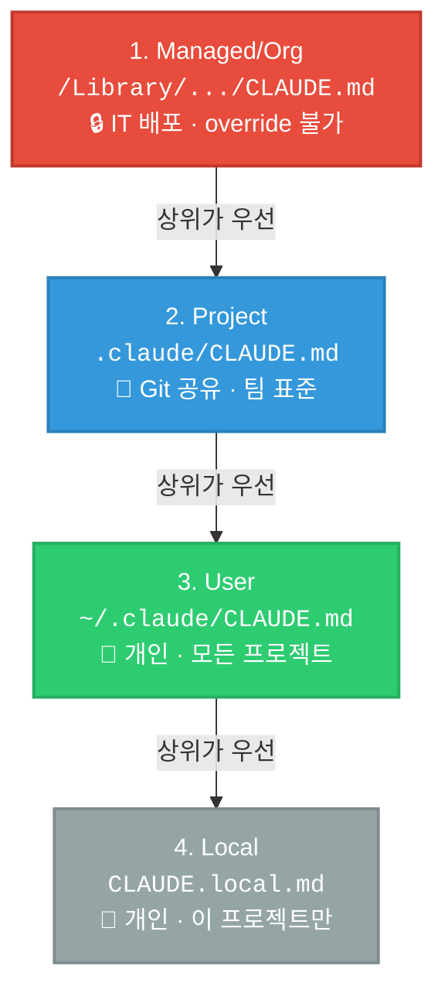
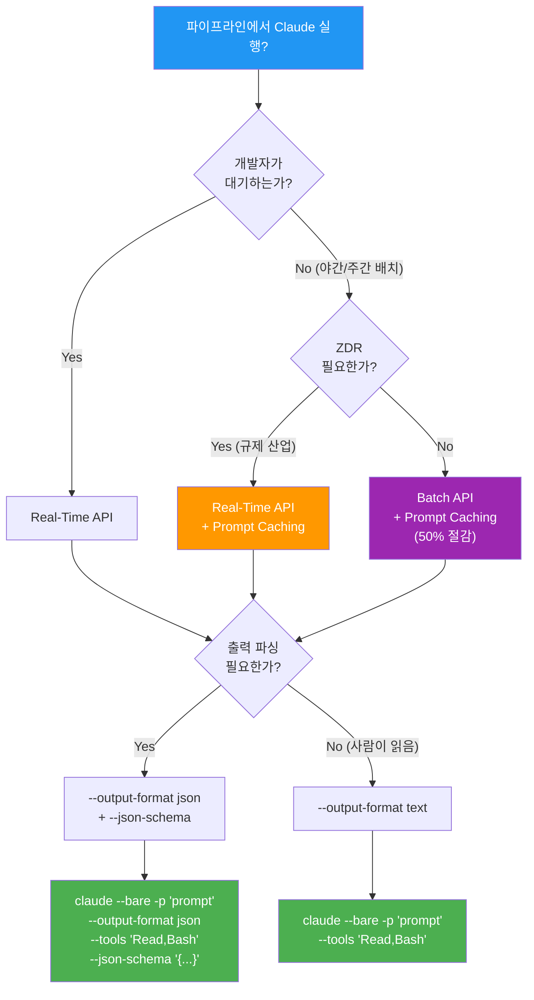

# Domain 3: Claude Code Configuration & Workflows

> **가중치 20%** | 예상 **~12문항** | 시험 전체의 1/5
> 출제 시나리오: Code Generation (Part 3), CI/CD (Part 6), Developer Productivity (Part 7)

---

## 1. 도메인 개요 (Domain Overview)

Domain 3은 Claude Code를 **실무 환경에서 설정하고 운영하는 능력**을 평가한다. 단순 사용법이 아니라 **왜 그렇게 설정해야 하는지**, 잘못 설정하면 **어떤 장애가 발생하는지**를 묻는다.

### 시험에서 물어보는 것

| 카테고리 | 핵심 질문 | 출제 빈도 |
|----------|----------|----------|
| CLAUDE.md 계층 구조 | "이 설정은 어느 레벨에 넣어야 하는가?" | ★★★ |
| CI/CD 플래그 | "`-p`, `--bare`, `--output-format json` 조합은?" | ★★★ |
| 도구 제한 vs 사전 승인 | "`--tools` vs `--allowedTools` 차이는?" | ★★★ |
| 커스텀 스킬 | "반복 워크플로우를 어떻게 표준화하는가?" | ★★☆ |
| Hooks | "프롬프트 vs 프로그래밍적 강제의 차이는?" | ★★★ |
| Permission / Sandboxing | "CI/CD에서 의도치 않은 동작을 어떻게 막는가?" | ★★☆ |
| ZDR vs Batch API | "규제 산업에서 비용 최적화 방법은?" | ★★★ |

**핵심 원칙**: "A prompt is guidance. A flag is a guarantee." (프롬프트는 안내, 플래그는 보장)

---

## 2. 핵심 개념 (Core Concepts)

### 2.1 CLAUDE.md 4-Level Hierarchy

> 대부분의 학습 자료는 Project/User 2개만 다루지만, **공식 문서는 4개 레벨**을 정의한다. 시험은 4개 모두를 테스트한다.

| 레벨 | 위치 (Location) | VCS 공유 | 범위 (Scope) | 통제 주체 |
|------|----------------|----------|-------------|----------|
| **1. Managed/Org** (최고 권한) | macOS: `/Library/Application Support/ClaudeCode/CLAUDE.md` / Linux: `/etc/claude-code/CLAUDE.md` | No (IT 배포) | 전체 조직 | IT / DevOps |
| **2. Project** | `./CLAUDE.md` 또는 `./.claude/CLAUDE.md` | **Yes** | 팀 전체 | 팀 (코드 리뷰) |
| **3. User** | `~/.claude/CLAUDE.md` | No | 개인, 모든 프로젝트 | 개인 |
| **4. Local** | `CLAUDE.local.md` (.gitignore) | No | 개인, 해당 프로젝트만 | 개인 |

**해석 순서 (Resolution order)**: Managed/Org -> Project -> User -> Local. 상위 레벨은 하위 레벨에 의해 **절대 재정의(override)될 수 없다**.

> DNS가 도메인을 네임서버 체인을 따라 해석하듯, CLAUDE.md 설정도 Managed/Org에서 Local까지 체인을 따라 해석된다. 상위 레벨이 항상 우선한다.

#### 시험 출제 패턴

| 시나리오 | 정답 레벨 | 왜? |
|---------|----------|-----|
| 조직 전체 보안 가이드라인, 개발자가 재정의 불가 | **Managed/Org** | 최고 권한, override 불가 |
| 팀 코딩 표준, 새 팀원 자동 적용 | **Project** | Git 공유, 코드 리뷰로 관리 |
| 개인 에디터 선호도, 모든 프로젝트에 적용 | **User** | 개인 전역 설정 |
| 개인 실험 설정, 이 프로젝트에서만 | **Local** | .gitignore, 프로젝트 한정 |

#### Monorepo 지원

리포지토리 루트에 CLAUDE.md를 배치하고, 하위 디렉토리에 컴포넌트별 CLAUDE.md를 추가하면 Claude가 해당 디렉토리의 파일을 읽을 때 자동으로 하위 CLAUDE.md를 로드한다.



---

### 2.2 CLI Flags: CI/CD 필수 3종 세트

CI/CD 파이프라인에서 Claude Code를 실행할 때 **반드시 함께 사용해야 하는 3개 플래그**:

```bash
claude --bare -p "Review this pull request" \
  --output-format json \
  --tools "Read,Bash"
```

#### `-p` (`--print`) — 비인터랙티브 모드

| 항목 | 설명 |
|------|------|
| **역할** | 프롬프트를 받고, 처리하고, 출력하고, **종료** (one-shot execution) |
| **누락 시 증상** | 파이프라인이 **무한 대기(hang)**. 에러도 없고 느려지는 것도 아닌 "멈춤" |
| **근본 원인** | 인터랙티브 UI가 사용자 입력을 기다리지만, CI에는 사용자가 없음 |
| **시험 함정** | "타임아웃을 120분으로 늘려라" = 증상 치료. `-p` 추가 = 근본 원인 해결 |

#### `--bare` — 헤드리스/재현 가능 모드

| 항목 | 설명 |
|------|------|
| **스킵 대상** | Hooks, LSP, 플러그인 동기화, 스킬 디렉토리 스캔, 자동 메모리, OAuth/Keychain 인증 |
| **왜 필요한가** | `-p`만 쓰면 로컬 머신과 CI 러너에서 **다른 동작**이 발생 (CLAUDE.md, MCP 서버, 훅 차이) |
| **인증 주의** | `--bare`는 OAuth를 스킵하므로 `ANTHROPIC_API_KEY` 환경변수를 **명시적으로 설정**해야 함 |
| **미래 기본값** | Anthropic은 `--bare`를 `-p`의 기본값으로 만들 예정이라고 명시 |

#### `--output-format json` — 기계 파싱 가능 출력

| 항목 | 설명 |
|------|------|
| **역할** | Claude의 응답을 **항상 유효한 JSON**으로 출력 |
| **모드** | `text`, `json`, `stream-json` |
| **시험 함정** | 프롬프트에 "Always return JSON" → 90% 작동 (마크다운 래핑, 설명 텍스트 가능). **플래그는 100% 보장** |
| **`--json-schema`와 조합** | 특정 스키마로 출력을 제약. 결과는 `structured_output` 필드에 위치 (**`result` 아님!**) |

---

### 2.3 CLI 플래그 완전 비교표 (Full Flag Reference)

> **이 표는 시험에서 가장 자주 출제되는 영역이다. 완벽하게 암기할 것.**

| 플래그 | 역할 (Role) | CI/CD 필수? | 시험 핵심 포인트 |
|--------|------------|-----------|----------------|
| **`-p` / `--print`** | 비인터랙티브 모드, one-shot 실행 | **필수** | 누락 시 파이프라인 hang (에러 아님, 무한 대기) |
| **`--bare`** | 훅/LSP/스킬/메모리/OAuth 스킵 | **필수** | 환경 간 재현성 보장. 향후 `-p`의 기본값 예정 |
| **`--output-format json`** | 기계 파싱 가능 JSON 출력 강제 | **권장** | 프롬프트 JSON 요청 = 90% / 플래그 = 100% |
| **`--json-schema`** | JSON 스키마로 출력 구조 제약 | 선택 | 결과는 **`structured_output`** 필드 (`result` 아님!) |
| **`--tools "Read,Bash"`** | 사용 가능 도구를 **제한 (restrict)** | **권장** | **실제 샌드박싱**. 지정 도구만 사용 가능 |
| **`--allowedTools "Read,Bash"`** | 지정 도구를 **사전 승인 (pre-approve)** | 선택 | 권한 프롬프트 스킵만. **다른 도구 사용 막지 않음!** |
| **`--continue` / `-c`** | 마지막 대화 이어가기 | 선택 | 멀티턴 파이프라인 |
| **`--resume <id>`** | 특정 세션 재개 | 선택 | 특정 세션 복구 |
| **`--thinking`** | 확장 사고 활성화 | 선택 | 복잡한 추론/디버깅 |
| **`--model <name>`** | 모델 선택 | 선택 | Opus/Sonnet 전환 |

#### `--tools` vs `--allowedTools` 결정적 차이

```
--tools "Read,Bash"
  → Claude는 Read와 Bash만 사용 가능 (나머지 전부 차단)
  → = 실제 샌드박싱 (restriction)

--allowedTools "Read,Bash"
  → Read와 Bash는 권한 프롬프트 없이 자동 승인
  → 다른 도구도 여전히 사용 가능 (승인만 스킵)
  → = 편의 기능 (pre-approval), 보안 아님!
```

> **시험 신호**: "CI/CD에서 의도하지 않은 동작을 막으려면?" → `--tools` (제한). `--allowedTools`는 오답.

---

### 2.4 CI/CD Pipeline Integration Patterns



#### Pattern 1: Automated PR Code Review (시험 최빈출)

```yaml
- name: Review PR
  run: |
    DIFF=$(gh pr diff ${{ github.event.pull_request.number }})
    echo "$DIFF" | claude --bare -p "Review for security issues" \
      --output-format json \
      --tools "Read,Bash" \
      --json-schema '{"type":"object","properties":{"issues":{"type":"array"},"approve":{"type":"boolean"}}}'
```

4대 요소 모두 포함: `--bare` (재현성) + `-p` (비인터랙티브) + `--output-format json` (파싱) + `--tools` (샌드박싱)

#### Pattern 2: Nightly Test Generation (Batch API 후보)

- 개발자가 대기하지 않음 → Batch API로 **50% 비용 절감** 가능
- 단, ZDR 필요 시 Real-Time API + Prompt Caching 사용

#### Pattern 3: Fix Pipeline (Validation-Retry Loop)

```
테스트 실패 → Claude 수정 시도 → 재실행 → 실패 시: 에러 피드백과 함께 재시도 (최대 2-3회) → 사람에게 에스컬레이션
```

| 원칙 | 설명 |
|------|------|
| 재시도 제한 | **2-3회 최대**. 무한 재시도 = 안티패턴 |
| 에러 피드백 | 이전 에러를 다음 재시도에 포함. **Blind retry** (에러 컨텍스트 없는 재시도) = 안티패턴 |
| 사람 에스컬레이션 | 제한 초과 시 반드시 사람에게 넘김. 무한 루프 금지 |

---

### 2.5 Custom Slash Commands / Skills

| 구분 | Rules | Skills |
|------|-------|--------|
| 경로 | `.claude/rules/*.md` | `.claude/skills/SKILL.md` |
| 로딩 | **매 세션 자동** (항상 컨텍스트에 포함) | **호출 시 또는 관련 시** (on-demand) |
| 용도 | 항상 적용해야 하는 지시사항 | 복잡한 다단계 절차 (3단계+ x 2회+ 반복) |
| 주의 | 세션 오버헤드 추가 | CLAUDE.md를 **참조(reference)**, **복제(duplicate) 금지** |

#### 스킬 생성 기준

- **3단계 이상** 워크플로우 AND **2회 이상** 반복 → 스킬로 인코딩
- 5명의 개발자가 각자 "deploy to staging" 프롬프트를 작성 = 5가지 다른 절차 → **스킬로 표준화**
- 스킬은 CLAUDE.md를 **참조**해야지 **복제**하면 안 됨 (dual maintenance 회피)

---

### 2.6 Hooks: 프로그래밍적 강제 (Programmatic Enforcement)

CLAUDE.md에 "항상 린터를 실행하라"고 쓰면 **대부분** 작동하지만, **컨텍스트 압력(context pressure)** 하에서 — 컨텍스트 윈도우가 채워지면 — 단계가 생략될 수 있다.

> **프롬프트는 확률적으로 실행된다. 훅은 결정적으로 실행된다.**

| Hook 종류 | 실행 시점 | 사용 예시 |
|-----------|----------|----------|
| **PreToolUse** | 도구 사용 **전** | 승인된 명령어 목록 확인 |
| **PostToolUse** | 도구 사용 **후** | 파일 저장 후 자동 린트 (`eslint --fix`) |
| **Stop** | Claude가 멈출 때 | 완료 검증 |
| **SessionStart** | 세션 시작 | 환경 초기화 |
| **SessionEnd** | 세션 종료 | 정리 작업 |
| **UserPromptSubmit** | 사용자 프롬프트 제출 | 입력 전처리 |

```json
{
  "hooks": {
    "PostToolUse": [
      {
        "matcher": "write_file",
        "command": "eslint --fix ${file_path}"
      }
    ]
  }
}
```

> **시험 신호**: "시스템 프롬프트에 지시 추가" vs "프로그래밍적 훅 설정" → **훅이 거의 항상 정답**. 예외 없이 따라야 하는 규칙은 프롬프트가 아니라 프로그래밍적 강제로 보장한다.

---

### 2.7 Permission Modes and Sandboxing

CI/CD 환경에서 Claude가 의도하지 않은 동작을 하지 못하도록 **심층 방어(Defense-in-Depth)** 전략을 적용한다:

| 방어 계층 | 수단 | 역할 |
|----------|------|------|
| **1. Context defense** | `--bare` | 로컬 컨텍스트 전부 제거 (훅, 스킬, 메모리) |
| **2. Tool defense** | `--tools` | 사용 가능 도구 제한 |
| **3. Output defense** | `--output-format json` + `--json-schema` | 출력 구조 제약 |
| **4. Validation defense** | Schema validation | 결과를 **신뢰하기 전에** 검증 |
| **5. Retry defense** | Error-feedback retry (2-3회) | 실패 시 에러 피드백 포함 재시도, 이후 사람 에스컬레이션 |

---

### 2.8 ZDR (Zero Data Retention) vs Batch API

| 항목 | Real-Time API | Batch API (Message Batches) |
|------|-------------|---------------------------|
| 지연시간 | 즉시 응답 | 최대 **24시간** |
| 비용 | 표준 | **50% 할인** |
| ZDR 호환 | **Yes** | **No** (ZDR 대상 아님!) |
| 사용 시나리오 | 개발자 대기, 규제 산업 | 야간/주간 배치, ZDR 불필요 |

> **Critical Exam Fact**: Message Batches API는 Zero Data Retention 대상이 **아니다**. 규제 산업(의료/금융/정부)에서 ZDR이 필요하면 Batch API를 **절대 사용할 수 없다**.

#### 시험 키워드 감지

| 키워드 | API 선택 |
|--------|----------|
| "nightly", "weekly", "scheduled", "overnight" + ZDR 불필요 | **Batch API** |
| "nightly", "weekly" + 규제 산업, ZDR 필요 | **Real-Time API + Prompt Caching** |
| "developer waiting", "merge blocking", "immediate" | **Real-Time API** |

---

### 2.9 Prompt Caching 비용 구조

| 유형 | 비용 | 설명 |
|------|------|------|
| **캐시 읽기 (Cache read)** | **0.1x** (90% 절감) | 반복 토큰의 핵심 절감 포인트 |
| **캐시 쓰기 (Cache write, 5분 TTL)** | **1.25x** (25% 추가) | 최초 기록 프리미엄 |
| **캐시 쓰기 (Cache write, 1시간 TTL)** | **2.0x** (100% 추가) | 장기 캐시 프리미엄 |

> **시험 함정**: "Prompt Caching은 모든 토큰을 90% 절감한다" = **오답**. 90%는 **읽기 토큰에만** 적용. 쓰기 토큰은 오히려 **비용 증가**.

---

## 3. 안티패턴 vs 정답 패턴 (Anti-Patterns vs Correct Patterns)

| # | 안티패턴 (Anti-Pattern) | 왜 틀린가 (Why It Fails) | 정답 패턴 (Correct Pattern) |
|---|----------------------|----------------------|--------------------------|
| 1 | CI/CD에서 `-p` 없이 실행 | 인터랙티브 모드 → 무한 hang | **`claude --bare -p "..."`** |
| 2 | 타임아웃을 120분으로 연장 | 증상 치료, 근본 원인 미해결 | **`-p` 플래그 추가** (근본 원인) |
| 3 | 프롬프트로 "Always return JSON" | 90% 작동, 마크다운 래핑 가능 | **`--output-format json`** (100% 보장) |
| 4 | `--allowedTools`로 도구 제한 시도 | 사전 승인만, 다른 도구 차단 안 됨 | **`--tools`로 실제 제한** |
| 5 | 팀 표준을 `~/.claude/CLAUDE.md`에 배치 | Git 비공유, 수동 복사 필요, 확장 불가 | **`.claude/CLAUDE.md`** (Project 레벨) |
| 6 | 프롬프트로 비즈니스 규칙 강제 | 컨텍스트 압력 시 단계 생략 가능 | **PostToolUse/PreToolUse 훅** |
| 7 | 규제 산업에서 Batch API 사용 | ZDR 미지원 → 컴플라이언스 위반 | **Real-Time API + Prompt Caching** |

---

## 4. 시험 빈출 용어 15개 (Key Exam Terms)

| # | 영어 용어 | 한국어 | 핵심 포인트 |
|---|----------|--------|-----------|
| 1 | **`-p` / `--print`** | 비인터랙티브 모드 | CI/CD 필수. 누락 = hang |
| 2 | **`--bare`** | 헤드리스 모드 | 훅/LSP/스킬/메모리 스킵. 재현성 보장 |
| 3 | **`--output-format json`** | JSON 출력 강제 | 프롬프트 = 안내(guidance), 플래그 = 보장(guarantee) |
| 4 | **`--json-schema`** | JSON 스키마 제약 | 결과는 `structured_output` 필드 |
| 5 | **`--tools`** | 도구 제한 (restrict) | 실제 샌드박싱. CI/CD 보안의 정답 |
| 6 | **`--allowedTools`** | 도구 사전 승인 (pre-approve) | 편의 기능. 보안 아님! |
| 7 | **Zero Data Retention (ZDR)** | 제로 데이터 보유 | Batch API는 ZDR **미지원** |
| 8 | **Prompt Caching** | 프롬프트 캐싱 | 읽기 90% 절감 / 쓰기 25-100% 추가 |
| 9 | **Batch API** | 배치 API | 50% 할인, 24시간 윈도우, ZDR 불가 |
| 10 | **PostToolUse hook** | 도구 사용 후 훅 | 결정적 실행. 프롬프트보다 확실 |
| 11 | **PreToolUse hook** | 도구 사용 전 훅 | 승인 목록 확인, 위험 명령 차단 |
| 12 | **structured_output** | 구조화된 출력 필드명 | `--json-schema` 사용 시 결과 위치 |
| 13 | **defense-in-depth** | 심층 방어 | 5계층: context → tool → output → validation → retry |
| 14 | **validation-retry loop** | 유효성 검사-재시도 루프 | 2-3회 제한, 에러 피드백 필수, blind retry = 안티패턴 |
| 15 | **Managed/Org CLAUDE.md** | 조직 레벨 CLAUDE.md | 최고 권한, override 불가. IT/DevOps 배포 |
| 16 | **Extended Thinking** | 확장 사고 | `--thinking`으로 활성화. 복잡한 추론/디버깅 |
| 17 | **`--continue` / `-c`** | 세션 이어가기 | 마지막 대화를 이어서 계속 |
| 18 | **`--resume`** | 세션 재개 | 특정 세션 ID 지정하여 재개 |
| 19 | **Task/Agent Tool** | Task 도구 | 서브에이전트 생성. 독립 컨텍스트에서 실행 |
| 20 | **Auto Memory** | 자동 메모리 | 대화 중 중요 사실 자동 저장. `--bare`에서 비활성화 |

---

## 5. 암기 필수: 숫자 카드 (Must-Memorize Numbers)

| 항목 | 값 | 시험 포인트 |
|------|-----|-----------|
| Prompt Caching 읽기 절감률 | **90%** (0.1x) | "모든 토큰" 아님, 읽기 토큰만 |
| Prompt Caching 쓰기 추가 (5분 TTL) | **25%** (1.25x) | 쓰기는 비용 **증가** |
| Prompt Caching 쓰기 추가 (1시간 TTL) | **100%** (2.0x) | 장기 캐시 프리미엄 |
| Batch API 비용 절감 | **50%** | ZDR 미지원 |
| Batch API 처리 윈도우 | **24시간** | 블로킹 워크플로우에 부적합 |
| 재시도 제한 횟수 | **2-3회** | 무한 재시도 = 안티패턴 |
| 에이전트당 권장 도구 수 | **4-5개** | 15+ = 선택 정확도 저하 |
| CLAUDE.md 레벨 수 | **4개** | Managed/Org, Project, User, Local |
| CI/CD 안티패턴 수 | **9가지** | 표로 암기 |

---

## 6. 예상 문제 5문항 (Practice Questions)

### Q1. CLAUDE.md 4-Level Hierarchy

조직의 보안 팀이 모든 Claude Code 세션에서 특정 보안 가이드라인을 강제하려 합니다. 개별 개발자가 이 설정을 재정의할 수 없어야 합니다. 어느 CLAUDE.md 레벨을 사용해야 합니까?

A) Project 레벨 (`.claude/CLAUDE.md`) — 팀 전체가 Git으로 공유하므로
B) User 레벨 (`~/.claude/CLAUDE.md`) — 개발자별로 배포하므로
C) Managed/Org 레벨 (`/Library/Application Support/ClaudeCode/CLAUDE.md`) — IT가 배포하고 override 불가
D) Local 레벨 (`CLAUDE.local.md`) — 프로젝트별로 적용하므로

<details>
<summary>정답 및 해설</summary>

**정답: C**

Managed/Org 레벨은 4-level hierarchy의 **최고 권한**이다. IT/DevOps가 배포하며, 하위 레벨(Project, User, Local)에서 **재정의(override)할 수 없다**. "개별 개발자가 재정의할 수 없어야 한다"는 요구사항이 핵심 키워드.

- A는 팀 표준에 적합하지만 개발자가 Local 레벨에서 재정의 가능
- B는 개인 설정이며 배포/관리가 불가능
- D는 개인 + 프로젝트 한정이며 Git 비공유

</details>

---

### Q2. `--tools` vs `--allowedTools`

CI/CD 파이프라인에서 Claude Code가 코드를 읽고 분석만 하도록 제한하려 합니다. 파일 수정이나 외부 명령 실행을 **막아야** 합니다. 올바른 플래그는?

A) `--allowedTools "Read"` — Read 도구를 사전 승인한다
B) `--tools "Read"` — Read 도구만 사용 가능하도록 제한한다
C) `--bare` — 모든 도구 접근을 차단한다
D) `--disableTools "Write,Edit,Bash"` — 위험한 도구를 비활성화한다

<details>
<summary>정답 및 해설</summary>

**정답: B**

`--tools "Read"`는 사용 가능한 도구를 Read **하나로 제한**한다. 이것이 실제 샌드박싱이다.

- A의 `--allowedTools`는 **사전 승인**만 할 뿐 다른 도구 사용을 **막지 않는다**. 가장 흔한 함정 오답
- C의 `--bare`는 훅/스킬/메모리를 스킵하지 도구를 제한하지 않는다
- D의 `--disableTools`는 존재하지 않는 플래그이다

</details>

---

### Q3. ZDR + 비용 최적화

금융 규제 기관에서 매일 밤 코드베이스 보안 분석을 실행합니다. **Zero Data Retention 정책을 준수**하면서 비용을 최적화하려면?

A) Batch API — 50% 비용 절감 + 야간 실행에 적합
B) Batch API + Prompt Caching — 최대 비용 절감
C) Real-Time API + Prompt Caching — ZDR 호환 + 캐싱으로 비용 최적화
D) ZDR 정책은 API 선택과 무관하다

<details>
<summary>정답 및 해설</summary>

**정답: C**

**Message Batches API는 Zero Data Retention 대상이 아니다.** 규제 산업(금융)에서 ZDR이 필요하면 Batch API를 사용할 수 없다. Real-Time API는 ZDR과 호환되며, Prompt Caching으로 반복 토큰의 읽기 비용을 90% 절감하여 비용을 최적화한다.

- A, B는 ZDR 미지원 → 컴플라이언스 위반
- D는 사실과 다름 — ZDR 호환성은 API 유형에 따라 다르다

**시험 신호**: "규제 산업" + "Batch API" 선택지 → 즉시 제거

</details>

---

### Q4. Hook vs 프롬프트

팀의 import 정렬 규칙이 간헐적으로 무시됩니다. 일부 개발자가 `~/.claude/CLAUDE.md`에 지시를 추가했지만 불일치가 계속됩니다. 가장 효과적인 해결책은?

A) 각 개발자의 개인 CLAUDE.md에 더 상세한 예시를 추가한다
B) import 정렬 지시를 담은 공유 스킬을 만든다
C) 프로젝트 레벨 `.claude/CLAUDE.md`에 지시를 추가하고, PostToolUse 훅으로 자동 정렬을 설정한다
D) 시스템 프롬프트에 few-shot 예시를 추가한다

<details>
<summary>정답 및 해설</summary>

**정답: C**

이 문제는 **두 가지 원칙을 동시에** 테스트한다:
1. 팀 표준은 **Project 레벨** CLAUDE.md에 (User 레벨 아님)
2. 예외 없이 따라야 하는 규칙은 **프로그래밍적 강제** (PostToolUse 훅)

- A는 User 레벨 + 프롬프트 기반 = 이중 오답
- B는 프로그래밍적 강제 없음
- D는 few-shot 예시로 도구 동작을 제어하는 안티패턴

</details>

---

### Q5. `--json-schema` 결과 필드

`--json-schema`를 사용하여 Claude Code의 출력을 구조화했습니다. 파이프라인의 다음 단계에서 결과를 파싱하려면 응답 JSON의 어떤 필드를 참조해야 합니까?

A) `result`
B) `output`
C) `structured_output`
D) `json_response`

<details>
<summary>정답 및 해설</summary>

**정답: C**

`--json-schema` 사용 시 결과는 **`structured_output`** 필드에 위치한다.

```json
{
  "structured_output": {
    "issues": [...],
    "approve": true
  }
}
```

- A의 `result`는 가장 흔한 함정 오답 — 직관적이지만 틀림
- B, D는 존재하지 않는 필드명

**이것은 단순 암기 문제다. `structured_output`을 외워라.**

</details>

---

### Q6. Task 도구와 서브에이전트

Claude Code에서 복잡한 작업을 병렬로 처리하기 위해 서브에이전트를 생성하려 합니다. Task 도구의 핵심 특성으로 **올바른** 것은?

A) 서브에이전트는 부모 에이전트의 컨텍스트를 공유하여 효율적으로 작업한다
B) 서브에이전트는 독립된 컨텍스트에서 실행되며, 결과만 부모에게 반환한다
C) 서브에이전트는 부모 에이전트의 도구 권한을 자동으로 상속한다
D) Task 도구는 `--bare` 모드에서만 사용 가능하다

<details>
<summary>정답 및 해설</summary>

**정답: B**

Task/Agent 도구는 **독립된 컨텍스트(isolated context)**에서 서브에이전트를 생성한다. 각 서브에이전트는 독립적으로 작업하고 **결과만 부모에게 반환**한다. 이것은 Domain 1의 **컨텍스트 격리(context isolation)** 원칙의 실제 구현이다.

- A는 컨텍스트 격리 원칙에 반한다. 컨텍스트를 공유하면 오염 위험
- C는 도구 권한은 자동 상속이 아니라 명시적으로 설정해야 한다
- D는 Task 도구는 인터랙티브/비인터랙티브 모드 모두에서 사용 가능하다

**핵심**: Task tool = subagent in isolated context → results only return to parent

</details>

---

### Q7. `--continue` vs `--resume`

CI/CD 파이프라인에서 멀티턴 대화가 필요합니다. 첫 번째 단계에서 코드 분석을 하고, 두 번째 단계에서 분석 결과를 기반으로 수정을 요청합니다. 올바른 접근 방식은?

A) 두 번째 단계에서 `--continue` 플래그로 마지막 대화를 이어간다
B) 첫 번째 단계의 세션 ID를 캡처하고, 두 번째 단계에서 `--resume <session-id>`로 특정 세션을 재개한다
C) 두 단계를 하나의 프롬프트에 모두 포함시킨다
D) `--continue`와 `--resume`은 동일한 기능이므로 어떤 것이든 사용한다

<details>
<summary>정답 및 해설</summary>

**정답: B**

CI/CD 파이프라인에서 멀티턴이 필요할 때는 **`--resume <session-id>`**가 정답이다. `--continue`는 "마지막 대화"를 이어가지만, 병렬 파이프라인 환경에서는 어떤 세션이 "마지막"인지 보장할 수 없다. `--resume`은 **특정 세션 ID를 명시적으로 지정**하므로 재현 가능하고 안전하다.

- A의 `--continue`는 로컬 개발에서는 편리하지만, CI/CD에서는 세션 식별이 모호할 수 있다
- C는 복잡한 멀티턴을 하나의 프롬프트로 합치면 결과 품질이 저하된다
- D는 두 플래그의 목적이 다르다 — `--continue`는 "마지막 대화", `--resume`은 "특정 세션"

**시험 신호**: "CI/CD" + "멀티턴" → `--resume` (특정 세션 ID 명시)

</details>

---

## 7. 빠른 복습 체크리스트 (Quick Review Checklist)

### CI/CD 플래그
- [ ] `-p` = 비인터랙티브 (누락 = hang, 에러 아님)
- [ ] `--bare` = 재현성 (훅/스킬/메모리 스킵, 향후 `-p` 기본값)
- [ ] `--output-format json` = 100% JSON 보장 (프롬프트 = 90%)
- [ ] `--json-schema` → 결과는 `structured_output` 필드
- [ ] `--tools` = 제한 (restrict) / `--allowedTools` = 사전 승인 (pre-approve)
- [ ] `--bare` 시 `ANTHROPIC_API_KEY` 환경변수 명시 필수

### CLAUDE.md
- [ ] 4-level: Managed/Org > Project > User > Local
- [ ] 상위 레벨이 항상 우선, override 불가
- [ ] 팀 표준 → Project 레벨 (User 레벨 = 오답)
- [ ] 조직 보안 정책 → Managed/Org 레벨
- [ ] Monorepo → 루트 + 하위 디렉토리 CLAUDE.md

### Hooks & Skills
- [ ] 프롬프트 = 확률적(probabilistic), 훅 = 결정적(deterministic)
- [ ] PostToolUse: 도구 사용 후 (auto-lint)
- [ ] PreToolUse: 도구 사용 전 (명령어 확인)
- [ ] 3단계+ x 2회+ 반복 → 스킬로 인코딩
- [ ] 스킬은 CLAUDE.md 참조 (복제 금지)

### 비용 최적화
- [ ] Prompt Caching 읽기 = 90% 절감 (쓰기 = 25-100% 추가)
- [ ] Batch API = 50% 절감, ZDR **미지원**
- [ ] 규제 산업 + Batch API = 즉시 제거
- [ ] 재시도 = 2-3회, 에러 피드백 필수, blind retry = 안티패턴

---

## 8. CI/CD 명령어 기본 템플릿 (Reference Template)

```bash
# 최소 CI/CD 명령어
claude --bare -p "<PROMPT>"

# 전체 옵션 CI/CD 명령어
export ANTHROPIC_API_KEY=${{ secrets.ANTHROPIC_KEY }}
claude --bare -p "<PROMPT>" \
  --output-format json \
  --tools "Read,Bash" \
  --json-schema '<SCHEMA>'
```

---

## 9. Anthropic 공식 문서 보완

> 기존 학습 자료에서 빠져 있거나 얕게 다룬 내용을 Anthropic 공식 문서 기준으로 보완한다.

### 9.1 Task 도구 — 서브에이전트 실제 구현 (높은 중요도)

Claude Code의 `Task` 도구는 서브에이전트 구현의 실체다.

| 항목 | 설명 |
|------|------|
| **실행 방식** | 독립 컨텍스트에서 실행, 결과만 부모에게 반환 |
| **D1 연결** | Domain 1의 컨텍스트 격리(context isolation) 원칙의 실제 구현 |
| **구성 요소** | `Agent` 도구와 `SendMessage`로 서브에이전트 생성 및 통신 |
| **핵심 이점** | 복잡한 작업을 병렬 분해하여 처리. 각 서브에이전트가 독립적으로 작업 |

> **English (Exam Vocabulary)**: The Task/Agent tool in Claude Code spawns subagents in isolated contexts. Each subagent works independently and returns only results to the parent, implementing context isolation in practice.

---

### 9.2 Extended Thinking (`--thinking`)

복잡한 태스크에서 Claude가 **단계별로 사고하는 과정**을 볼 수 있음. 디버깅과 복잡한 추론에 유용.

- 활성화: `claude --thinking`
- 사고 과정이 출력에 포함되어 Claude의 판단 근거를 확인 가능
- 복잡한 코드 리뷰, 아키텍처 결정 시 특히 유용

---

### 9.3 `--continue` / `--resume` 플래그

| 플래그 | 역할 | 사용 시나리오 |
|--------|------|-------------|
| `--continue` (`-c`) | 마지막 대화를 이어서 계속 | 로컬 개발에서 이전 대화 이어가기 |
| `--resume <session-id>` | 특정 세션 ID를 지정하여 재개 | CI/CD 파이프라인에서 멀티턴 필요 시 |

> **시험 포인트**: 파이프라인에서 멀티턴이 필요하면 `--resume`을 사용한다. `--continue`는 "마지막 대화"가 모호할 수 있어 CI/CD에 부적합.

---

### 9.4 Memory 시스템 상세

| Memory 유형 | 설명 | 위치 |
|-------------|------|------|
| **자동 메모리** | 대화 중 중요 사실을 자동 저장 | `~/.claude/` 하위 |
| **CLAUDE.md 기반 메모리** | 프로젝트 규칙/선호사항 매 세션 자동 로드 | 4-level hierarchy |
| **`--bare` 모드** | 자동 메모리 **비활성화** | CI/CD 재현성의 핵심 |

> **시험 연결**: `--bare`가 자동 메모리를 비활성화하는 이유 = CI/CD **재현성(reproducibility)**. 로컬에서 축적된 메모리가 CI 러너에 없으면 동작이 달라진다.

---

### 9.5 OAuth vs API Key 인증

| 모드 | 인증 방식 | 설명 |
|------|----------|------|
| **인터랙티브 모드** | OAuth (Anthropic 계정) | 브라우저 기반 인증 |
| **`--bare` 모드** | `ANTHROPIC_API_KEY` 환경변수 | CI/CD에서 유일하게 작동하는 방식 |

> **안티패턴**: CI/CD에서 OAuth 사용 → 인증 실패. `--bare` 모드는 OAuth를 스킵하므로 반드시 `ANTHROPIC_API_KEY`를 설정해야 한다.

---

### 9.6 `--model` 플래그

사용할 모델을 지정한다. 기본값은 Claude Sonnet이며, Opus 등으로 전환 가능.

```bash
# Opus 모델로 전환
claude --model claude-opus-4-0-20250514 -p "Complex architecture review"

# 기본 Sonnet 사용
claude -p "Simple code fix"
```

> 복잡한 추론이 필요한 작업(아키텍처 리뷰, 보안 분석)에는 Opus, 빠른 반복 작업에는 Sonnet이 적합하다.

---

> **이 도메인의 핵심 한 줄**: CI/CD에서 Claude를 실행할 때 `-p --bare`는 선택이 아니라 **필수**이고, `--tools`는 **제한**이며 `--allowedTools`는 **편의**일 뿐이다. 프롬프트는 안내(guidance)이고 플래그는 보장(guarantee)이다.
