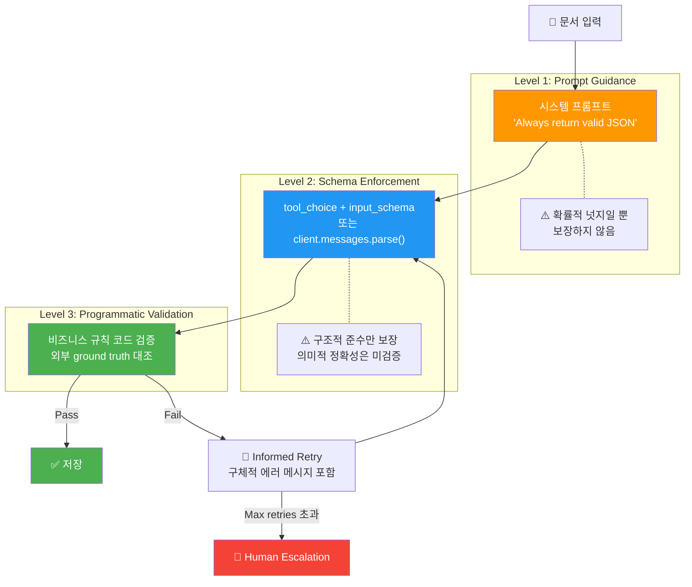

# Domain 4: Prompt Engineering & Structured Output (20%)

> **비중**: 20% (~12문항) | **핵심 키워드**: 3-Tier Reliability Model, tool-forcing, Pydantic parse, prefill, validation-retry
>
> 이 도메인의 핵심은 단 하나다: **"Prompts are guidance. Code is law."**
> 프롬프트로 JSON 형식을 지시하는 것은 확률적 넛지(probabilistic nudge)일 뿐이며,
> 프로덕션에서는 프로그래밍적 강제(programmatic enforcement)가 정답이다.

---

## 1. 도메인 개요

Domain 4는 Claude에게 **구조화된 출력을 안정적으로 생성**시키는 아키텍처 역량을 평가한다.

| 평가 영역 | 출제 비중 | 핵심 질문 |
|-----------|----------|----------|
| 3-Tier Reliability Model | ★★★★★ | 각 레벨의 한계와 순서를 이해하는가? |
| Tool-forcing vs Auto selection | ★★★★★ | `tool_choice` 파라미터의 정확한 사용법을 아는가? |
| SDK vs Framework 구분 | ★★★★☆ | `with_structured_output()` 함정을 식별할 수 있는가? |
| Validation-retry 패턴 | ★★★★☆ | Informed + bounded + human escalation 조합을 아는가? |
| Prefill & Few-shot 기법 | ★★★☆☆ | 출력 형식을 제어하는 프롬프트 기법을 구분하는가? |

**시험 전략**: 이 도메인에서 "시스템 프롬프트에 지시를 추가하여"로 시작하는 선택지는 **거의 항상 오답**이다. 시험은 일관되게 프로그래밍적 강제를 정답으로 보상한다.

---

## 2. 핵심 개념

### 2.1 3-Tier Reliability Model (3계층 신뢰성 모델)

> **이 모델이 Domain 4의 핵심 중 핵심이다. 반드시 외워야 한다.**

구조화된 데이터 추출 시스템은 3개의 신뢰성 계층이 필요하며, 시험은 **항상 Level 3 답을 보상**한다.

| Level | 메커니즘 | 해결하는 문제 | 한계 |
|-------|---------|-------------|------|
| **Level 1**: Prompt Guidance | "Always return valid JSON" | Claude에게 무엇을 할지 안내 | **확률적 넛지**(probabilistic nudge) — 보장이 아님 |
| **Level 2**: Schema Enforcement | tool-forcing / JSON Schema | **구조적(structural)** 준수 보장 | **의미적(semantic)** 정확성은 검증 불가 |
| **Level 3**: Programmatic Validation | 비즈니스 규칙 코드 검증 | 추출 데이터의 실제 정확성 검증 | — |

**왜 이 순서가 중요한가**: 각 계층은 이전 계층이 성공해야만 의미가 있다. 구조적으로 무효한 데이터에 시맨틱 검증을 실행하는 것은 컴퓨팅 낭비다.

#### Level 1의 실패 모드 (Failure Modes)

"Always return valid JSON"을 시스템 프롬프트에 넣으면 확률 분포를 JSON 출력 쪽으로 **강하게 이동**시키지만, 다른 가능성을 **제거하지는 않는다**:

| 실패 모드 (Failure Mode) | 예시 |
|--------------------------|------|
| Markdown code fence wrapping | ` ```json { ... } ``` ` |
| Explanatory text prepended | "Here is the extracted data:" + JSON |
| Schema mismatch | 예상치 못한 필드, 누락 필드, 타입 오류 |
| **Hallucinated values** | "payment pending" → `"status": "completed"` |
| Truncation under context pressure | 긴 문서에서 닫는 중괄호 누락 |

**시험 시그널**: 프롬프트 강화(prompt enhancement) 답이 보이면, **즉시 제거**하라.

#### Level 2: 구조적 신뢰성 (Structural Reliability)

스키마 강제는 `total` 필드가 `number` 타입인 것을 보장하지만, 그 숫자가 `line_items` 합계와 일치하는지는 검증하지 **않는다**.

> "A perfectly formatted check is not the same as a check that will clear."
> (완벽한 형식의 수표가 은행에서 통과되는 수표와 같지 않다.)

#### Level 3: 의미적 신뢰성 (Semantic Reliability)

프로그래밍적 검증은 **Claude에게 아무것도 묻지 않는다** — 외부 ground truth에 대해 독립적으로 확인한다.

**자기보고 신뢰도(self-reported confidence) 안티패턴**: Claude에게 "1-10 척도로 추출 신뢰도를 평가하라"고 하면, 환각된 데이터에도 높은 신뢰도를 보고할 수 있다. **LLM은 자기 출력의 정확성을 객관적으로 평가할 수 없다.**

---

### 2.2 Mermaid 다이어그램: 3-Tier Reliability Model Flow



---

### 2.3 Tool-Forcing vs Auto Selection

**Tool-forcing**은 `tool_choice` 파라미터로 Claude가 **특정 도구를 반드시 호출**하도록 강제하는 메커니즘이다.

| 모드 | `tool_choice` 값 | 동작 |
|------|-------------------|------|
| **Auto** (기본값) | `{"type": "auto"}` | Claude가 도구 호출 여부와 어떤 도구를 호출할지 자율 결정 |
| **Tool-forcing** | `{"type": "tool", "name": "extract_invoice"}` | **반드시** 지정된 도구를 호출 — 마크다운 래퍼 없음, 설명 텍스트 없음, 스키마 준수 JSON만 반환 |
| **Any** | `{"type": "any"}` | 반드시 어떤 도구든 하나를 호출하되, 어떤 도구인지는 Claude가 결정 |
| **None** | `{"type": "none"}` | 도구 호출 금지 |

**시험 포인트**: 구조화된 데이터 추출에서는 **항상 tool-forcing**이 정답이다. Auto selection은 Claude가 도구를 호출하지 않을 수 있어 프로덕션에서 불안정하다.

---

### 2.4 Structured Output with JSON Schema (`input_schema`)

도구 정의의 `input_schema`는 **JSON Schema** 형식으로 출력 구조를 정의한다. Claude는 이 스키마에 맞는 JSON만 생성하도록 강제된다.

핵심 스키마 기능:
- **`required`**: 필수 필드 지정 → 누락 방지
- **`enum`**: 허용 값 목록 → **환각 방지** (예: currency는 "USD", "EUR", "GBP", "JPY"만 허용)
- **`pattern`**: 정규식 패턴 매칭 (예: 날짜 형식 `^\d{4}-\d{2}-\d{2}$`)
- **중첩 객체/배열**: 복잡한 구조도 정의 가능

---

### 2.5 Pydantic Parse + Retry Pattern

`client.messages.parse()`는 **Pydantic 모델을 직접 전달**하여 타입된 출력을 받는 네이티브 SDK 메서드다.

**재시도 패턴의 3가지 유형**:

| 유형 | 예시 | 시험 판정 |
|------|------|----------|
| **Blind retry** | "Try again." (에러 정보 없음) | **항상 오답** |
| **Informed retry** | "The total is 150 but line items sum to 175. Re-examine the source." | **정답 패턴** |
| **Unbounded retry** | "Keep retrying until it succeeds" (횟수 제한 없음) | **항상 오답** |

정답 공식: **Informed** (구체적 에러 메시지) + **Bounded** (2-3회) + **Human escalation** (최대 재시도 후 인간 개입)

---

### 2.6 Prefill Technique (Assistant Message Prefill)

어시스턴트 메시지의 시작 부분을 미리 채워서 출력 형식을 유도하는 기법이다.

```python
response = client.messages.create(
    model="claude-sonnet-4-6",
    messages=[
        {"role": "user", "content": "Extract the key entities from this text: ..."},
        {"role": "assistant", "content": "{"}  # JSON 출력 시작을 강제
    ]
)
```

**주의**: Prefill은 Level 1 기법이다. 단독으로는 충분하지 않으며, tool-forcing(Level 2) + validation(Level 3)과 함께 사용해야 한다.

---

### 2.7 Few-shot Prompting for Extraction

입력-출력 예시를 제공하여 추출 패턴을 학습시키는 기법이다.

```python
messages = [
    {"role": "user", "content": "Invoice: Acme Corp, #INV-001, 2026-01-15, Total: $500"},
    {"role": "assistant", "content": '{"vendor": "Acme Corp", "number": "INV-001", "date": "2026-01-15", "total": 500}'},
    {"role": "user", "content": "Invoice: Beta LLC, #INV-002, 2026-02-20, Total: $1,200"},
    {"role": "assistant", "content": '{"vendor": "Beta LLC", "number": "INV-002", "date": "2026-02-20", "total": 1200}'},
    {"role": "user", "content": f"Invoice: {actual_document}"}
]
```

**시험 포인트**: Few-shot은 Level 1 기법으로 유용하지만, 프로덕션에서는 단독으로 충분하지 않다. 반드시 Level 2 + Level 3과 조합해야 한다.

---

### 2.8 System Prompt Design Patterns

| 패턴 | 용도 | 시험에서의 위치 |
|------|------|----------------|
| Role definition | "You are a data extraction specialist..." | Level 1 — 유용하지만 불충분 |
| Output format instruction | "Always return valid JSON" | Level 1 — **확률적 넛지일 뿐** |
| Constraint specification | "Only use values from the provided document" | Level 1 — 환각 감소에 도움이지만 보장 아님 |
| CLAUDE.md injection | 자동 주입되는 프로젝트 규칙 | **프로그래밍적 접근** — 매 세션 일관성 보장 |

**핵심 원칙**: 시스템 프롬프트는 **안내(guidance)**이지 **법(law)**이 아니다. 비즈니스 룰, JSON 준수, 라우팅 결정은 **코드로 강제**해야 한다.

---

### 2.9 Validation Layers: LLM-based vs Programmatic

| 검증 방식 | 설명 | 시험 판정 |
|-----------|------|----------|
| **LLM-based** (자기보고 신뢰도) | Claude에게 "추출 품질을 1-10으로 평가하라" | **안티패턴** — 환각 데이터에도 높은 점수 |
| **Programmatic** (코드 기반) | 비즈니스 규칙 코드로 독립 검증 | **정답 패턴** — 외부 ground truth 대조 |
| **Hard failure** 처리 | API 오류, 스키마 오류, 응답 형태 오류 → try/except | 반드시 포함 |
| **Soft failure** 처리 | 시맨틱 검증 실패 → validate 함수 | 반드시 포함 |

**시험 포인트**: Hard failure만 또는 Soft failure만 처리하면 **불완전한 패턴**이다. 둘 다 처리하는 답이 정답이다.

---

## 3. 코드 예제

### 3.1 Tool-Forcing API Call

```python
# 도구 정의: input_schema로 출력 구조 강제
extraction_tool = {
    "name": "extract_invoice",
    "description": "Extract structured invoice data from the document",
    "input_schema": {
        "type": "object",
        "properties": {
            "vendor_name": {"type": "string"},
            "invoice_number": {"type": "string"},
            "date": {"type": "string", "pattern": "^\\d{4}-\\d{2}-\\d{2}$"},
            "line_items": {
                "type": "array",
                "items": {
                    "type": "object",
                    "properties": {
                        "description": {"type": "string"},
                        "quantity": {"type": "integer"},
                        "unit_price": {"type": "number"},
                        "total": {"type": "number"}
                    },
                    "required": ["description", "quantity", "unit_price", "total"]
                }
            },
            "total": {"type": "number"},
            "currency": {"type": "string", "enum": ["USD", "EUR", "GBP", "JPY"]}
        },
        "required": ["vendor_name", "invoice_number", "date", "line_items",
                      "total", "currency"]
    }
}

# tool_choice로 강제 호출 — Level 2 Schema Enforcement
response = client.messages.create(
    model="claude-sonnet-4-6",
    tools=[extraction_tool],
    tool_choice={"type": "tool", "name": "extract_invoice"},  # 핵심!
    messages=[{
        "role": "user",
        "content": f"Extract invoice data from this document:\n\n{document_text}"
    }]
)

# 결과 추출 — 스키마 준수 JSON 보장
extracted = response.content[0].input
```

### 3.2 Pydantic Validation + Retry (완전한 패턴)

```python
from pydantic import BaseModel
from typing import List
from datetime import datetime

# Pydantic 모델 정의
class LineItem(BaseModel):
    description: str
    quantity: int
    unit_price: float
    total: float

class Invoice(BaseModel):
    vendor_name: str
    invoice_number: str
    date: str
    line_items: List[LineItem]
    total: float
    currency: str

# Level 3: 프로그래밍적 시맨틱 검증
def validate_invoice(extracted: dict) -> tuple[bool, list[str]]:
    errors = []

    # 날짜 형식 검증
    try:
        datetime.strptime(extracted["date"], "%Y-%m-%d")
    except ValueError:
        errors.append(f"Invalid date format: {extracted['date']}")

    # line_items 합계 vs total 교차 검증
    calculated_total = sum(item["total"] for item in extracted["line_items"])
    if abs(calculated_total - extracted["total"]) > 0.01:
        errors.append(
            f"Total mismatch: stated {extracted['total']}, "
            f"calculated {calculated_total}"
        )

    # 양수 검증
    if extracted["total"] <= 0:
        errors.append(f"Total must be positive: {extracted['total']}")

    # 외부 데이터 대조 (ground truth)
    known_vendors = load_known_vendors()
    if extracted["vendor_name"] not in known_vendors:
        errors.append(f"Unknown vendor: {extracted['vendor_name']}")

    return (len(errors) == 0, errors)

# 완전한 추출 + 검증 + 재시도 루프
def extract_invoice_complete(document_text: str, max_retries: int = 3) -> dict:
    for attempt in range(max_retries):
        try:
            # Level 2: Schema Enforcement
            response = client.messages.create(
                model="claude-sonnet-4-6",
                tools=[extraction_tool],
                tool_choice={"type": "tool", "name": "extract_invoice"},
                messages=[{
                    "role": "user",
                    "content": f"Extract: {document_text}"
                }]
            )

            # Hard failure 방어
            if not response.content:
                raise ExtractionError("Empty response content")
            if response.content[0].type != "tool_use":
                raise ExtractionError(
                    f"Unexpected block type: {response.content[0].type}"
                )

            extracted = response.content[0].input

            # Level 3: Semantic Validation (Soft failure 감지)
            is_valid, errors = validate_invoice(extracted)
            if is_valid:
                return extracted

            # Informed retry — 구체적 에러 메시지 포함
            if attempt < max_retries - 1:
                document_text = (
                    f"{document_text}\n\n"
                    f"Previous extraction had errors: {errors}. "
                    f"Please re-examine the source document carefully."
                )

        except (APIError, ExtractionError) as e:
            # Hard failure 재시도
            if attempt < max_retries - 1:
                continue
            raise

    # Human escalation — 최대 재시도 후 필수
    escalate_to_human(document_text, errors)
    return None
```

### 3.3 JSON Schema Definition (enum으로 환각 방지)

```python
# enum 제약으로 카테고리 필드 환각 방지
category_schema = {
    "type": "object",
    "properties": {
        "category": {
            "type": "string",
            "enum": ["electronics", "clothing", "food", "furniture"],
            "description": "Product category — must be one of the allowed values"
        },
        "priority": {
            "type": "string",
            "enum": ["low", "medium", "high", "critical"]
        },
        "amount": {
            "type": "number",
            "minimum": 0  # 음수 방지
        }
    },
    "required": ["category", "priority", "amount"]
}
```

### 3.4 Prefill Technique

```python
# Prefill: 어시스턴트 메시지 시작 부분을 미리 채워 출력 형식 유도
response = client.messages.create(
    model="claude-sonnet-4-6",
    messages=[
        {"role": "user", "content": "Extract entities from: 'Apple CEO Tim Cook announced...'"},
        {"role": "assistant", "content": '{"entities": ['}  # JSON 배열 시작 강제
    ]
)
# Claude는 '{"entities": [' 이후부터 이어서 생성

# 주의: Prefill은 Level 1 기법 — tool-forcing(Level 2)과 함께 사용 권장
```

---

## 4. 안티패턴 vs 정답 패턴 비교

### 비교 1: 출력 형식 강제

| | 안티패턴 | 정답 패턴 |
|---|---------|----------|
| **접근법** | 시스템 프롬프트에 "Always return valid JSON" | `tool_choice` + `input_schema`로 스키마 강제 |
| **신뢰도** | 확률적 넛지 — 대부분 동작하지만 보장 아님 | 구조적 보장 — 스키마 준수 JSON만 반환 |
| **실패 모드** | 마크다운 래퍼, 설명 텍스트, 스키마 불일치 | 스키마 위반 시 API 레벨에서 차단 |
| **시험 키워드** | "시스템 프롬프트에 지시 추가", "출력 형식 명시" | `tool_choice`, `input_schema`, tool-forcing |

### 비교 2: 검증 메커니즘

| | 안티패턴 | 정답 패턴 |
|---|---------|----------|
| **접근법** | Claude에게 "추출 신뢰도를 1-10으로 평가하라" | 비즈니스 규칙 코드로 독립 검증 |
| **문제점** | 환각 데이터에도 높은 신뢰도 보고 가능 | 외부 ground truth 대조 — Claude에게 아무것도 묻지 않음 |
| **시험 키워드** | "모델에게 신뢰도를 평가하게 하여", "자체 평가" | `validate_invoice()`, programmatic validation |

### 비교 3: 재시도 전략

| | 안티패턴 | 정답 패턴 |
|---|---------|----------|
| **접근법** | Blind retry ("다시 해봐") 또는 Unbounded retry ("성공할 때까지") | Informed + Bounded + Human escalation |
| **문제점** | 같은 실수 반복 / 무한 루프 위험 | 구체적 에러 → 수렴, 2-3회 제한, 인간 개입 경로 |
| **시험 키워드** | "실패 시 자동 재시도", "성공할 때까지 반복" | "에러 메시지와 함께 재시도", "최대 3회 후 에스컬레이션" |

### 비교 4: SDK 메서드 선택

| | 안티패턴 (함정) | 정답 패턴 |
|---|---------|----------|
| **메서드** | `with_structured_output(PydanticModel)` | `client.messages.parse(output_format=PydanticModel)` |
| **소속** | **LangChain** 메서드 — 네이티브 SDK가 아님 | **Anthropic SDK** 네이티브 메서드 |
| **시험 키워드** | "네이티브 SDK로 구현하라" 문제에서 이 옵션이 등장 | `tool_choice` 또는 `client.messages.parse()` |

### 비교 5: 실패 처리 범위

| | 안티패턴 | 정답 패턴 |
|---|---------|----------|
| **접근법** | Hard failure만 처리 (try/except) 또는 Soft failure만 처리 (validate) | **둘 다** 하나의 재시도 루프에서 처리 |
| **문제점** | API 성공했지만 데이터 부정확 / 데이터 정확하지만 API 실패 시 크래시 | Hard failure(API/스키마) + Soft failure(시맨틱) 모두 포괄 |
| **시험 키워드** | "구조적 오류 처리", "비즈니스 규칙 검증만" | "완전한 신뢰성 패턴", "compound failure mode" |

---

## 5. 시험 빈출 용어 19개

| # | English | 한국어 | 정의 | 시험 출현 |
|---|---------|--------|------|----------|
| 1 | **Three-Level Reliability Model** | 3계층 신뢰성 모델 | Prompt → Schema → Programmatic Validation의 3단계 | ★★★★★ |
| 2 | **probabilistic nudge** | 확률적 넛지 | Level 1 프롬프트 안내의 본질적 한계 — 보장이 아닌 확률 이동 | ★★★★★ |
| 3 | **tool-forcing** | 도구 강제 | `tool_choice={"type": "tool", "name": "..."}` 로 특정 도구 호출 강제 | ★★★★★ |
| 4 | **tool_choice** | 도구 선택 파라미터 | API 요청 시 도구 호출 동작을 제어하는 파라미터 | ★★★★★ |
| 5 | **input_schema** | 입력 스키마 | 도구 정의의 JSON Schema — 출력 구조를 정의 | ★★★★☆ |
| 6 | **structural reliability** | 구조적 신뢰성 | JSON 파싱 가능 여부 — Level 2가 보장 | ★★★★☆ |
| 7 | **semantic reliability** | 의미적 신뢰성 | 데이터 정확성 여부 — Level 3만 검증 가능 | ★★★★☆ |
| 8 | **self-reported confidence** | 자기보고 신뢰도 | LLM에게 품질 자체 평가를 요청 — **안티패턴** | ★★★★☆ |
| 9 | **informed retry** | 정보 기반 재시도 | 구체적 에러 메시지를 포함한 재시도 — 정답 패턴 | ★★★★☆ |
| 10 | **blind retry** | 맹목적 재시도 | 에러 정보 없이 "다시 해봐" — **항상 오답** | ★★★★☆ |
| 11 | **bounded retry** | 횟수 제한 재시도 | 2-3회 재시도 후 에스컬레이션 — 정답 패턴 | ★★★☆☆ |
| 12 | **human escalation** | 인간 에스컬레이션 | 최대 재시도 후 인간에게 넘기는 경로 — 필수 포함 | ★★★☆☆ |
| 13 | **hallucinated values** | 환각된 값 | 소스에 없는 데이터를 LLM이 생성 — enum으로 방지 | ★★★☆☆ |
| 14 | **hard failure / soft failure** | 하드 실패 / 소프트 실패 | API/스키마 오류 vs 시맨틱 검증 실패 — 둘 다 처리 필수 | ★★★☆☆ |
| 15 | **with_structured_output()** | (LangChain 메서드) | **네이티브 SDK가 아닌 LangChain 메서드** — 시험의 대표적 함정 | ★★★☆☆ |
| 16 | **XML Tag Structuring** | XML 태그 구조화 | 시스템 프롬프트를 `<role>`, `<instructions>` 등 XML 태그로 섹션 분리 — Anthropic 공식 권장 | ★★★★☆ |
| 17 | **tool_choice: any** | tool_choice: any | 반드시 도구를 호출하되 어떤 도구인지는 Claude가 결정 — `tool`+`name`과 구별 필수 | ★★★☆☆ |
| 18 | **tool_choice: none** | tool_choice: none | 도구 호출 금지, 텍스트만 생성 | ★★☆☆☆ |
| 19 | **Context Engineering** | 컨텍스트 엔지니어링 | 프롬프트 엔지니어링의 상위 개념 — 에이전트가 각 단계에서 올바른 컨텍스트를 갖도록 시스템 전체 설계 | ★★★★☆ |

---

## 6. 예상 문제 7문항

### 문제 1

**송장 데이터 추출 시스템에서 Claude가 가끔 마크다운 코드 펜스로 JSON을 감싸서 반환합니다. 이 문제를 해결하는 가장 적절한 접근법은?**

A) 시스템 프롬프트에 "마크다운 코드 펜스 없이 순수 JSON만 반환하라"고 명시
B) 응답에서 코드 펜스를 제거하는 후처리 파서 추가
C) `tool_choice` 파라미터로 특정 도구 호출을 강제하여 스키마 적합 JSON만 반환
D) 응답 형식을 텍스트에서 JSON 모드로 변경

<details>
<summary>정답 및 해설</summary>

**정답: C**

- **A**: Level 1 프롬프트 안내 — 확률적 넛지(probabilistic nudge)일 뿐, 보장하지 않는다.
- **B**: 증상(symptom)만 치료하고 근본 원인(구조적 강제 부재)을 해결하지 않는다.
- **D**: Anthropic SDK에 `response_format` 파라미터는 존재하지 않는다 (OpenAI 패턴).
- **C**: tool-forcing은 Level 2 스키마 강제로, Claude가 도구의 `input_schema`에 맞는 JSON만 반환하도록 **구조적으로 보장**한다.

**3-Tier Model 적용**: 이 문제는 Level 1(A)과 Level 2(C)의 차이를 묻는다. Level 2가 항상 우선이다.
</details>

---

### 문제 2

**네이티브 Anthropic SDK를 사용하여 Pydantic 모델 기반으로 구조화된 출력을 받으려면 어떤 메서드를 사용해야 합니까?**

A) `client.messages.create()` with `response_format="json"`
B) `client.messages.with_structured_output(PydanticModel)`
C) `client.messages.parse(output_format=PydanticModel)`
D) `client.completions.create(schema=PydanticModel)`

<details>
<summary>정답 및 해설</summary>

**정답: C**

- **A**: `response_format` 파라미터는 **OpenAI API 패턴**이다. Anthropic SDK에는 없다.
- **B**: `with_structured_output()`는 **LangChain** 메서드로 네이티브 Anthropic SDK가 아니다 — **시험의 대표적 함정**.
- **D**: `client.completions`는 존재하지 않는 메서드이다.
- **C**: `client.messages.parse()`가 Pydantic 모델을 직접 전달하여 타입된 출력을 받는 **네이티브 SDK 메서드**이다.

**함정 식별**: "네이티브 SDK로 구현하라"는 문구가 나오면 `with_structured_output()`를 즉시 제거하라.
</details>

---

### 문제 3

**구조화된 데이터 추출 후 검증에서 `total` 필드가 150이지만 `line_items` 합계가 175로 불일치합니다. 재시도 시 가장 적절한 접근법은?**

A) "추출을 다시 시도하세요"라는 메시지로 재시도
B) "total은 150이지만 line items 합계는 175입니다. 소스 문서를 재검토하세요"라는 구체적 피드백과 함께 재시도, 최대 3회 후 인간 에스컬레이션
C) 성공할 때까지 자동으로 재시도하되, 매 시도마다 temperature를 조정
D) Claude에게 추출 신뢰도를 1-10으로 자체 평가하게 하고, 8 이상이면 수용

<details>
<summary>정답 및 해설</summary>

**정답: B**

- **A**: Blind retry — 에러 정보 없이 "다시 해봐". **항상 오답**.
- **C**: Unbounded retry — "성공할 때까지". **항상 오답**. temperature 조정은 근본 해결이 아니다.
- **D**: Self-reported confidence 안티패턴 — 환각 데이터에도 높은 점수를 매길 수 있다.
- **B**: **Informed**(구체적 에러: "150 vs 175") + **Bounded**(3회) + **Human escalation**의 올바른 3요소 조합.

**공식 암기**: Retry = Informed + Bounded + Human escalation
</details>

---

### 문제 4

**대량의 제품 리뷰에서 감정(sentiment)을 추출할 때, Claude가 `"sentiment": "somewhat positive"`처럼 정의되지 않은 값을 반환합니다. 가장 적절한 해결책은?**

A) 시스템 프롬프트에 "positive, negative, neutral 중 하나만 사용하라"고 명시
B) 응답을 후처리하여 가장 가까운 허용 값으로 매핑
C) `input_schema`에 `"enum": ["positive", "negative", "neutral"]` 제약을 추가한 도구를 정의하고 `tool_choice`로 강제
D) Few-shot 예시를 3개 추가하여 원하는 출력 형식을 시연

<details>
<summary>정답 및 해설</summary>

**정답: C**

- **A**: Level 1 프롬프트 안내 — 확률적 넛지. "somewhat positive"같은 변형을 방지하지 못한다.
- **B**: 후처리 매핑은 증상 치료. "somewhat positive"를 "positive"로 매핑하면 원래 뉘앙스가 손실될 수 있고, 새로운 변형에 대응 불가.
- **D**: Few-shot도 Level 1 기법 — 패턴을 보여주지만 강제하지 않는다.
- **C**: `enum` 제약이 포함된 `input_schema` + `tool_choice` = Level 2 스키마 강제. 정의된 값만 허용하여 **환각된 카테고리 값을 구조적으로 차단**.

**핵심 원리**: enum constraint는 카테고리형 필드에서 환각을 방지하는 Level 2의 핵심 기능이다.
</details>

---

### 문제 5

**송장 추출 시스템이 API 호출은 성공하지만, 추출된 vendor_name이 실제 거래처 목록에 없는 경우가 발생합니다. 현재 코드는 try/except로 API 오류만 처리합니다. 가장 적절한 개선 방법은?**

A) 시스템 프롬프트에 "알려진 거래처 이름만 사용하라"고 지시
B) try/except 블록 안에 시맨틱 검증(거래처 목록 대조)을 추가하고, 검증 실패 시 구체적 에러와 함께 재시도, 최대 3회 후 인간 에스컬레이션
C) Claude에게 "거래처 이름이 정확한지 자체 확인하라"고 요청하는 후속 호출 추가
D) API 오류 재시도 횟수를 5회로 늘림

<details>
<summary>정답 및 해설</summary>

**정답: B**

- **A**: Level 1 프롬프트 안내 — 환각을 줄이지만 보장하지 않는다.
- **C**: Self-reported confidence의 변형 — LLM에게 자체 출력의 정확성을 검증시키는 것은 안티패턴.
- **D**: Hard failure 재시도만 강화 — 문제는 Soft failure(시맨틱 오류)인데 Hard failure 처리만 반복.
- **B**: Hard failure(try/except) + **Soft failure(시맨틱 검증)** 모두 포함하는 **완전한 신뢰성 패턴**. Informed retry + bounded + human escalation의 3요소도 충족.

**핵심 원리**: 이 문제는 Hard failure와 Soft failure의 차이, 그리고 **compound failure mode**에서 둘 다 처리해야 함을 테스트한다.
</details>

---

### 문제 6

**복잡한 시스템 프롬프트에서 역할(role), 지시사항(instructions), 맥락(context), 출력 형식(output format)을 명확히 구분하여 Claude의 처리 정확도를 높이고 싶습니다. Anthropic이 공식 권장하는 접근법은?**

A) 각 섹션을 `###` 마크다운 헤더로 구분
B) 각 섹션을 `<role>`, `<instructions>`, `<context>`, `<output_format>` 등 XML 태그로 구조화
C) 각 섹션을 JSON 객체의 키-값 쌍으로 구성하여 `system` 파라미터에 전달
D) 각 섹션을 별도의 `user` 메시지로 분할하여 멀티턴으로 전달

<details>
<summary>정답 및 해설</summary>

**정답: B**

- **A**: 마크다운 헤더는 시각적으로 구분을 주지만, Claude가 프롬프트 섹션을 **의미적으로** 분리하는 데 XML 태그만큼 효과적이지 않다.
- **C**: JSON 형식은 시스템 프롬프트의 자연어 지시와 어울리지 않으며, Anthropic이 공식 권장하는 방식이 아니다.
- **D**: 시스템 프롬프트를 멀티턴 user 메시지로 분할하면 대화 흐름이 왜곡되고, 컨텍스트 혼란을 야기할 수 있다.
- **B**: Anthropic은 공식적으로 XML 태그(`<role>`, `<instructions>`, `<context>`, `<output_format>`)로 시스템 프롬프트를 구조화할 것을 권장한다. Claude는 XML 태그 경계를 명확히 인식하여 각 섹션을 독립적으로 처리한다.

**핵심 원리**: XML 태그 구조화는 Level 1(Prompt Guidance)의 효과를 극대화하는 Anthropic 공식 권장 기법이다.
</details>

---

### 문제 7

**여러 도구가 정의된 에이전트 시스템에서, Claude가 반드시 도구를 호출하되 어떤 도구를 호출할지는 자율적으로 결정하게 하려면 어떤 `tool_choice` 설정을 사용해야 합니까?**

A) `{"type": "auto"}`
B) `{"type": "any"}`
C) `{"type": "tool", "name": "process_request"}`
D) `{"type": "none"}`

<details>
<summary>정답 및 해설</summary>

**정답: B**

- **A**: `auto`는 Claude가 도구 호출 **여부 자체**를 자율 결정한다. 도구를 호출하지 않고 텍스트만 반환할 수 있어, "반드시 도구를 호출"이라는 요구사항을 만족하지 못한다.
- **C**: `tool`+`name`은 **특정 도구 하나**를 강제 호출한다. "어떤 도구를 호출할지 자율 결정"이라는 요구사항과 맞지 않는다.
- **D**: `none`은 도구 호출을 금지하므로 정반대의 동작이다.
- **B**: `any`는 **반드시 하나의 도구를 호출**하되, 어떤 도구를 선택할지는 Claude가 자율 결정한다. "도구 호출은 강제 + 도구 선택은 자율"이라는 정확한 조합.

**시험 함정**: `any`와 `tool`+`name`의 차이를 정확히 구분해야 한다. `any` = "아무 도구든 반드시 호출", `tool`+`name` = "이 도구만 호출".
</details>

---

## 7. Anthropic 공식 문서 보완

### 7.1 XML 태그 구조화 — Anthropic 공식 권장 (높은 중요도)

Anthropic은 시스템 프롬프트를 XML 태그로 구조화할 것을 공식 권장:

```xml
<role>You are a data extraction specialist.</role>
<instructions>
  Extract structured data from the provided documents.
  Always validate against the schema before returning.
</instructions>
<context>
  {{relevant_documents}}
</context>
<output_format>
  Return valid JSON matching the provided schema.
</output_format>
```

장점: Claude가 프롬프트의 다른 섹션을 명확히 구분하여 처리. 복잡한 시스템 프롬프트에서 특히 효과적.

> **English (Exam Vocabulary)**: Anthropic officially recommends structuring system prompts with XML tags (`<role>`, `<instructions>`, `<context>`, `<output_format>`). This helps Claude clearly distinguish different sections of the prompt for more precise processing.

### 7.2 `tool_choice: any` 모드 상세

`tool_choice` 파라미터의 4가지 모드 완전 정리:

| 모드 | 값 | 동작 |
|------|---|------|
| `auto` (기본값) | `{"type": "auto"}` | Claude가 도구 호출 여부와 대상을 자율 결정 |
| `any` | `{"type": "any"}` | **반드시 하나의 도구를 호출**하되 어떤 것인지는 Claude가 결정 |
| `tool` + `name` | `{"type": "tool", "name": "..."}` | 특정 도구 강제 호출 (tool-forcing) |
| `none` | `{"type": "none"}` | 도구 호출 금지, 텍스트만 생성 |

**시험 함정**: `any`와 `tool`+`name`의 차이가 핵심. `any`는 "아무 도구든 반드시 호출", `tool`+`name`은 "이 도구만 호출". 구조화된 데이터 추출에서는 `tool`+`name`이 정답이다 (어떤 도구를 호출할지까지 확정해야 하므로).

### 7.3 컨텍스트 엔지니어링 > 프롬프트 엔지니어링

Anthropic은 "프롬프트 엔지니어링"을 넘어 **"컨텍스트 엔지니어링"**이라는 더 넓은 개념을 사용. 단순히 프롬프트를 잘 쓰는 것이 아니라, 에이전트가 각 단계에서 올바른 컨텍스트를 갖도록 시스템 전체를 설계.

> **English (Exam Vocabulary)**: Context Engineering is a superset of Prompt Engineering — it encompasses designing the entire system so that the agent has the right context at each step, not just writing good prompts.

---

## 8. 빠른 복습 체크리스트

- [ ] 3-Tier Reliability Model의 **순서와 각 레벨의 한계**를 설명할 수 있는가?
- [ ] `tool_choice={"type": "tool", "name": "..."}` 코드를 기억하는가?
- [ ] `client.messages.parse(output_format=PydanticModel)` 코드를 기억하는가?
- [ ] `with_structured_output()`가 **LangChain** 메서드이며 네이티브 SDK가 아닌 이유를 설명할 수 있는가?
- [ ] Blind / Informed / Unbounded 재시도의 차이를 즉시 구분할 수 있는가?
- [ ] **Informed + Bounded + Human escalation** 공식을 암기했는가?
- [ ] Hard failure(API/스키마)와 Soft failure(시맨틱)를 **둘 다** 처리해야 하는 이유를 아는가?
- [ ] `enum` 제약이 카테고리 필드 환각을 방지하는 메커니즘을 이해하는가?
- [ ] Self-reported confidence가 왜 안티패턴인지 한 문장으로 설명할 수 있는가?
- [ ] Prefill과 few-shot이 Level 1 기법이며 단독으로 충분하지 않은 이유를 아는가?
- [ ] Anthropic이 시스템 프롬프트에 XML 태그 구조화를 공식 권장하는 이유를 설명할 수 있는가?
- [ ] `tool_choice`의 4가지 모드(`auto`, `any`, `tool`+`name`, `none`)를 즉시 구분할 수 있는가?
- [ ] 컨텍스트 엔지니어링이 프롬프트 엔지니어링의 상위 개념인 이유를 이해하는가?

---

*Generated: 2026-04-04 | Sources: CCA Foundations Exam Guide, Structured Data Extraction Scenario, Code Generation Scenario by Rick Hightower*
