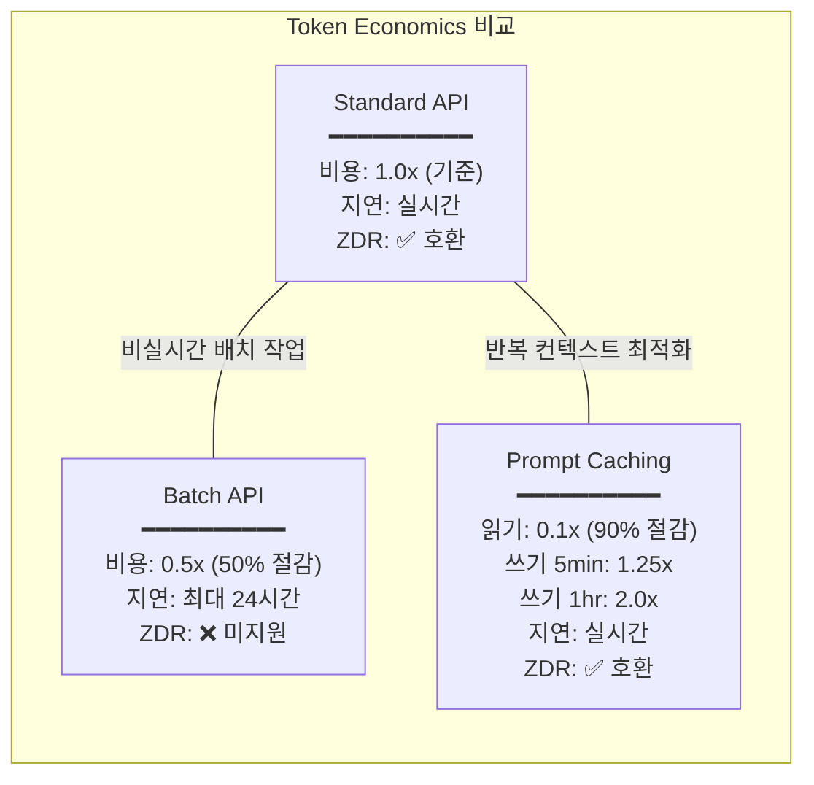
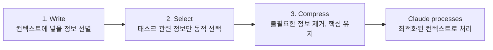

# Domain 5: Context Management & Reliability (15%)

> 예상 출제: **~9문항** / 60문항 | 권장 학습: **4-5시간**
> 가중치는 가장 낮지만, **모든 도메인을 관통하는 횡단 개념(cross-cutting concern)**이다.

---

## 1. 도메인 개요

Domain 5는 Claude의 **컨텍스트 윈도우를 효율적으로 관리**하고, **토큰 비용을 최적화**하며, **장기 대화에서 품질을 유지**하는 능력을 평가한다.

### 시험에서 테스트하는 것

| 토픽 | 출제 빈도 | 핵심 키워드 |
|------|----------|-----------|
| Token Economics (비용 최적화) | ★★★ | Prompt Caching, Batch API, cache read/write |
| Context Degradation (컨텍스트 열화) | ★★★ | attention dilution, lost in the middle |
| Focused Per-File Passes (파일별 집중 패스) | ★★★ | decomposition, coordinator pattern |
| Prompt Caching 조건과 제약 | ★★★ | 1024+ tokens, 5-min TTL, ZDR |
| Retry Strategies (재시도 전략) | ★★☆ | informed retry, bounded, human escalation |
| Context Isolation (컨텍스트 격리) | ★★☆ | subagents start with empty context |
| API Selection (API 선택) | ★★☆ | Real-Time vs Batch, latency requirements |

---

## 2. 핵심 개념

### 2.1 Context Window Economics — 입력 vs 출력 토큰 비용

컨텍스트 윈도우는 **무한하지 않다**. 토큰은 곧 비용이며, 입력 토큰(input tokens)과 출력 토큰(output tokens)은 과금 구조가 다르다. 시험에서는 "어떤 API를 언제 써야 비용을 줄이는가"가 핵심이다.

**암기 필수**: 반복되는 시스템 프롬프트나 정책 문서(50,000-100,000 토큰)를 매 요청마다 전송하면, 그 토큰 비용이 **기하급수적으로 누적**된다. Prompt Caching은 이 문제를 해결한다.

### 2.2 Context Degradation — 컨텍스트 열화

> **"컨텍스트 열화는 용량(capacity) 문제가 아니라 주의력(attention) 문제다."**

Transformer 모델의 총 주의력(total attention)은 **고정**되어 있다. 컨텍스트에 토큰이 많아질수록 각 토큰에 할당되는 주의력은 **얇아진다**. 특히 컨텍스트 **중간부(middle)**가 가장 큰 영향을 받는다.

**Lost in the Middle 효과**:
- 컨텍스트 **시작부**: 높은 주의력 (high attention)
- 컨텍스트 **중간부**: 낮은 주의력 (lowest attention) -- 여기서 품질 저하 발생
- 컨텍스트 **끝부분**: 주의력 회복 (end-of-context attention boost)

**실패 사례**: 47개 서비스 파일(380K 토큰)을 단일 세션에 로드한 결과:
- 파일 1-5: 깔끔한 리팩토링
- 파일 15-30: 변수명 불일치, 엣지 케이스 누락 (중간부 손실)
- 파일 40-47: 품질 회복하지만, 초반 파일과 import 패턴 충돌

**시험 신호**: "컨텍스트 윈도우를 늘리면 해결된다" → **항상 오답**. 200K 토큰의 집중된 컨텍스트가 1M 토큰의 덤프된 컨텍스트보다 성능이 좋다.

### 2.3 Focused Per-File Passes — 파일별 집중 패스

대규모 코드베이스 작업의 정답 패턴은 **분해(decomposition)**이다:

```
1. Decompose — 대규모 태스크를 파일/모듈 단위로 분해
2. Execute  — 각 단위를 필요한 컨텍스트만 담은 집중 세션에서 실행
3. Compose  — 결과 합성
4. Review   — 교차 파일 일관성 검토 (명명, import, 인터페이스 계약)
```

> "외과의가 모든 장기를 동시에 수술하지 않는 것처럼, 한 영역에 집중하고, 완벽한 주의력으로 작업한 뒤, 다음으로 이동한다."

코디네이터 패턴(Coordinator Pattern)은 이 원칙의 고급 구현이다:
1. 코디네이터 세션이 전체 구조를 가볍게 읽음 (lightweight read)
2. 작업 계획 생성 (어떤 파일을, 어떤 순서로, 어떤 의존성으로)
3. 각 파일에 집중 세션(focused session) 할당
4. 코디네이터가 교차 파일 일관성 검토

### 2.4 Prompt Caching — 프롬프트 캐싱

**조건과 제약** (암기 필수):

| 항목 | 값 | 시험 포인트 |
|------|-----|-----------|
| 최소 토큰 수 | **1,024 토큰** 이상 | 이 이하의 프롬프트는 캐싱 불가 |
| 기본 TTL | **5분** | 5분 내 재사용 시 cache read |
| 확장 TTL | **1시간** | 추가 비용으로 캐시 수명 연장 |
| 캐시 읽기 비용 | **0.1x** (90% 절감) | 핵심 절감 포인트 |
| 캐시 쓰기 비용 (5분 TTL) | **1.25x** (25% 추가) | 쓰기는 비용이 **증가**한다 |
| 캐시 쓰기 비용 (1시간 TTL) | **2.0x** (100% 추가) | 장기 캐시 프리미엄 |
| Real-Time 호환 | **완전 호환** | 사용자 대기 워크플로우에서 사용 가능 |

**시험 함정**: "Prompt Caching은 모든 토큰 비용을 90% 절감한다" → **오답**. 90%는 **캐시 읽기(cache read) 토큰에만** 해당. 캐시 쓰기(cache write)는 오히려 25-100% 비용이 증가한다.

**적합한 캐싱 대상**:
- 컴플라이언스 규정집 (company refund policies, escalation procedures)
- 제품 카탈로그 (descriptions, pricing, known issues)
- 에스컬레이션 정책 문서 (tier definitions, routing rules)
- 반복되는 시스템 프롬프트

### 2.5 Token Cost Comparison — Standard vs Batch vs Cached



### 2.6 Context Isolation — 에이전트 간 컨텍스트 격리

> **"서브에이전트는 컨텍스트를 자동으로 상속하지 않는다. 빈 컨텍스트(empty context)에서 시작한다."**

이것은 CCA 시험에서 **가장 많이 출제되는 개념** 중 하나다. 사람은 "같은 시스템 안의 에이전트는 인식을 공유한다"고 직관적으로 가정하지만, 실제로는 그렇지 않다.

컨텍스트 포킹(Context Forking) — Unix의 `fork()` 시스템 콜에서 차용:
- 부모 프로세스의 컨텍스트가 자식 프로세스에 **선택적으로** 복제됨
- 각 자식은 필요한 것만 받음
- 코디네이터 패턴의 핵심 메커니즘

### 2.7 Retry Strategies — 재시도 전략

| 전략 | 설명 | 시험 판정 |
|------|------|----------|
| **Blind retry** (맹목적 재시도) | "다시 시도해" (에러 피드백 없음) | **항상 오답** |
| **Informed retry** (정보 기반 재시도) | "합계가 150이지만 항목 합은 175입니다. 원본을 재확인하세요." | **정답 패턴** |
| **Unbounded retry** (무한 재시도) | "성공할 때까지 재시도" | **항상 오답** |
| **Content-modified retry** | 에러 피드백을 컨텍스트에 추가하여 재시도 | **정답 패턴** |

**정답 공식**: informed + bounded (2-3회) + human escalation

---

## 3. 비용 비교 테이블 (Decision Matrix)

### 가격 비교

| 구분 | Standard API | Batch API | Prompt Caching (Read) | Prompt Caching (Write 5min) | Prompt Caching (Write 1hr) |
|------|-------------|-----------|----------------------|---------------------------|---------------------------|
| **비용 배수** | 1.0x (기준) | 0.5x | **0.1x** | 1.25x | 2.0x |
| **절감률** | - | 50% | **90%** | -25% (추가 비용) | -100% (추가 비용) |
| **지연시간** | 실시간 | 최대 24시간 | 실시간 | 실시간 | 실시간 |
| **ZDR 호환** | Yes | **No** | Yes | Yes | Yes |

### 언제 무엇을 사용하는가 (Decision Matrix)

| 시나리오 | 선택 | 이유 |
|----------|------|------|
| 고객이 채팅창에서 대기 중 | **Real-Time + Prompt Caching** | 24시간 지연 불가, 반복 정책 문서 캐싱 |
| 개발자가 PR 머지 대기 중 | **Real-Time + Prompt Caching** | 블로킹 워크플로우, 즉시 응답 필요 |
| 매일 새벽 2시 보안 스캔 (ZDR 불필요) | **Batch API** | 비실시간, 50% 비용 절감, 24시간 윈도우 |
| 야간 분석 (ZDR 필수, 규제 산업) | **Real-Time + Prompt Caching** | Batch API는 ZDR 미지원 |
| 5,000건 송장 일괄 추출 | **Batch API** | 대량 비실시간 처리 |
| Deploy gate (릴리스 차단) | **Real-Time + Prompt Caching** | 릴리스 대기 중, 지연 불가 |

### 핵심 판단 질문

```
"누가 기다리고 있는가?" (Who is waiting?)
├── 사람이 기다리고 있다 → Real-Time API (유일한 선택)
├── SLA가 24시간 미만이다 → Real-Time API
├── 금융적 결과가 지연에 영향받는다 → Real-Time API
└── 아무도 기다리지 않는 백그라운드 작업이다
    ├── ZDR 필요? → Real-Time API + Prompt Caching
    └── ZDR 불필요? → Batch API (+ 선택적 Prompt Caching)
```

---

## 4. 안티패턴 vs 정답 패턴

### Pattern 1: 컨텍스트 윈도우 크기

| 안티패턴 | 정답 패턴 |
|----------|----------|
| "컨텍스트 윈도우를 늘려서 모든 파일을 로드하자" | **컨텍스트를 줄이고 주의력 밀도를 높여라** (focused per-file passes) |
| **시험 신호**: "increase window", "load everything", "larger context" → 즉시 제거 | **시험 신호**: "decompose", "focused session", "per-file" → 정답 후보 |

### Pattern 2: 비용 최적화 (실시간 워크플로우)

| 안티패턴 | 정답 패턴 |
|----------|----------|
| 고객 지원 시스템을 Batch API로 마이그레이션 (50% 절감) | **Prompt Caching** 적용 (90% 절감, 실시간 호환) |
| **시험 신호**: "Batch API" + 실시간 워크플로우 = 항상 오답 | **시험 신호**: 반복 컨텍스트 + 비용 최적화 = Prompt Caching |

### Pattern 3: 대규모 리팩토링

| 안티패턴 | 정답 패턴 |
|----------|----------|
| 47개 파일을 단일 세션에 로드하고 한 번에 리팩토링 | **코디네이터 패턴**: 분해 → 집중 세션 → 합성 → 일관성 검토 |
| **증상**: 중간 파일 품질 저하, 교차 파일 충돌 | **결과**: 각 파일에 높은 주의력 밀도, 일관성 보장 |

### Pattern 4: 에스컬레이션 핸드오프

| 안티패턴 | 정답 패턴 |
|----------|----------|
| 전체 대화 기록(full transcript)을 휴먼 에이전트에게 전달 | **구조화된 JSON 요약**으로 핵심 정보만 전달 |
| **문제**: 길고, 비구조적이고, 핵심 정보가 중간에 묻힘 | **장점**: 컴팩트하고 핵심 정보가 명확한 위치에 배치 |

### Pattern 5: Prompt Caching 비용 이해

| 안티패턴 | 정답 패턴 |
|----------|----------|
| "Prompt Caching은 모든 토큰을 90% 절감한다" | **캐시 읽기만 90% 절감**, 캐시 쓰기는 25-100% 추가 비용 |
| **시험 신호**: "all tokens reduced by 90%" → 오답 | **시험 신호**: "cache read" 90%, "cache write" premium → 정답 |

---

## 5. 시험 빈출 용어 17개

| # | 영어 | 한국어 | 시험 포인트 |
|---|------|--------|-----------|
| 1 | **context degradation** | 컨텍스트 열화 | 용량이 아닌 **주의력** 문제 |
| 2 | **lost in the middle** | 중간부 손실 | 컨텍스트 중간 정보의 주의력 저하 (U자 곡선) |
| 3 | **attention dilution** | 주의력 희석 | 토큰 증가 → 토큰당 주의력 감소 |
| 4 | **Prompt Caching** | 프롬프트 캐싱 | 반복 컨텍스트 비용 최적화, 읽기 90% 절감 |
| 5 | **cache read / cache write** | 캐시 읽기 / 캐시 쓰기 | 읽기 0.1x, 쓰기 1.25x-2.0x (비용 구조 분리) |
| 6 | **Batch API** | 배치 API | 50% 할인, 24시간 윈도우, ZDR 미지원 |
| 7 | **Zero Data Retention (ZDR)** | 제로 데이터 보유 | 규제 산업 필수, Batch API 미지원 |
| 8 | **focused per-file passes** | 파일별 집중 패스 | 대규모 코드 작업의 정답 패턴 |
| 9 | **context forking** | 컨텍스트 포킹 | Unix fork() 차용, 선택적 컨텍스트 복제 |
| 10 | **informed retry** | 정보 기반 재시도 | 구체적 에러 피드백 포함 재시도 (blind retry와 대비) |
| 11 | **validation-retry loop** | 유효성 검사-재시도 루프 | informed + bounded(2-3회) + human escalation |
| 12 | **structured handoff** | 구조화된 핸드오프 | 전체 transcript가 아닌 JSON 요약으로 전달 |
| 13 | **Write-Select-Compress** | Write-Select-Compress 전략 | Anthropic 공식 3단계 컨텍스트 관리 프레임워크 | ★★★★★ |
| 14 | **Tool Result Summarization** | 도구 결과 요약 | 긴 도구 결과를 핵심만 추출하여 삽입 | ★★★★ |
| 15 | **Sliding Window** | 슬라이딩 윈도우 | 최근 N개 메시지만 유지하는 대화 관리 | ★★★ |
| 16 | **Summary-based Compression** | 요약 기반 압축 | 오래된 대화를 요약으로 대체 | ★★★ |
| 17 | **Information Placement Strategy** | 정보 배치 전략 | 중요 정보를 시작/끝에 배치 (lost-in-the-middle 대응) | ★★★ |

---

## 6. 예상 문제 7문항

### Q1. 컨텍스트 열화의 본질

팀이 대규모 코드베이스 리팩토링 중 컨텍스트 중간에 위치한 파일들에서 품질 저하를 경험합니다. 가장 적절한 설명은?

A) 컨텍스트 윈도우의 토큰 제한에 도달했다
B) 모델의 주의력이 모든 토큰에 분산되어 중간부의 주의력이 희석되었다
C) 중간 파일이 더 복잡한 코드를 포함하고 있다
D) 모델이 처리 시간 제한에 걸렸다

<details>
<summary>정답 및 해설</summary>

**정답: B**

Context degradation은 **capacity** 문제가 아니라 **attention** 문제다. 총 주의력은 고정되어 있고 모든 토큰에 분배되므로, 컨텍스트가 커지면 각 토큰의 주의력이 얇아진다. 특히 중간부가 가장 큰 영향을 받는다 ("lost in the middle" 효과).

- A: 용량 문제로 잘못 진단 (열화는 토큰 한계 전에 발생)
- C: 파일 복잡도와 무관한 현상
- D: 시간 제한과 무관

</details>

---

### Q2. 고객 지원 비용 최적화

고객 지원 시스템이 Real-Time API로 하루 50,000건의 상호작용을 처리하며, 각 요청마다 80,000 토큰의 정책 문서가 반복됩니다. API 비용을 크게 줄이려면?

A) Message Batches API로 마이그레이션하여 50% 비용 절감을 달성한다
B) 정책 문서를 20,000 토큰으로 요약하여 컨텍스트를 줄인다
C) 반복되는 정책 문서에 Prompt Caching을 적용하여 최대 90% 비용 절감을 달성한다
D) 더 작은 모델을 사용하여 토큰당 비용을 줄인다

<details>
<summary>정답 및 해설</summary>

**정답: C**

고객 지원은 **실시간 워크플로우**다. 고객이 채팅창에서 대기하고 있다.

- A: Batch API는 최대 24시간 지연. 실시간 고객 지원에서는 아키텍처 실패. **시험 최다 오답**
- B: 토큰을 줄이면 중요한 정책 세부사항 손실 가능. 엔지니어링 트레이드오프이지 아키텍처 베스트 프랙티스가 아님
- C: 50,000 x 80,000 반복 토큰 문제에 직접 대응. 90% 절감 + 실시간 호환
- D: 이중 모델 라우팅은 복잡도 증가. 반복 컨텍스트 비용이 핵심 문제

</details>

---

### Q3. Prompt Caching 비용 구조

Prompt Caching의 비용 구조에 대한 설명 중 올바른 것은?

A) 모든 토큰이 90% 절감된다
B) 캐시 읽기는 기본의 0.1배, 캐시 쓰기(5분 TTL)는 기본의 1.25배이다
C) 캐시 읽기와 쓰기 모두 동일하게 절감된다
D) 1,024 토큰 미만의 프롬프트도 캐싱 가능하다

<details>
<summary>정답 및 해설</summary>

**정답: B**

Prompt Caching 비용 구조:
- 캐시 읽기: **0.1x** (90% 절감) -- 핵심 절감 포인트
- 캐시 쓰기 (5분 TTL): **1.25x** (25% 추가 비용)
- 캐시 쓰기 (1시간 TTL): **2.0x** (100% 추가 비용)

- A: "모든 토큰 90% 절감"은 대표적 함정 오답. 쓰기는 오히려 비용 증가
- C: 읽기와 쓰기는 완전히 다른 비용 구조
- D: 최소 1,024 토큰 이상이어야 캐싱 가능

</details>

---

### Q4. ZDR 환경에서의 API 선택

금융 규제 기관에서 야간 코드 분석을 수행하면서 Zero Data Retention 정책을 준수해야 합니다. 비용 최적화를 위한 올바른 접근법은?

A) Batch API를 사용하여 50% 비용 절감
B) Batch API + Prompt Caching을 조합하여 비용 최소화
C) Real-Time API + Prompt Caching을 사용
D) ZDR 정책은 API 선택과 무관하다

<details>
<summary>정답 및 해설</summary>

**정답: C**

**Message Batches API는 Zero Data Retention 대상이 아니다.** 이것은 시험 핵심 사실(critical exam fact)이다.

- A, B: 규제 산업(금융)에서 ZDR이 필요하면 Batch API는 **컴플라이언스 위반**
- C: Real-Time API는 ZDR 호환. Prompt Caching으로 비용 최적화 가능
- D: ZDR은 API 선택에 **직접적 영향**을 미침

**시험 규칙**: 규제 산업 + Batch API = 즉시 제거

</details>

---

### Q5. 대규모 리팩토링 전략

47개 서비스 파일의 인증 미들웨어를 일관되게 리팩토링해야 합니다. 가장 효과적인 접근법은?

A) 모든 파일을 하나의 세션에 로드하고 한 번에 리팩토링
B) 컨텍스트 윈도우를 최대로 설정하고 전체 src/ 디렉토리를 로드
C) 코디네이터 세션으로 구조를 분석하고, 각 파일을 집중 세션에서 개별 처리한 뒤, 교차 파일 일관성을 검토
D) 파일을 알파벳순으로 정렬하고 순차적으로 처리

<details>
<summary>정답 및 해설</summary>

**정답: C**

코디네이터 패턴(Coordinator Pattern):
1. 코디네이터가 전체 구조를 가볍게 읽고 작업 계획 수립
2. 각 파일에 필요한 컨텍스트만 담은 집중 세션 할당
3. 코디네이터가 교차 파일 일관성 검토 (명명, import, 인터페이스 계약)

- A: 380K 토큰 단일 세션 → lost in the middle, 중간 파일 품질 저하
- B: 컨텍스트를 늘리면 주의력이 더 얇아짐 (**항상 오답**)
- D: 의존성과 컨텍스트를 무시한 기계적 순차 처리

</details>

---

### Q6. Write-Select-Compress 전략

RAG 시스템에서 사용자 질문에 관련된 문서 청크를 벡터 검색으로 찾아 컨텍스트에 삽입하는 과정은 Write-Select-Compress 프레임워크의 어떤 단계에 해당하는가?

A) Write — 컨텍스트에 넣을 정보를 준비하는 단계
B) Select — 현재 태스크에 관련된 정보를 동적으로 선택하는 단계
C) Compress — 불필요한 정보를 제거하는 단계
D) Write와 Select를 동시에 수행하는 단계

<details>
<summary>정답 및 해설</summary>

**정답: B**

Write-Select-Compress는 Anthropic의 3단계 컨텍스트 관리 프레임워크다:
- **Write**: 시스템 프롬프트, 도구 정의, 정적 문서 등 **사전에 준비한 정보**를 컨텍스트에 배치
- **Select**: 현재 쿼리/태스크에 **동적으로 관련 정보를 선택** — RAG 검색, 필터링이 여기에 해당
- **Compress**: 선택된 정보에서 불필요한 부분을 제거하고 핵심만 유지

벡터 검색으로 관련 문서를 찾는 것은 "현재 태스크에 관련 있는 정보만 동적으로 선택"하는 Select 단계의 대표적 구현이다.

- A: Write는 사전에 정적으로 준비하는 단계
- C: Compress는 이미 선택된 정보를 압축하는 단계
- D: 각 단계는 순차적으로 구분됨

</details>

---

### Q7. 도구 결과 삽입 전략

에이전트가 대규모 API 응답(15,000 토큰)을 받았습니다. 이 결과를 다음 Claude 호출의 컨텍스트에 포함할 때 가장 적절한 접근법은?

A) 원본 API 응답 전체를 그대로 컨텍스트에 삽입한다
B) API 응답에서 현재 태스크에 필요한 핵심 정보만 추출하여 요약본을 삽입한다
C) API 응답을 캐싱하고 참조 ID만 컨텍스트에 넣는다
D) 컨텍스트 윈도우를 늘려 전체 응답을 수용한다

<details>
<summary>정답 및 해설</summary>

**정답: B**

**Tool Result Summarization**: 긴 도구 결과를 그대로 컨텍스트에 넣는 것은 안티패턴이다. 핵심 정보만 추출하여 요약본을 삽입해야 한다.

- A: 원본 전체 삽입은 **대표적 안티패턴**. 15,000 토큰의 대부분이 불필요한 정보이며, 주의력 희석(attention dilution)을 유발
- B: Tool Result Summarization의 정답 패턴. 필요한 필드/값만 추출하여 컴팩트하게 삽입
- C: 참조 ID만으로는 Claude가 실제 데이터에 접근 불가
- D: "컨텍스트 윈도우를 늘린다"는 **항상 오답** (Domain 5의 핵심 원칙)

</details>

---

## 7. 암기 필수 숫자

| 항목 | 값 | 시험 포인트 |
|------|-----|-----------|
| Prompt Caching 최소 토큰 | **1,024 토큰** | 이 이하 = 캐싱 불가 |
| 캐시 기본 TTL | **5분** | 5분 내 재사용 시 cache read |
| 캐시 확장 TTL | **1시간** | 추가 비용으로 수명 연장 |
| 캐시 읽기 비용 | **0.1x** (90% 절감) | "모든 토큰 90%"는 오답 |
| 캐시 쓰기 비용 (5분) | **1.25x** (25% 추가) | 쓰기는 비용 **증가** |
| 캐시 쓰기 비용 (1시간) | **2.0x** (100% 추가) | 장기 캐시 프리미엄 |
| Batch API 비용 절감 | **50%** (0.5x) | ZDR 미지원 주의 |
| Batch API 처리 윈도우 | **최대 24시간** | 실시간 불가 |
| 재시도 제한 | **2-3회** | 무한 재시도 = 안티패턴 |
| 에이전트당 권장 도구 수 | **4-5개** | 초과 시 선택 정확도 저하 |
| 200K vs 1M 토큰 | **200K 집중 > 1M 덤프** | 주의력 밀도가 핵심 |

---

## 8. Anthropic 공식 문서 보완

### 8.1 Write-Select-Compress 3단계 전략 (높은 중요도)

Anthropic이 제시하는 컨텍스트 관리의 3단계 프레임워크:

1. **Write**: 무엇을 컨텍스트에 넣을지 선별 (시스템 프롬프트, 도구 정의, 관련 문서)
2. **Select**: 현재 태스크에 관련 있는 정보만 동적으로 선택 (RAG, 검색)
3. **Compress**: 불필요한 정보를 제거하고 핵심만 유지 (요약, 트리밍)

> **English (Exam Vocabulary)**: The Write-Select-Compress strategy is Anthropic's three-phase context management framework: Write (decide what goes into context), Select (dynamically choose task-relevant information), Compress (remove noise and keep essentials).



### 8.2 도구 결과 요약 (Tool Result Summarization) (높은 중요도)

긴 도구 결과를 그대로 컨텍스트에 넣지 않고 핵심만 요약하여 삽입하는 전략.
- 대규모 파일 읽기, API 응답 등에서 필수
- 원본 전체 삽입 = 안티패턴 (컨텍스트 낭비, 주의력 분산)

> **English (Exam Vocabulary)**: Tool Result Summarization extracts only the essential information from lengthy tool outputs before inserting them into context. Dumping raw tool results is an anti-pattern that wastes context and dilutes attention.

### 8.3 대화 이력 관리 전략

3가지 접근법:
- **슬라이딩 윈도우(Sliding Window)**: 최근 N개 메시지만 유지
- **요약 기반 압축(Summary-based Compression)**: 오래된 대화를 요약으로 대체
- **하이브리드**: 최근 메시지 원문 + 오래된 메시지 요약 (정답 패턴)

### 8.4 중요 정보 배치 전략

"가장 중요한 정보를 컨텍스트의 시작과 끝에 배치하라" — lost-in-the-middle 효과의 공식적 대응.
- 시스템 프롬프트(시작) + 가장 최근/중요 도구 결과(끝)
- 덜 중요한 정보는 중간에 배치

### 8.5 도구 정의의 토큰 비용

도구 정의 자체가 입력 토큰으로 과금. 도구 수가 많으면 매 요청마다 비용 증가. 4-5 도구 규칙의 경제적 근거.

---

## 9. 빠른 복습 체크리스트

- [ ] 컨텍스트 열화 = **주의력** 문제 (용량 아님)
- [ ] "윈도우 늘리기"는 **항상 오답**
- [ ] Lost in the middle = 시작과 끝은 높은 주의력, 중간은 낮은 주의력
- [ ] 대규모 작업: **분해 → 집중 실행 → 합성 → 일관성 검토**
- [ ] Prompt Caching: 읽기 **0.1x**, 쓰기 5min **1.25x**, 쓰기 1hr **2.0x**
- [ ] 최소 **1,024 토큰** 이상이어야 캐싱 가능
- [ ] 캐시 기본 TTL = **5분**
- [ ] **Batch API는 ZDR 미지원** — 규제 산업에서 즉시 제거
- [ ] 실시간 비용 최적화 = **Prompt Caching** (Batch API 아님)
- [ ] 재시도 = **informed + bounded(2-3회) + human escalation**
- [ ] 서브에이전트는 **빈 컨텍스트**에서 시작 (자동 상속 없음)
- [ ] 에스컬레이션 핸드오프 = **구조화된 JSON** (전체 transcript 아님)
